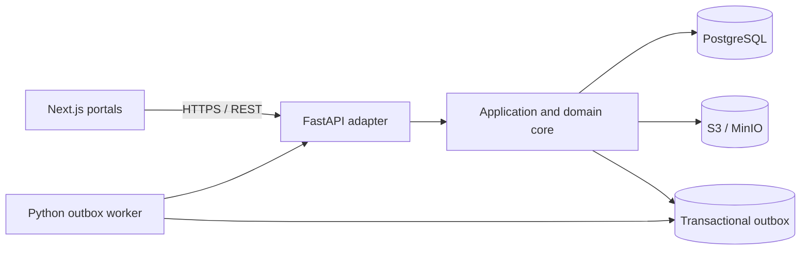

# Audentra Platform

Backend services for the Audentra enrollment product. The active backend is a
Python modular monolith: framework-neutral application/domain code is exposed
through FastAPI, while a separate Python process consumes the durable outbox.
The portals live in
[`Audentra-ai/Audentra-portals`](https://github.com/Audentra-ai/Audentra-portals).



## Repository layout

```text
apps/api/                         FastAPI adapter, Python core, worker, tests
apps/api/migrations/              Immutable SQL migration chain
apps/api/assets/                  Backend-owned signing templates and media
packages/contracts/               Temporary TypeScript contract source
packages/document-preprocessing/  Retained compatibility tests/tooling
packages/state-effects/           State-effect registry and graph generator
tools/demo-api/                   Development-only preview API
config/tenants/                   Tenant configuration fixtures
infra/                            Container image and local service stack
```

FastAPI is an inbound adapter, not the application architecture. Business
operations depend on Python protocols and can later be reused from Django,
Flask, a CLI, a job runner, or another Python framework without importing
FastAPI. PostgreSQL uses bounded async pools, object-storage calls are moved off
the event loop, and API/worker HTTP clients are shared for each process lifetime.

## Local development

Tested requirements: Python 3.12.11, uv 0.7.12, Node.js 22, npm, and Docker
for the full dependency stack.

```bash
uv sync --directory apps/api --locked --all-groups
npm ci
docker compose --env-file infra/.env.example -f infra/compose.yaml up --build
```

The API defaults to `http://localhost:4000`. The worker is deliberately a
headless process; its liveness is managed by process supervision and outbox
lease recovery rather than an extra HTTP server.

Useful direct-process commands:

```bash
npm run dev:api
npm run dev:worker
npm run worker:once
npm run db:migrate
npm run db:seed
npm run lint
npm run typecheck
npm test
```

Use [`.env.example`](.env.example) as the direct-process variable reference
(the application does not silently load dotenv files). Compose defaults are in
[`infra/.env.example`](infra/.env.example). The local credentials are never
appropriate for a shared or production environment.

## Migration and release safety

- The Nest-era SQL files remain byte-for-byte immutable and the Python migrator
  rejects checksum changes. New schema work must use a new numbered migration.
- Migration, API, and worker run from one locked Python image with different
  commands, eliminating dependency drift between process roles.
- The local-development Compose stack runs the integrity-checked compatibility
  seed after migrations and before the API. The Python seeder is insert-only,
  idempotent, and disabled in production; shared environments should provision
  application data explicitly.
- Preserve the pre-rewrite implementation in Git history and retain its built
  images during the compatibility window; do not keep duplicate legacy source
  trees in the active repository.
- CI uses the committed `uv.lock`, strict Ruff/mypy checks, coverage enforcement,
  real PostgreSQL tests, remaining Node checks, and a non-root container build.

`AUDENTRA_ENV=production` currently fails closed while `AUTH_MODE=demo`; a real
identity adapter must be configured before production rollout. This prevents a
demo identity from being deployed accidentally. Run FastAPI and Nest contract
comparisons against the checkpointed revision during the migration window, and
retire its images only after production route and event parity gates are green.

## Cross-repository contract

`packages/contracts` remains the temporary contract source during the repo
split. Publish a versioned client generated from FastAPI OpenAPI and consume it
from the portals repo before allowing the two snapshots to evolve independently.
Internal outbox event contracts stay backend-only.

See [`docs/README.md`](docs/README.md) for the architecture and flow index.
