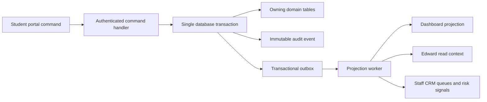

# Student Domain State Map

## Why this exists

The portal is a modular monolith with one authoritative student record, not
seven disconnected mini-apps. Each user-facing domain owns its tables and
commands, while versioned events update read models used by Dashboard and
Edward. This keeps the code deployable as one service today and leaves clean
service boundaries for a later Kubernetes split.

## Command and projection flow

The response to a material command is returned only after the owner record,
audit record, and outbox record are committed. Projection updates may happen
asynchronously in production; the local development adapter performs them
synchronously for an immediate demo.

## Dependency rules

| Source change | Authoritative update | Dependent updates |
|---|---|---|
| Onboarding completed | `student_onboarding` | Future visits route to Dashboard; completion audit and CRM milestone |
| Offer accepted | `admission_offer` | Enrollment journey and versioned requirement instances |
| Document uploaded | `document_record` | Parser job, matching enrollment/financial requirement becomes under review |
| Extraction confirmed | Reviewed extraction on document | Transcript credits or safe student fields imported; audit and outbox |
| Transcript credits imported | `student_transcript_credit` | Stored equivalency rules evaluated; exemption-review queue and academic projection rebuilt |
| Exemption approved by staff | `course_exemption_recommendation` | Target course exempted; prerequisite graph and degree progress recomputed |
| Financial document verified | `financial_document_requirement` | Enrollment checklist, aid risk reason, dashboard next action |
| Deposit succeeded | `student_payment` | Enrollment deposit requirement completed; financial balance and dashboard projection updated |
| Payment plan selected | `student_payment_plan` | Billing projection and staff CRM timeline |
| Catalog or rule version activated | Versioned catalog tables | Affected recommendations superseded and recalculated; no silent removal of approved credit |

## Enrollment funnel tracking

Enrollment activity events are analytics records, not the source of truth for
completion. Each event contains tenant, authenticated student, session,
page-instance, event time, receive time, event version, and a small allowlisted
property set.

Tracked milestones include:

- enrollment checklist and task viewed;
- action started, submitted, rejected, completed, or blocked;
- document upload and reviewed extraction;
- financial-aid screen viewed;
- enrollment task abandoned with duration bucket and last safe interaction;
- Edward tool invoked, action widget shown, and action outcome.

The client does not send names, email addresses, raw URLs, transcript values,
financial amounts, payment credentials, document contents, or free-form text in
analytics properties. Material changes are separately recorded in the
immutable audit log.

## Edward tool boundary

Edward uses typed, read-only data tools first:

- `get_enrollment_status`
- `get_student_financials`
- `get_student_academics`
- `search_course_catalog`
- `get_campus_life`

An intent router decides which tools are needed. The LLM receives only the
bounded results of those tools and recent chat turns. Write actions are rendered
as typed UI widgets. The student explicitly activates the widget; the normal
authenticated, idempotent command endpoint performs the change and records the
audit trail. Edward itself never writes directly to domain tables.

## Service-split seams

The current modules can later become independent services for enrollment,
academics, financials, campus content, documents, and AI orchestration. The API
contracts and outbox event envelopes are the split seams. Do not introduce
distributed transactions when splitting: preserve one owner per record and
propagate read models through idempotent events.
