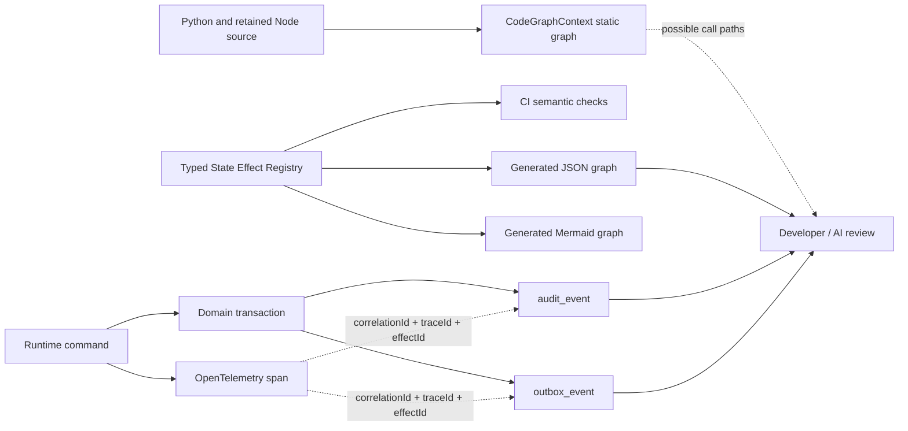

# CRM Change Graph

## Decision

The project uses three complementary layers:

1. **CodeGraphContext** indexes Python and retained TypeScript/JavaScript files,
   symbols, imports, call chains, and structural dependencies for developer and
   AI navigation.
2. **The typed State Effect Registry** is the authoritative declaration of CRM
   field ownership, reads, writes, emitted or consumed events, idempotency, and
   transaction boundaries.
3. **OpenTelemetry, `audit_event`, and `outbox_event`** provide runtime evidence
   for what actually happened to a student record.

CodeGraphContext is deliberately not treated as runtime data lineage. Static
code can show that a handler *may* call another function. Only a correlated
trace, audit record, and outbox envelope can prove that a particular execution
changed a particular student.

## Architecture



## Authoritative registry

The versioned source is
`packages/state-effects/src/registry.ts`. Each state effect declares:

- one stable effect ID and owning domain;
- its implementation status and concrete Python runtime handler when one exists;
- fields read and written;
- events emitted and consumed;
- synchronous effect calls;
- the deduplication or optimistic-concurrency contract;
- the transaction/outbox boundary.

The generated artifacts are:

- [`generated/crm-change-graph.json`](./generated/crm-change-graph.json), for
  internal CRM visualization and bounded AI context;
- [`generated/crm-change-graph.mmd`](./generated/crm-change-graph.mmd), for
  architecture documentation.

`implemented` effects must name a real FastAPI/Python runtime symbol. The two
credential identity effects are `preview_only` and therefore have a null
production handler: the retained demo API exercises those user flows, while
the FastAPI process deliberately refuses production startup until a real
identity adapter is configured. The former
`enrollment.applyDocumentExtraction` consumer was removed because no such
worker handler exists; `documents.completeExtraction` commits the matching
requirement projection in the same database transaction, and its emitted
completion event is deliberately ignored by the worker catalog.

Run `npm run crm:graph` after editing the registry. CI runs
`npm run crm:graph:check` and fails when:

- two domains claim the same field;
- the synchronous effect graph contains a cycle;
- an event handler has no event-scoped deduplication key;
- an effect writes a field without a declared owner;
- generated graph artifacts are stale.

## Runtime correlation

The API accepts `X-Correlation-Id` (falling back to `X-Request-Id` or a
server-generated ID), starts an OpenTelemetry server span, and returns:

- `X-Correlation-Id`
- `X-Request-Id`
- `X-Trace-Id`

Consequential commands commit the domain change, audit record, and outbox
record together. Audit metadata and outbox envelopes carry a `lineage` object:

```json
{
  "correlationId": "request-or-workflow-id",
  "traceId": "OpenTelemetry trace id",
  "spanId": "OpenTelemetry span id",
  "effectRegistryVersion": 1,
  "effectId": "financials.selectPaymentPlan"
}
```

This is safe linkage metadata, not student content. A support or CRM
investigation can start with any one of these IDs and reconcile the trace,
append-only audit fact, and publishable domain event.

## Example: document extraction retry

`documents.retryExtraction` is a documents-owned command in the registry. It
reads the stored document state, category, requirement context, and prior
extraction; writes only the document processing state; and emits both
`document.extraction_retry_started.v1` and a durable
`document.extraction_requested.v1` worker request. The worker then calls the
private authenticated API command that performs extraction and commits
`documents.completeExtraction`; this is asynchronous, not a synchronous graph
edge. Its aggregate-scoped `Idempotency-Key` contract prevents duplicate retry
clicks from creating another provider call after the document reaches a
terminal state.

At runtime, `document.extraction_retry_started` maps to that effect ID in the
lineage mapper. The subsequent `document.extraction_completed` audit/outbox
fact maps to `documents.completeExtraction`. Together, the correlation ID and
trace establish the actual retry path; the generated graph only declares the
permitted path.

## CodeGraphContext workflow

The repository includes `.cgcignore` and uses a local KuzuDB graph under the
gitignored `tmp/` directory:

```bash
npm run cgc:index
npm run cgc:update
npm run cgc:report
```

The first command creates the initial index, the second refreshes an existing
index after code changes, and the third writes a local static architecture
report to `docs/generated/codegraphcontext-report.md`. The pre-split checked-in
snapshot was retired because it indexed deleted NestJS symbols; regenerate it
before using it for current code review. Developers can also use
CodeGraphContext CLI/MCP call-chain and dependency queries while reviewing a
registry change.

CodeGraphContext remains advisory: a static edge never authorizes a cross-domain
write, replaces an idempotency key, or proves runtime execution.

## Evolution

Keep this as a versioned package while the domain boundaries are changing. A
graph database for business lineage is justified later only if the registry and
runtime evidence become too large for generated JSON and ordinary SQL queries.
At that point Neo4j can ingest the same stable IDs; it should not replace the
registry or the audit/outbox facts.
