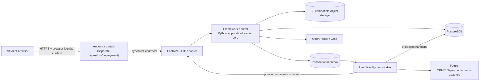
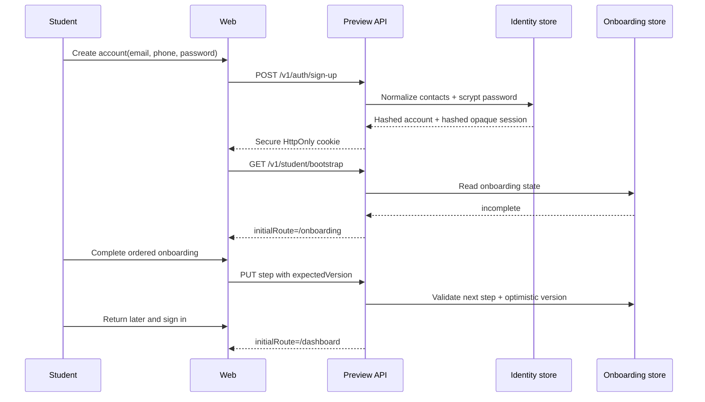
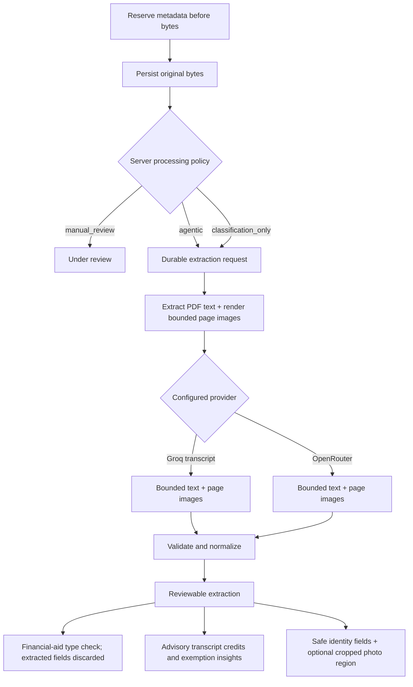

# Current implementation map

This document describes what the repository actually implements as of
2026-08-19. It complements the design documents by distinguishing the
production-oriented FastAPI path from development-only preview tooling and
from integrations that remain planned.

## 1. System in one picture



Text fallback:

1. The browser renders the portal and calls same-origin `/v1` routes.
2. The separately deployed portal routes those requests to the FastAPI inbound
   adapter.
3. FastAPI composes the framework-neutral application core. The worker shares
   the Python package and executes idempotent projection handlers or invokes a
   private authenticated FastAPI document command.
4. Domain changes, audit records, and outbox events commit atomically. The
   headless worker leases committed events and performs recoverable side
   effects outside the request lifecycle.

## 2. Runtime profiles

| Capability | Production-oriented FastAPI profile | Development preview tool |
|---|---|---|
| Web | Separately deployed `Audentra-portals` repository | Portal or contract-test client |
| API | `apps/api` FastAPI/ASGI adapter | `tools/demo-api` Node HTTP adapter |
| Primary state | PostgreSQL 17 | Account-isolated JSON files |
| Document bytes | MinIO/managed S3-compatible adapter | Ignored local development directory |
| Async processing | `audentra-worker` outbox consumer from the shared Python image | Recoverable in-process job queue |
| Authentication | Development-only demo adapter or student-only Google/Microsoft OIDC proof | Development credential signup/sign-in and hashed sessions |
| AI providers | Python OpenRouter and Groq adapters | Node OpenRouter and Groq adapters |
| Deployment | Compose locally; independent API/worker roles in production | Development process only |
| Intended use | Target production integration path (identity-gated) | Synthetic-data compatibility preview |

The preview remains useful for synthetic-data product development but is not a
production deployment path. The combined public VM profile has been retired and
is preserved only in Git history. Preview-only routes are not evidence of
FastAPI parity.

## 3. Repository map

```text
apps/api
  src/audentra/interfaces/http
    FastAPI routes, middleware, error mapping, request dependencies
  src/audentra/application + domain + core
    Framework-neutral use cases, policies, ports, authorization context
  src/audentra/infrastructure
    Async PostgreSQL repositories, S3 storage, SQL migrations, outbox,
    document processing, worker leasing/retry/dead-letter behavior
  src/audentra/interfaces/worker
    Headless Python worker entry point
  src/audentra/integrations/ai
    OpenRouter/Groq gateways, Edward safety, extraction validation
  migrations + assets + tests
    Checksummed SQL, onboarding templates, backend verification suite

packages/contracts
  Retained browser/API/event compatibility types and mapping helpers

packages/state-effects
  Authoritative CRM field ownership and read/write/event registry

packages/document-preprocessing
  Retained Node compatibility tooling/tests; production processing is Python

tools/demo-api
  Development-only preview adapter and its local state/providers

infra
  Compose stack and shared migration/seed/API/worker Python image

docs
  Architecture decisions, flows, models, security, operations, generated graphs
```

Portal routes, components, browser state, browser tests, and public assets live
in `Audentra-portals`, not this backend repository.

## 4. Primary application flows

### 4.1 Development-preview registration and returning login

The following flow is implemented by `tools/demo-api` for synthetic preview
accounts. It is not the production FastAPI identity design:



Security properties:

- email and phone are normalized before uniqueness checks;
- passwords use a slow salted hash;
- only session-token digests are stored;
- sessions expire and can be revoked;
- onboarding order and completion are server-controlled;
- dashboard access is gated by the bootstrap result.

Email and SMS verification state is modeled, but delivery providers are not yet
connected.

The FastAPI composition supports `AUTH_MODE=demo` for development/test and
`AUTH_MODE=oidc` for a student-only Google/Microsoft proof. OIDC uses
authorization code plus PKCE, tenant-scoped stable provider identities, and
hashed opaque sessions for existing accounts; it does not create students.
Credential routes and staff authentication fail closed in OIDC mode, so staff,
leader, and VP authentication is intentionally unavailable. Hosted use also
requires the public-edge and callback-log controls in the student SSO runbook.

### 4.2 Enrollment requirement

```text
Enrollment list
  -> open stable requirement slug
  -> render action inline
  -> submit form/document/payment with expected version or idempotency key
  -> transaction updates owned fields
  -> audit event + outbox event
  -> dashboard/requirement projections refresh
```

Stable examples include `profile-verification`, `identity-document-upload`,
`transcript-upload`, `financial-aid-verification`, `immunization-upload`, and
`enrollment-deposit`. UUIDs remain internal identifiers.

### 4.3 Document upload and extraction



Important invariants:

- metadata is committed before file processing;
- the original is retained if parsing fails;
- identity and transcript are agentic today;
- financial-aid uploads use document-type-only classification before staff
  review, while immunization uploads go directly to manual review;
- provider responses and normalized results are separate records;
- transcript course matching is advisory, never an official exemption;
- duplicate worker delivery cannot spend model tokens twice after a terminal
  result exists.

### 4.4 Edward AI

Edward is a bounded assistant, not an autonomous enrollment authority.

```text
Student message + page context
  -> server chooses allowlisted record projections
  -> context receipts prove which sources were read
  -> prompt sent through configured gateway
  -> response normalized
  -> safe navigation suggestions and typed widgets returned
  -> payment/upload/appointment action still calls a deterministic API command
```

Edward can display deposit, document-upload, and appointment widgets. Academic
questions receive a bounded program/plan/prerequisite summary; campus-life
questions receive bounded event and organization summaries. Dashboard and
profile identity are always available, while documents, onboarding, payments,
academics, financials, messages, and campus life are fetched only when the
message or current page makes that domain relevant. Edward cannot directly
waive requirements, approve credit, change permissions, or mark a payment
successful.

### 4.5 Tenant-owned academic and campus content

Academic programs, catalog versions, courses, program requirements, campus
events, event visual themes and background media, clubs, club calendars,
meeting schedules, course-resource PDFs, media references, source URLs, and
social links are tenant-owned
records. The Aster and Harvard previews therefore return different catalogs and
directories through the same public contracts. Staff editing is not yet
implemented, but no page needs a tenant-specific React component when that
editor is added.

Content provenance is explicit:

- `official_source` identifies information represented from an institutional
  source;
- `synthetic_preview` identifies a plausible preview derived from an official
  activity or policy but not an announced event;
- `tenant_authored` identifies content entered by university staff.

### 4.6 CRM change graph and runtime lineage

The system uses three complementary forms of evidence:

1. CodeGraphContext describes static Python and retained TypeScript imports and
   call paths.
2. `packages/state-effects` is the source of truth for domain field ownership,
   reads, writes, events, idempotency, and transaction boundaries.
3. Runtime correlation IDs, audit records, outbox events, trace/span IDs, and
   projection receipts prove what happened for an actual request.

Static code graphs are navigation aids; they are not runtime data-lineage
evidence.

## 5. Frontend surface

The student navigation contains:

- Dashboard
- My Enrollment
- My Financials
- My Classrooms
- My Campus Life
- Edward AI
- My Documents
- Profile

Supporting routes include documents, messages, appointments, payments, help,
sign-in, and onboarding. The responsive shell provides desktop navigation and
a mobile bottom navigation pattern.

## 6. Data authority

| Concern | Current owner | Notes |
|---|---|---|
| Credential account/session | Identity | Hashed demo sessions plus tenant-scoped student OIDC identities/sessions; non-student federation pending |
| Onboarding answers | Onboarding | Versioned and student-editable |
| Admission offer | Admissions | Eventually synchronized from CRM |
| Enrollment requirement state | Enrollment | Deterministic server transitions |
| Uploaded original | Documents | Immutable evidence with provenance |
| Model extraction | Documents | Untrusted/reviewable |
| Transcript credit recommendation | Academics | Advisory pending registrar action |
| Deposit outcome | Financials | Dummy processor today; provider authority later |
| Activity signal | Analytics | Never an official record |
| Audit record | Audit | Append-only consequential action record |

## 7. Implemented versus planned

Implemented:

- a FastAPI compatibility surface with 42 operations protected by OpenAPI and
  parity tests;
- framework-neutral Python application/domain code behind the HTTP adapter;
- async SQLAlchemy Core/`asyncpg` PostgreSQL access with bounded connection
  pools, statement timeouts, and PostgreSQL-backed readiness;
- a headless Python outbox worker with leases, idempotent receipts, retries,
  dead-letter behavior, and graceful shutdown;
- preview credential accounts plus a student-only Google/Microsoft OIDC proof
  with PKCE, stable tenant-scoped identities, and hashed opaque sessions;
- resumable one-time onboarding;
- enrollment actions in their requirement pages;
- multiple file uploads, durable originals, parsing, retry, and review;
- transcript-to-advisory-course matching;
- financial, academic, campus, message, appointment, payment, profile, and help
  projections;
- Edward context orchestration and action widgets;
- staff action-center, student-context, preferences, and document-review API
  operations;
- activity tracking, audit/outbox lineage, state-effect graph checks;
- local Compose with PostgreSQL, MinIO, migration, seed, API, worker, Keycloak,
  and Mailpit; migration/seed/API/worker use one non-root Python image.

Not yet production-complete:

- institution-wide OIDC/SAML, staff/leader/VP authentication, account
  provisioning/invitations, and hosted callback-log controls beyond the
  current student proof;
- migration or explicit contract removal of development-preview routes outside
  the 42-operation FastAPI compatibility set;
- real email/SMS verification;
- payment processor and signed webhook verification;
- broader staff and leader/VP interfaces beyond the action-center operations;
- official registrar exemption approval;
- production object storage, managed PostgreSQL, backup policy, and Kubernetes;
- malware scanning and institutional retention/DLP policy;
- production alerting/on-call integration.

## 8. Source-of-truth files

- FastAPI routes: `apps/api/src/audentra/interfaces/http/`
- Production composition: `apps/api/src/audentra/bootstrap/`
- Application/domain core: `apps/api/src/audentra/application/` and
  `apps/api/src/audentra/domain/`
- PostgreSQL repositories: `apps/api/src/audentra/infrastructure/postgres/`
- Migrations: `apps/api/migrations/`
- Worker: `apps/api/src/audentra/interfaces/worker/` and
  `apps/api/src/audentra/infrastructure/worker/`
- Storage: `apps/api/src/audentra/infrastructure/storage/s3.py`
- Document processing: `apps/api/src/audentra/infrastructure/documents/processing.py`
- Agent integrations: `apps/api/src/audentra/integrations/ai/`
- Backend tests: `apps/api/tests/`
- Public compatibility contracts: `packages/contracts/src/index.ts`
- CRM state effects: `packages/state-effects/src/registry.ts`
- Preview behavior: `tools/demo-api/src/`
- Runtime deployment: `infra/compose.yaml` and `infra/docker/api.Dockerfile`
