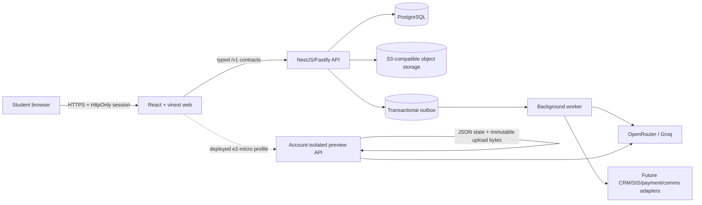
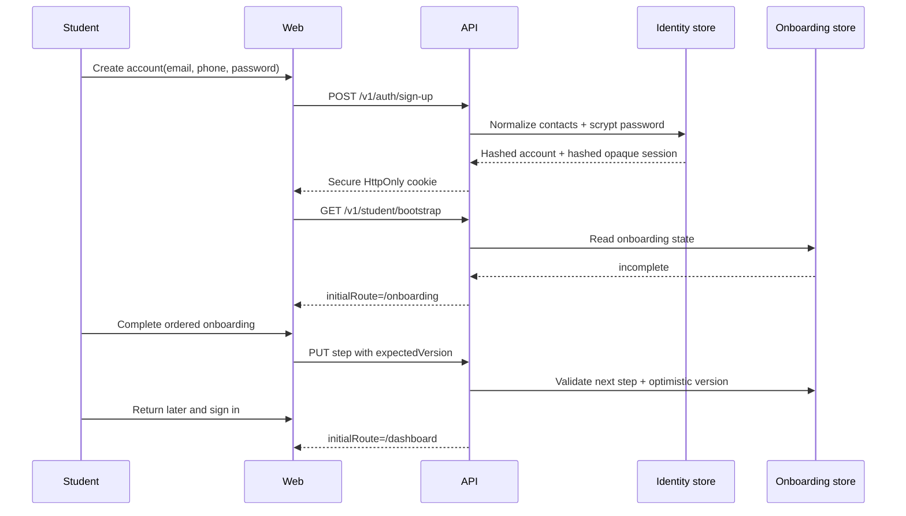
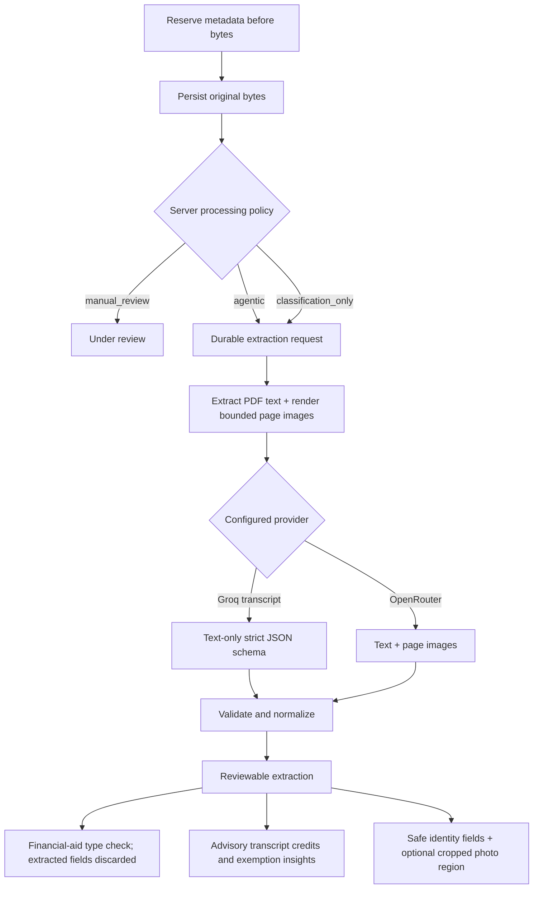

# Current implementation map

This document describes what the repository actually implements as of
2026-07-26. It complements the design documents by distinguishing the complete
production-oriented code path from the lighter public preview deployment.

## 1. System in one picture



Text fallback:

1. The browser renders the portal and calls same-origin `/v1` routes.
2. The production path uses NestJS, PostgreSQL, object storage, and an outbox
   worker.
3. The current micro-VM preview substitutes an account-isolated JSON store and
   durable local upload volume because the complete stack is too large for a
   1 GB VM.
4. Both paths use the same public TypeScript contracts and preserve the same
   domain boundaries.

## 2. Runtime profiles

| Capability | Local/full-stack profile | Public micro-VM preview |
|---|---|---|
| Web | `apps/web` | `apps/web` production build |
| API | `apps/api` NestJS/Fastify | `tools/demo-api` Node HTTP adapter |
| Primary state | PostgreSQL 17 | Account-isolated JSON files |
| Document bytes | MinIO/S3 adapter | Protected Docker volume |
| Async processing | `apps/worker` outbox consumer | Recoverable in-process job queue |
| Authentication | Demo identity resolver today; credential tables prepared | Real credential signup/sign-in and hashed sessions |
| AI providers | OpenRouter and Groq adapters | OpenRouter and Groq adapters |
| Edge/TLS | Environment-specific ingress | Caddy with automatic HTTPS |
| Intended use | Architecture and integration development | Synthetic-data product preview |

The preview is functional, persistent across container restarts, and
account-isolated. It is not approved for real student records, payment details,
or institutional production traffic.

## 3. Repository map

```text
apps/web
  Portal routes, components, browser state, API client, activity tracking

apps/api
  HTTP controllers, authorization context, application services,
  PostgreSQL stores, migrations, audit/outbox/runtime-lineage writes

apps/worker
  Outbox leasing, deduplication receipts, retries, dead-letter behavior,
  document extraction execution, dashboard projection

packages/contracts
  Browser/API/event types and deterministic mapping helpers

packages/state-effects
  Authoritative CRM field ownership and read/write/event registry

packages/document-preprocessing
  PDF text extraction, bounded page rendering, visual-region cropping

tools/demo-api
  Stateful preview adapter, credential store, student store registry,
  OpenRouter/Groq gateway, durable uploads

infra
  Full Compose stack, container images, hardened VM profile, CI/CD scripts

docs
  Architecture decisions, flows, models, security, operations, generated graphs
```

## 4. Primary application flows

### 4.1 First registration and returning login



Security properties:

- email and phone are normalized before uniqueness checks;
- passwords use a slow salted hash;
- only session-token digests are stored;
- sessions expire and can be revoked;
- onboarding order and completion are server-controlled;
- dashboard access is gated by the bootstrap result.

Email and SMS verification state is modeled, but delivery providers are not yet
connected.

### 4.2 Enrollment requirement

```text
Enrollment list
  -> open stable requirement slug
  -> render action inline
  -> submit form/document/payment with expected version or idempotency key
  -> transaction updates owned fields
  -> audit event + outbox event
  -> dashboard/requirement projections refresh
```

Stable examples include `profile-verification`, `identity-document-upload`,
`transcript-upload`, `financial-aid-verification`, `immunization-upload`, and
`enrollment-deposit`. UUIDs remain internal identifiers.

### 4.3 Document upload and extraction



Important invariants:

- metadata is committed before file processing;
- the original is retained if parsing fails;
- identity and transcript are agentic today;
- financial-aid uploads use document-type-only classification before staff
  review, while immunization uploads go directly to manual review;
- provider responses and normalized results are separate records;
- transcript course matching is advisory, never an official exemption;
- duplicate worker delivery cannot spend model tokens twice after a terminal
  result exists.

### 4.4 Edward AI

Edward is a bounded assistant, not an autonomous enrollment authority.

```text
Student message + page context
  -> server chooses allowlisted record projections
  -> context receipts prove which sources were read
  -> prompt sent through configured gateway
  -> response normalized
  -> safe navigation suggestions and typed widgets returned
  -> payment/upload/appointment action still calls a deterministic API command
```

Edward can display deposit, document-upload, and appointment widgets. It cannot
directly waive requirements, approve credit, change permissions, or mark a
payment successful.

### 4.5 CRM change graph and runtime lineage

The system uses three complementary forms of evidence:

1. CodeGraphContext describes static TypeScript imports and call paths.
2. `packages/state-effects` is the source of truth for domain field ownership,
   reads, writes, events, idempotency, and transaction boundaries.
3. Runtime correlation IDs, audit records, outbox events, trace/span IDs, and
   projection receipts prove what happened for an actual request.

Static code graphs are navigation aids; they are not runtime data-lineage
evidence.

## 5. Frontend surface

The student navigation contains:

- Dashboard
- My Enrollment
- My Financials
- My Classrooms
- My Campus Life
- Edward AI
- Profile

Supporting routes include documents, messages, appointments, payments, help,
sign-in, and onboarding. The responsive shell provides desktop navigation and
a mobile bottom navigation pattern.

## 6. Data authority

| Concern | Current owner | Notes |
|---|---|---|
| Credential account/session | Identity | Passwords/tokens never stored in plaintext |
| Onboarding answers | Onboarding | Versioned and student-editable |
| Admission offer | Admissions | Eventually synchronized from CRM |
| Enrollment requirement state | Enrollment | Deterministic server transitions |
| Uploaded original | Documents | Immutable evidence with provenance |
| Model extraction | Documents | Untrusted/reviewable |
| Transcript credit recommendation | Academics | Advisory pending registrar action |
| Deposit outcome | Financials | Dummy processor today; provider authority later |
| Activity signal | Analytics | Never an official record |
| Audit record | Audit | Append-only consequential action record |

## 7. Implemented versus planned

Implemented:

- functional student portal and responsive UI;
- credential accounts in the preview and production credential schema;
- resumable one-time onboarding;
- enrollment actions in their requirement pages;
- multiple file uploads, durable originals, parsing, retry, and review;
- transcript-to-advisory-course matching;
- financial, academic, campus, message, appointment, payment, profile, and help
  projections;
- Edward context orchestration and action widgets;
- activity tracking, audit/outbox lineage, state-effect graph checks;
- full local Compose stack and hardened VM preview deployment.

Not yet production-complete:

- institutional OIDC and invitation delivery;
- real email/SMS verification;
- payment processor and signed webhook verification;
- staff/leader/VP interfaces;
- official registrar exemption approval;
- production object storage, managed PostgreSQL, backup policy, and Kubernetes;
- malware scanning and institutional retention/DLP policy;
- production alerting/on-call integration.

## 8. Source-of-truth files

- Public contracts: `packages/contracts/src/index.ts`
- PostgreSQL model: `apps/api/src/database/schema.ts`
- Migrations: `apps/api/migrations/`
- CRM state effects: `packages/state-effects/src/registry.ts`
- Agent preprocessing: `packages/document-preprocessing/`
- Production store behavior: `apps/api/src/platform/`
- Preview behavior: `tools/demo-api/src/`
- Runtime deployment: `infra/preview-vm/`
