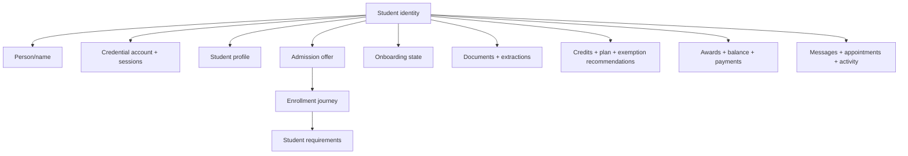
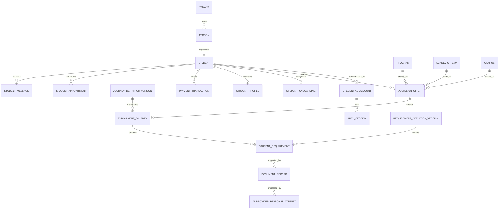
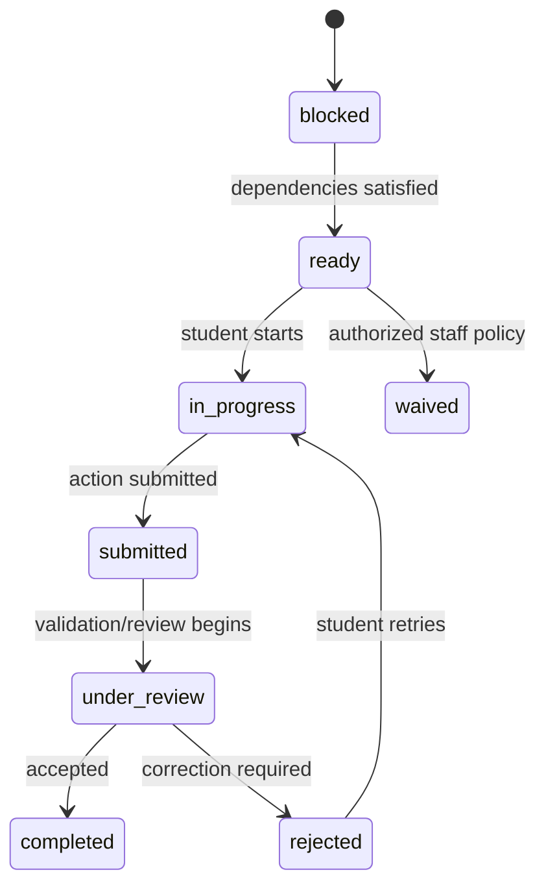

# Domain model and object reference

## 1. What “Student” means

`Student` is an aggregate identity, not one giant mutable JSON object.



This prevents unrelated modules from overwriting each other. The dashboard is
a read projection assembled from these owned records; it is not the source of
truth.

## 2. Identity and tenancy

Every production business record is tenant-scoped. The root relationship is:

```text
Tenant
  -> Person
      -> Student
          -> domain records
```

Identity records:

| Object/table | Purpose | Sensitive fields |
|---|---|---|
| `student_identity_invitation` | Single-use link between an admitted student and signup | token hash, normalized contacts, expiry |
| `credential_account` | Account lifecycle and password metadata | password hash, normalized email/phone, lockout |
| `auth_session` | Expiring/revocable browser session | token hash, expiry, revocation |
| `auth_verification_challenge` | Future email/SMS proof | token hash, destination, attempt count |

The public `StudentBootstrap` response intentionally exposes only:

```ts
interface StudentBootstrap {
  authenticated: true;
  student: { id: string; preferredName: string; fullName: string };
  onboarding: {
    required: boolean;
    status: "not_started" | "in_progress" | "completed";
    currentStep: OnboardingStep;
    version: number;
  };
  initialRoute: "/onboarding" | "/dashboard";
  generatedAt: string;
}
```

## 3. Core entity relationship model



## 4. PostgreSQL table catalog

### Institution and identity

| Table | Key facts |
|---|---|
| `tenant` | Institutional isolation boundary |
| `person` | Names and person identity |
| `student` | Student role linked to a person |
| `campus` | Tenant campus |
| `academic_term` | Start term |
| `program` | Academic program |
| `student_identity_invitation` | Expiring single-use credential claim |
| `credential_account` | Hashed-password account and verification state |
| `auth_session` | Hashed opaque sessions |
| `auth_verification_challenge` | Hashed email/SMS verification challenge |

### Admissions and enrollment

| Table | Key facts |
|---|---|
| `admission_offer` | Program/term/campus offer, deposit, versioned status |
| `journey_definition_version` | Immutable workflow definition version |
| `requirement_definition_version` | Blocking/dependency/submission policy |
| `journey_requirement_definition` | Definition many-to-many join |
| `enrollment_journey` | Student-specific journey for one offer |
| `student_requirement` | Instantiated requirement, status, due date, progress |
| `student_onboarding` | Ordered steps, payload, version, completion |

### Student operations

| Table | Key facts |
|---|---|
| `student_profile` | Student-editable contact preferences |
| `student_message` | Inbox/read state |
| `student_appointment` | Advising/support appointment |
| `payment_transaction` | Deposit result and processor reference |
| `document_record` | Metadata, storage locator, SHA-256, extraction |
| `ai_provider_response_attempt` | Correlated provider response/transport evidence |
| `help_article` | Tenant help content |

### Reliability, audit, and projections

| Table | Key facts |
|---|---|
| `audit_event` | Actor, authorization basis, request/correlation IDs |
| `outbox_event` | Transactional domain event with lease/retry state |
| `activity_event` | Allowlisted client signal with lower trust level |
| `idempotency_record` | Request hash and replay-safe response |
| `student_portal_projection` | Query-optimized dashboard snapshot |
| `projection_event_receipt` | Event-handler deduplication |

## 5. Public contract families

The browser and API share `packages/contracts/src/index.ts`.

| Family | Important types |
|---|---|
| Dashboard | `StudentDashboard`, `AdmissionOfferSummary`, `StudentRequirementSummary` |
| Onboarding | `StudentOnboarding`, `StudentOnboardingData`, `StudentHousingPlan` |
| Requirements | `StudentRequirementDetail`, `StudentRequirementList` |
| Documents | `StudentDocument`, `StudentDocumentExtraction`, `ExtractedTranscriptCourse`, `ExtractedDocumentVisualRegion` |
| Edward | `AskEdwardInput`, `AskEdwardResponse`, `EdwardContextReceipt`, `EdwardActionWidget` |
| Academics | `StudentAcademics`, `CatalogCourse`, `AcademicProgram`, `TranscriptCredit`, `CourseExemptionRecommendation` |
| Financials | `StudentFinancials`, `FinancialAward`, `FinancialDocumentRequirement`, `StudentPayment` |
| Campus | `CampusLifeFeed`, `CampusEvent`, `StudentClub` |
| Operations | `StudentMessage`, `StudentAppointment`, `HelpArticle` |
| Tracking | `ActivityEventInput`, `ActivityEventName` |
| Errors | `ApiErrorResponse` |

## 6. Enrollment state

Requirement statuses:

```text
not_applicable
blocked
ready
in_progress
submitted
under_review
completed
waived
rejected
expired
```

Common transition:



No React component or model response may directly assign these states.

## 7. Document model

```ts
type StudentDocumentProcessingMode = "agentic" | "manual_review";

interface StudentDocument {
  id: string;
  requirementId?: string;
  fileName: string;
  mimeType: "application/pdf" | "image/jpeg" | "image/png";
  sizeBytes: number;
  category:
    | "identity"
    | "residency"
    | "transcript"
    | "financial_aid"
    | "health"
    | "consent"
    | "other";
  processingMode?: StudentDocumentProcessingMode;
  status:
    | "placeholder"
    | "uploaded"
    | "processing"
    | "needs_review"
    | "under_review"
    | "accepted"
    | "rejected";
  sha256?: string;
  contentUrl?: string;
  extraction?: StudentDocumentExtraction;
  createdAt: string;
}
```

`StudentDocumentExtraction` contains normalized fields, transcript courses,
optional normalized profile-photo coordinates, warnings, provider/model,
processing time, failure classification, retryability, and verification state.
Raw provider responses are stored separately in
`ai_provider_response_attempt`; they do not become browser contracts.

## 8. Academic model

`StudentAcademics` is a generated view:

```text
selected program
+ versioned course catalog
+ program requirements
+ normalized transcript credits
+ versioned equivalency rules
= academic plan and advisory exemption recommendations
```

Recommendation status is one of:

```text
suggested -> needs_review -> approved | denied
```

Only `approved` is an official exemption. Agentic matching creates
`suggested`/`needs_review` evidence.

## 9. Financial model

`StudentFinancials` includes:

- cost of attendance;
- accepted/pending aid;
- payments and remaining balance;
- awards by federal/state/institutional/private source;
- required financial documents;
- payment-plan choices;
- satisfactory academic progress (SAP).

Money is represented in integer cents. A model cannot calculate or record an
authoritative payment result.

## 10. CRM field ownership

The authoritative ownership types are:

```ts
type DomainOwner =
  | "identity"
  | "admissions"
  | "onboarding"
  | "documents"
  | "academics"
  | "enrollment"
  | "financials"
  | "student-profile";
```

Each `StateEffect` declares:

```ts
interface StateEffect {
  id: string;
  owner: DomainOwner;
  kind: "command" | "event_handler" | "projection";
  handler: string;
  reads: readonly string[];
  writes: readonly string[];
  emits: readonly string[];
  consumes: readonly string[];
  synchronousCalls: readonly string[];
  idempotency: IdempotencyContract;
  transaction: TransactionContract;
}
```

CI rejects:

- duplicate field ownership;
- undeclared reads/writes;
- synchronous effect cycles;
- event handlers without event-scoped deduplication;
- stale generated Mermaid/JSON graphs.

## 11. Example composed student view

This is an explanatory projection, not a database row:

```json
{
  "identity": {
    "studentId": "uuid",
    "preferredName": "Alex",
    "onboardingComplete": true
  },
  "admissions": {
    "offerStatus": "accepted",
    "program": "Computer Science"
  },
  "enrollment": {
    "journeyStatus": "in_progress",
    "completionPercent": 46,
    "nextRequirementSlug": "transcript-upload"
  },
  "academics": {
    "transcriptCredits": [],
    "exemptionRecommendations": []
  },
  "financials": {
    "remainingBalanceCents": 0,
    "depositStatus": "pending"
  }
}
```

Every section is loaded or projected from its owning module. A single profile
save cannot silently mutate academics, financials, or admissions.

## 12. Concurrency and consistency

- `version`/`expectedVersion` protects student-editable aggregates.
- `Idempotency-Key` protects consequential commands and external retries.
- domain records, audit record, and outbox event commit in one transaction.
- event receipts deduplicate worker handlers.
- correlation/causation IDs connect request, state effect, audit, outbox, and
  telemetry.
