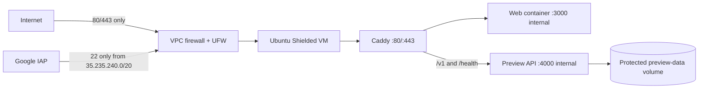
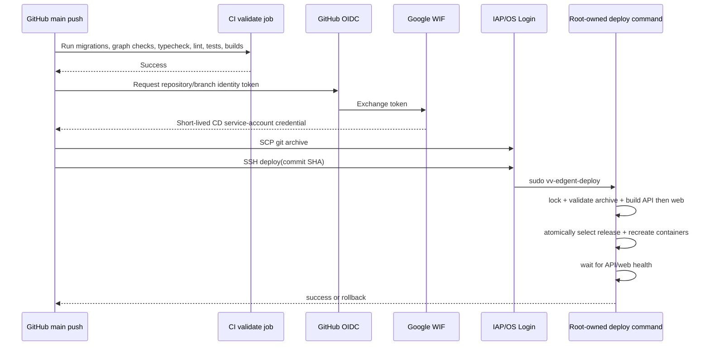

# Deployment, security, and CI/CD runbook

## 1. Current deployment

| Setting | Value |
|---|---|
| Cloud | Google Compute Engine |
| Project | `even-advantage-502610-n1` |
| Instance | `deneme-harness` |
| Zone | `us-central1-a` |
| Machine | `e2-micro` |
| Public URL | `https://aster.34-30-254-45.sslip.io` |
| Release root | `/opt/vv-edgent` |
| Public ports | TCP 80/443 and UDP 443 |
| Administrative path | Google IAP to SSH with OS Login |

The static address is reserved as `vv-edgent-web-ip`. Caddy obtains and renews
the TLS certificate.

## 2. Deployed topology



The unrelated legacy process on port 8000 remains locally running but is denied
by both the VPC policy and UFW.

## 3. Applied security controls

### Google Cloud

- reserved static external IP;
- deletion protection;
- Shielded VM vTPM, integrity monitoring, and Secure Boot;
- explicit public web allow rule;
- SSH allowed only from the IAP range;
- default-deny ingress for the tagged VM;
- explicit deny for the legacy port 8000;
- firewall logging;
- OS Login enabled;
- inherited project SSH keys blocked;
- obsolete static instance SSH key removed;
- repository-specific Workload Identity Federation;
- dedicated CD service account;
- OIDC condition restricted to immutable owner ID, exact repository, and
  `refs/heads/main`;
- no Google service-account key file.

### Ubuntu host

- incoming UFW default deny;
- only 80/tcp, 443/tcp, 443/udp, and IAP-origin 22/tcp allowed;
- root login, password login, keyboard-interactive login, agent forwarding,
  X11 forwarding, TCP forwarding, and SSH tunnels disabled;
- login grace time and authentication attempts bounded;
- automatic security updates enabled without automatic reboot;
- `auditd` enabled;
- network redirects/source routing disabled;
- reverse-path filtering, SYN cookies, restricted kernel pointers, and
  restricted unprivileged BPF;
- Docker users removed from the root-equivalent `docker` group;
- deployment and environment directories owned by root;
- application environment mode `0600`;
- Docker log rotation, live restore, and default no-new-privileges.

### Containers and edge

- Caddy image pinned by digest;
- only Caddy publishes host ports;
- API and web ports are internal Docker-network ports;
- read-only root filesystems;
- all capabilities dropped for API/web;
- Caddy receives only `NET_BIND_SERVICE`;
- `no-new-privileges`;
- memory and PID limits;
- bounded writable `tmpfs`;
- health checks and `unless-stopped` restart policy;
- persistent data and certificate volumes;
- maximum request body at the edge;
- HSTS, nosniff, frame, referrer, permissions, and XSS compatibility headers;
- structured access logs with bounded Docker rotation.

### Application

- HttpOnly, Secure, SameSite session cookies in production;
- normalized unique account contacts;
- slow password hashing and account lockout state;
- hashed session tokens and revocation;
- API body and upload limits;
- MIME allowlist and document SHA-256;
- original stored before parsing;
- provider output treated as untrusted;
- idempotency for consequential commands;
- audit/outbox/runtime-lineage correlation;
- server-authored document processing policy;
- no browser or model authority over official state.

No system can guarantee that an internet service will never be attacked or
compromised. These controls materially reduce exposure; the residual-risk
section identifies what remains before real student data is allowed.

## 4. Keyless CI/CD



Security characteristics:

- CI deploys only after the validation job succeeds;
- pull requests cannot deploy;
- WIF rejects any repository, owner, or branch other than the configured main
  branch;
- the source release is addressed by the 40-character Git commit SHA;
- the archive is path-validated and symbolic links are rejected;
- only one deployment can hold the `flock` lock;
- the VM `.env` never leaves the VM;
- Git checkout credentials are not persisted;
- third-party actions are pinned to immutable commit SHAs;
- deployments use IAP and OS Login;
- failed health checks restore the previous release and image tag;
- only the newest three previous release directories are retained.

## 5. Pipeline files and cloud identities

| Item | Location/name |
|---|---|
| Workflow | `.github/workflows/ci.yml` |
| Release command source | `infra/preview-vm/deploy-release.sh` |
| Installed release command | `/usr/local/sbin/vv-edgent-deploy` |
| WIF pool | `github-vv-edgent` |
| WIF provider | `github` |
| CD service account | `vv-edgent-cd` |
| Protected environment | `/opt/vv-edgent/shared/.env` |
| Active release link | `/opt/vv-edgent/current` |
| Immutable releases | `/opt/vv-edgent/releases/<git-sha>` |
| Deployment image tag | `/opt/vv-edgent/shared/deployment.env` |

## 6. Operator commands

All administration uses IAP:

```bash
gcloud compute ssh deneme-harness \
  --project=even-advantage-502610-n1 \
  --zone=us-central1-a \
  --tunnel-through-iap
```

Check services:

```bash
sudo docker compose \
  --env-file /opt/vv-edgent/shared/.env \
  --env-file /opt/vv-edgent/shared/deployment.env \
  -f /opt/vv-edgent/current/infra/preview-vm/compose.yaml \
  ps
```

Follow application logs:

```bash
sudo docker compose \
  --env-file /opt/vv-edgent/shared/.env \
  --env-file /opt/vv-edgent/shared/deployment.env \
  -f /opt/vv-edgent/current/infra/preview-vm/compose.yaml \
  logs --follow --tail=200 api web caddy
```

Verify host controls:

```bash
sudo ufw status verbose
sudo sshd -T
sudo systemctl status auditd unattended-upgrades docker
sudo docker inspect vv-edgent-preview-api-1
```

## 7. Secret handling

The following are server-side secrets:

- `OPENROUTER_API_KEY`
- `GROQ_API_KEY`
- future database, storage, identity, email/SMS, and payment credentials

Rules:

1. Keep them in `/opt/vv-edgent/shared/.env` with root ownership and mode
   `0600` for this preview.
2. Never commit `.env`, generated Google credential files, cookies, provider
   response logs, student uploads, or database dumps.
3. Do not store a Google service-account JSON key in GitHub.
4. Rotate a provider key immediately if it appears in a terminal capture,
   issue, commit, or CI log.
5. Move production secrets to Google Secret Manager or the target Kubernetes
   secret integration before real data.

## 8. Backup and recovery

Current persistence:

- account/student JSON, uploads, and provider attempts: Docker
  `preview-data` volume;
- Caddy certificates/config: Caddy volumes;
- source releases: `/opt/vv-edgent/releases`;
- VM disk: Google persistent disk.

Required before real data:

- scheduled encrypted disk/database backups;
- object-storage versioning and retention;
- tested restore runbook;
- separate backup IAM identity;
- recovery point and recovery time objectives;
- alerting for backup failure.

Backups are intentionally not enabled automatically here because snapshot
storage can incur charges and retention is a product/compliance decision.

## 9. Residual risks and production gate

The preview must remain synthetic-data-only until:

- managed PostgreSQL and object storage replace the JSON/local-volume path;
- institutional identity and verified invitations are connected;
- malware scanning and file quarantine are implemented;
- email/SMS/payment webhooks use signed provider verification;
- centralized monitoring, alerts, and incident response exist;
- backups and restore tests are active;
- retention, FERPA, DLP, consent, and staff authorization policies are approved;
- a third-party application and infrastructure security review is complete;
- load testing or a larger runtime replaces the 1 GB VM;
- a real domain replaces the temporary `sslip.io` hostname.

## 10. Hardening source and repeatability

- New host provisioning: `infra/preview-vm/provision-host.sh`
- Repeatable host policy: `infra/preview-vm/harden-host.sh`
- Container policy: `infra/preview-vm/compose.yaml`
- Edge policy: `infra/preview-vm/Caddyfile`
- Release/rollback policy: `infra/preview-vm/deploy-release.sh`

Run scripts from a reviewed commit. Do not pipe remote shell content directly
into root.
