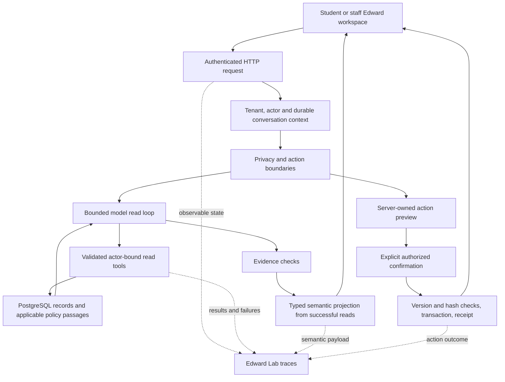

# Edward: capability evaluation and interaction redesign

Evaluation date: 12 September 2026. This report describes the local implementation,
not a deployment or a claim of human-level university advising. All people and
records in the evaluation are synthetic. The institution's snapshot clock is
8 September 2026; it is deliberately different from the evaluation date.

## What changed

Edward now separates the answer, next step, relevant record details, and policy
evidence. The backend constructs record components from successful, authorized
reads. The frontend controls presentation. Student and staff experiences share a
larger, calmer workspace, progressive disclosure, mobile layout, and reliable
stop/retry behavior. Existing transactional confirmations remain the write boundary.

The substantive changes address observed mistakes: confusing submitted evidence
with completed review, missing adviser coverage, losing explicit student identity,
treating informational questions as support requests, treating a negated send as
an action, rejecting correct arithmetic/percentage formatting, and losing current
record grounding in follow-ups. Staff can produce an actual reusable draft and
request separate preparation through the existing email capability when a sendable mailbox is configured.

Edward still has material limits. Multi-student comparison is not reliable,
appointment availability for a covering adviser is incomplete, and a numeric
claim guard cannot establish that every qualitative conclusion is correct. Some
answers still invent a causal link, miss an available document reason, or confuse
secondary global facets with personal workload. This
work does not claim perfect capability or prove that people trust the product.

## Original system and baseline

Baseline revisions were platform `cdfcc44` and portals `5e17c12`. Pre-existing
uncommitted portal changes were preserved and excluded from these commits.
The audit covered student/staff HTTP routes and services, normalization,
classification and entity resolution, model configuration, read execution,
source repositories, write gateway, durable conversations, UI rendering,
Edward Lab, telemetry, and the existing evaluation banks. Detailed initial notes
are in [BASELINE-NOTES.md](../../tools/edward-eval/experience/BASELINE-NOTES.md).

The actual request path was:

1. HTTP authentication and tenant/actor binding.
2. Service-level privacy/injection boundaries and action recognition.
3. Durable conversation loading and, for staff, identity/entity/referent resolution.
4. An actor-bound tool host and assistant pipeline.
5. For university tenants, a bounded model read loop: up to three planning rounds
   and a final answer round. Legacy tenants retain deterministic/hybrid behavior.
6. Evidence checks, response serialization, conversation persistence, and trace recording.

Actions have a separate path: deterministic patterns and an optional model
recognizer propose a capability; server code resolves targets and scope,
persists an immutable preview, checks version/hash and authority at confirmation,
executes the write, and records the receipt. Reads cannot execute writes. Preparing
an email is distinct from final send review. Edward cannot release university
holds or manufacture payment/document decisions.

University reads use PostgreSQL, not the SQLite seed or a model-generated student
profile. Tools expose overview, academic attempts and deterministic drop impacts,
ledger/awards/disbursements, relationships and coverage, documents and revisions,
and two-time event history. Staff additionally have work queues, casework,
operations, cohorts and delivery information. Policy retrieval uses indexed
PostgreSQL passages with audience, publication, effectivity and applicability
constraints. It is bounded retrieval, not an exhaustive policy audit.

The original university answer was usually plain prose plus a text list of policy
citations. The prompt explicitly discouraged headings and bullets. The floating
student window was narrow; static suggestions could offer deposit payment to a
student who had already paid. Staff had a separate panel and embedded workspace.
The model saw six recent messages, despite a larger durable transcript, and often
received an additional textual reconstruction of the prior exchange.

The initial focused deterministic suite passed **168 tests**, with three
integration tests not yet configured. That did not expose the conversational
failures below.

## Evaluation method

The new [HTTP runner](../../tools/edward-eval/experience/run.py) creates real durable
conversations through the same endpoints used by the portal. It uses seeded
student/staff identities and an isolated PostgreSQL copy. Oracle expectations
remain outside model context. Every turn preserves its HTTP response, full
available trace, selected tools, guard outcome, and latency in local artifacts.
The model receives only the normal request and authorized tool results.

The baseline contains **88 turns**: 37 university development scenarios across
student/staff roles and 51 turns across 16 new journeys. These include fragments,
typos, multi-intent requests, changing direction, ambiguous pronouns, quoted
claims, denied writes, privacy probes, and confirmation cancellation. Separate
sets contain **19 existing university holdout turns**, **31 newly authored holdout
turns**, an eight-turn mutation bank with different staff assignments and wording,
and six final unseen turns authored after the main fixes.
The long conversation crosses the six-message context boundary. Failed reads,
empty results, and confirmed-write failure are exercised separately.

Qualitative review assesses the actual requested outcome, record/policy
correctness, useful next step, continuity and unnecessary questions. Outcomes are
`success`, `partial`, or `failure`; a safe refusal is not automatically success,
and a generic fallback is a task failure even when it prevents hallucination.
Review annotations are committed individually and aggregated by
[analyze.py](../../tools/edward-eval/experience/analyze.py). The reviewer is this
Codex GPT-6 agent, not Edward's GPT-5.6 Luna model and not an independent human
panel. A free different-family review was attempted through OpenRouter: NVIDIA returned an unusable response and Google Gemma was rate-limited. No valid independent-judge score is claimed, and those attempts cost $0. No model self-score is used as evidence of correctness. This is an
engineering evaluation, not a blinded usability study or statistical estimate
for all university users.

Deterministic checks cover HTTP success, trace presence, component provenance,
absence of model-authored action URLs, actual confirmation responses,
cross-actor access denial, version/hash rejection, idempotency, unchanged state
after a failed write, and exact cents grouped by term and lifecycle status.
Grounding-guard acceptance is recorded separately from task success. It does not
prove semantic correctness. Latency is end-to-end local HTTP time and includes
provider variation and shared-machine load; it is not a controlled performance
benchmark.

Raw captured transcripts/provider-facing traces remain local and ignored, in
accordance with repository rules. The committed artifacts contain reproducible
inputs, explicit reviews, aggregate results, selected synthetic examples, and
browser screenshots. Failure transcripts were retained rather than replaced by
successful retries. Intermediate runs are kept under distinct batch names.

## Failure classes and resulting changes

| Observed failure | Root cause | Change and practical effect |
|---|---|---|
| “The shortest safe path is already complete,” while verification holds aid | Submission checklist and downstream office work represented different stages; student reads omitted office progress | Account reads now expose minimal public-facing verification stages, their owning offices, and the actual aid requirement with status meaning. Internal case notes and identifiers remain excluded. |
| Advising during leave routed to Admissions, Financial Aid and Housing | The familiar advising tool lacked the actual cover held in the relationships source | Enrich that tool with canonical active coverage. Explain unknown cover availability instead of inventing a slot. |
| Correct percentage/aid total triggered a full fallback | Evidence formatting differed from prose; a computed sum was absent from the evidence corpus | Normalize percentages before both model context and guard evidence; compute monetary aggregates in integer cents, grouped by term and status, in the account projection. |
| Follow-up quoted an earlier balance after only reading policy | Conversation text was treated as current record evidence | When a follow-up proposes unsupported numeric/date/contact tokens, use a remaining bounded round to fetch current evidence or omit the claim. The existing round cap and final guard remain. |
| Student asks who to talk to; Edward proposes a support request | Overbroad pattern and model action recognition | Contact questions remain reads; model-selected support needs explicit intervention language. A general request for advice cannot silently become outreach. |
| “Don't send it. What else is missing?” asks for an email recipient | Separate action recognizers disagreed about negation, disrupting student binding | Reject negated preparation in the action parser and keep it out of staff normalization's action classification. |
| Staff supplies a UUID but receives “identify the student” | Department/parent-name interpretation preempted explicit identity; guard fallback could clear a valid referent | Validated explicit IDs take precedence, and a prose failure does not discard an already resolved student. |
| Fact-checking a quoted message triggers an injection refusal | A legitimate quoted claim was treated as a command | Narrow read-only fact-check exception for both roles; quoted instructions still cannot authorize a write. |
| Staff asks for a draft and gets another case summary | Draft intent was incompletely recognized; repeated prior-question text competed with the new request; prepared emails required a subject | Pass the current question plus ordinary history once, recognize explanation drafts, reuse the existing typed draft block, and provide a neutral subject. Preparation still uses the existing confirmation gateway. |
| “The other class” silently selects one of several possibilities | Model guessed the referent | Strengthen clarification guidance and use existing enrollment evidence. Some replies still discuss multiple possible alternatives instead of asking; this remains a limitation. |
| “Register for orientation” despite its blocked state and complete prerequisites | The tool exposed statuses without explaining an inconsistent dependency state; staff lacked dependency codes | Both requirement tools derive unmet recorded prerequisites. An unexplained block is assigned to the owning office for reconciliation; Edward must not invent a link to an unrelated aid case. |
| Department aggregate says zero while the actual queue contains work | The loop automatically filled omitted **optional** staff/student filters with the current handles | Only required identities default to a handle. Omitted optional filters remain omitted. Explicitly requested handles still resolve and validate normally. |
| Personal workload answer uses 813 institution-wide items, or excludes overdue work from “attention today” | Board-wide facets and filtered counts were presented together; the `today` enum meant calendar date only | Label count scopes, explain date-window semantics in arguments and results, expose the already-read signed-in workload, and omit optional identity filters from schema examples. |
| Staff transcript answer omits the known rejection reason | Two document tools exposed different fidelity for the same university job | Remove the redundant legacy document tool from the university read-loop catalog; retain the canonical university document read and the legacy tenant path. |
| Main answer disappears above the viewport; excessive prose/source codes | Tail-follow scrolling and an undifferentiated paragraph renderer | Scroll to the beginning of the newest answer; separate primary answer and next step, move supporting detail into disclosure, and make passages inspectable. |

A final communication check found that an office procedure was being copied into
a student email checklist. The prompt now keeps transaction metadata out of that
guidance; the eight-turn regression produced a usable student email. Staff
comparison limits are also explained without asking people for internal handles.
Neither change adds a model call or pretends the missing comparison is supported.

The final account projection also distinguishes `ready` submission requirements
from `ready` office review stages. Empty workflow data cannot certify that aid is
complete. This was found during retesting rather than assumed from the first fix.

The resulting university request path is deliberately compact:



## Architecture choices deliberately not made

No agents, new planner, vector store, memory service, retrieval service, model
router, or separate rendering model was added. The existing PostgreSQL source
and bounded read loop were sufficient to expose and fix the main defects.
The model family is unchanged. The new response fields ride on the same final
model step; backend record projection makes no provider call.

No broad relaxation of grounding checks was made to turn failures green.
Missing cover availability, unresolved curricular distributions, unknown campus
hours, and unsupported authority remain honest limitations. There is no fake
appointment, pay, release-hold, or send button. No arbitrary model HTML, URLs,
CSS or frontend component names cross the response boundary.

The full staff multi-student comparison problem was not solved by casually
adding handles: the current execution accumulator is largely keyed by tool name,
so parallel reads of the same tool for different people need careful identity
and evidence isolation first. Asking for clarification is safer than displaying
mixed records. This is an explicit remaining capability gap.

## Interaction and semantic contract

The design review considered [Intercom's conversational Fin experience](https://www.intercom.com/help/en/articles/11433030-conversational-fin-experience) and [Notion's source-connected assistant experience](https://www.notion.com/help/notion-ai-connectors). The resulting design applies clear answer hierarchy, nearby actions and inspectable sources within Audentra's own visual language.

The floating workspace opens directly into relevant help. Student suggestions
use a small existing requirements read, without a model call or a sensitive
record dump. Completed requirements are not offered as work to do. Staff starts
with case understanding and the signed-in person's work. The composer supports
multiline input; existing voice capabilities remain available where configured.
Unsupported attachments were not added.

Desktop uses a 640-pixel workspace with room for structured answers; mobile uses
the available viewport, safe-area padding, keyboard focus containment and Escape
closure. Reopening preserves the conversation. Stop cancels the browser's wait
and explicitly says that the server may still finish. Retry reuses the original
client message ID; it does not create another user message or blindly replay a
write. New-conversation state clears a pending retry identity.

Implementation entry points: [semantic projection](../../apps/api/src/audentra/integrations/assistant/presentation.py), [bounded read loop](../../apps/api/src/audentra/integrations/assistant/read_loop.py), and [frontend renderer](../../../portals/apps/web/app/components/edward-response.tsx).

The canonical contract is
[platform/packages/contracts/src/index.ts](../../packages/contracts/src/index.ts),
with the synchronized portal snapshot. `EdwardSemanticBlock` is an additive union:

| Concept | Typed representation | Who owns its values |
|---|---|---|
| Direct answer | `answer` | Guarded model text |
| Next useful step | `next_action` | Guarded model text; not an executable button |
| Supporting explanation | `explanation` | Guarded text, progressively disclosed |
| Account/academic facts | `facts` | Successful canonical tool result |
| Requirements and review stages | `checklist` | Canonical status, owner, evidence and trusted destination |
| Adviser/office contact | `contacts` | Canonical names and addresses; validated mail links |
| Event history | `timeline` | Effective and recorded timestamps from history reads |
| Inspectable policy evidence | `sources` | Retrieved passage, version, section, applicability and citation |
| Record freshness | `record_context` | Backend snapshot time |
| Draft | Existing staff `draft` | Guarded recipient-facing text; clearly unsent |
| Consequential operation | Existing action intent/receipt | Server-owned preview, confirmation and transaction |

The existing typed lists and tables remain available. Calendar deadlines can be
expressed as concise text/facts; a dedicated appointment or comparison widget was
not added without reliable supporting data. Status lives on the relevant record
row, and operation success/failure lives on the existing receipt.

Each semantic block has `fallbackText`; record components carry provenance.
The model chooses at most two named views. Backend code chooses the rows and
values, omits unavailable views, and refuses to turn model text into navigation
or an action. Long primary prose is split at sentence boundaries for disclosure
without silently discarding the text. A direct question can still be answered in
one plain sentence; cards are not mandatory.

Policy passages are labeled **retrieved evidence**, not proof that every passage
supports every sentence. Unknown applicability is visible. Multiple retrievals
of the same tool retain their distinct sources. Secondary details, history and
policy text can be expanded without obscuring the first useful answer. Existing
confirmation controls render the actual server preview and receipt.

Lab's Architecture view explains the university request path separately from
legacy routes. Traces include semantic response construction and component
provenance, alongside tools, results, guard decisions, provider usage, actions,
errors and fallbacks. Observable decision summaries are shown, not hidden
chain-of-thought. A passed guard is explicitly described as a configured check,
not a guarantee of correctness.

## Representative journeys

**Student: financial-aid verification.** Before: “The shortest safe path is
already complete,” followed by held disbursements and a long citation. After:
a short explanation distinguishes accepted submissions from the university's
pending review, a next-step panel identifies Financial Aid, and record components
show account status and office-owned stages. The student is not told to upload
accepted documents again.

**Student: pending payment.** Before, “my friend said it clears instantly” could
lose the whole answer to a grounding failure; “who do I talk to then” opened a
support workflow. After, Edward checks current evidence and identifies Student
Accounts. Repayment guidance explicitly avoids a second payment while the first
is pending. The new holdout that initially exposed contrary advice is preserved.

**Staff: case understanding and draft.** Before, a guard failure erased the case
summary and the next two turns asked who the email should go to, despite the
selected student. After, the response identifies the university review stages,
then provides an actual recipient-facing draft with Copy draft. Asking to prepare
it still goes through the server gateway. The evaluated staff account has no
active sendable mailbox, so Edward explains that requirement and produces no
misleading confirmation button. Positive send preparation was not browser-tested
for this account.

**Staff: explicit student and parent name.** Before, the parent's name triggered
a fuzzy student lookup. After, the explicit student remains bound and the
revoked consent is checked against the record and policy. The response does not
turn a parent's claim into authorization.

## Browser evidence and verification

See the paired screenshots in [screenshots](screenshots/). Reproducible browser
scripts live in the portal's `tools/university-explorer/edward-*.mjs` files. They
use real API responses and PostgreSQL state, with no fabricated answer fixtures.
Desktop and 390×844 mobile checks cover both roles, primary-answer visibility,
horizontal overflow, source disclosure, reopening, Escape and focus return.
Additional checks cover student preview/cancellation, stop/idempotent retry,
staff draft and honest mailbox-unavailable handling, confirmed profile edit and restoration, and Lab architecture/semantic inspection.

Axe checks are scoped to the Edward dialog and use WCAG 2 A/AA and 2.1 AA tags.
They are complemented by keyboard and geometry checks; they are not a full
screen-reader or real-device audit. Browser speech/live voice, network streaming,
physical-device keyboard behavior and a human usability study are not claimed.

Validation results and quantitative comparisons are recorded in
[RESULTS.md](RESULTS.md). The report includes unsuccessful intermediate runs and
remaining limitations rather than counting only favorable examples.

## Remaining weaknesses and next improvements

1. **Cross-student comparison:** support several explicitly validated student
   handles only after changing result accumulation to retain identity per call.
   Add tests proving identical tools for different students cannot overwrite or
   mix evidence. Current clarification is safe but much slower than a good employee.
2. **End-to-end resolution:** Edward can explain many problems but cannot complete
   office-owned reviews or release holds. A good employee could act in the owning
   system; Edward must hand off. Broaden capabilities only with real authorization,
   review and receipt semantics, not a generic write tool.
3. **Coverage and appointment availability:** the correct cover is available,
   but their bookable slots are not fully projected. Connecting the existing
   scheduling source would avoid another navigation step.
4. **Qualitative grounding:** exact amounts, dates and contacts can be checked;
   causal interpretation, policy applicability and implied move-in permission
   remain harder. Guard acceptance is not a trust score. Domain invariants and
   adversarial case review remain necessary.
5. **Retrieval completeness and long conversations:** bounded passages can omit
   relevant detail, and six-message context can lose earlier preferences. A
   good employee remembers the case better. Expand context only after measuring
   the actual failure and token/latency tradeoff; no durable memory system was
   added speculatively.
6. **Draft/edit fidelity:** a neutral default subject is used for generated email
   drafts. Custom task title extraction and detailed draft revisions need more
   work. Generated drafts can still invent causal sequencing and need substantive
   review. The server preview is authoritative; a requested custom label must not
   be assumed applied merely because an action succeeds.
7. **Operational context and temporal consistency:** a director's empty personal
   queue is not the same as no departmental work. Secondary global facets can still
   contaminate an otherwise correct personal answer. University snapshot time and
   live queue time also differ; the UI exposes the snapshot, but prose does not
   consistently maintain that distinction.
8. **Usability validation:** the hierarchy is substantially easier to scan in
   browser checks, but perceived understanding and trust require students and
   staff using the system. Measure time to correct resolution, not satisfaction
   with confident prose.

## Reproduce and inspect

Follow [the university setup](../../tools/university/README.md) to build the
synthetic world and import it into a **new local PostgreSQL database**. Do not run
integration tests or reset scripts against a developer's normal database.
The existing importer is not a reset command.

For the exact local evaluation environment, from `platform`:

```bash
export EDWARD_EXPERIENCE_DATABASE_URL=postgresql://dhairya2801@127.0.0.1:55487/audentra_university_edward_final
# OPENAI_API_KEY must already be in the environment; never paste it into files.
PYTHONPATH=apps/api/src apps/api/.venv/bin/python tools/edward-eval/experience/serve.py
```

Use this metered server, not `run_runtime.py`, for budgeted evaluation and browser
work. Every provider request reserves cost against the same locked ledger. It
refuses requests above $9.80. Do not delete the ledger during a budgeted task.
The default port is 45609; `EDWARD_EXPERIENCE_PORT` can select a second isolated
server. `EDWARD_EXPERIENCE_DATABASE_URL` selects its database.

In another terminal:

```bash
apps/api/.venv/bin/python tools/edward-eval/experience/run.py --batch my-regression
apps/api/.venv/bin/python tools/edward-eval/experience/run.py --batch my-university-holdout --holdout
apps/api/.venv/bin/python tools/edward-eval/experience/run.py --batch my-holdout --bank tools/edward-eval/experience/holdouts.json
apps/api/.venv/bin/python tools/edward-eval/experience/run.py --batch my-mutations --bank tools/edward-eval/experience/mutations.json
apps/api/.venv/bin/python tools/edward-eval/experience/run.py --batch my-read-fault --ids student:failed-payment,staff:failed-payment --fault university_record:error
apps/api/.venv/bin/python tools/edward-eval/experience/run.py --batch my-unseen --bank tools/edward-eval/experience/unseen.json
apps/api/.venv/bin/python tools/edward-eval/experience/run.py --batch my-empty-read --ids student:failed-payment,staff:failed-payment --fault university_record:empty
apps/api/.venv/bin/python tools/edward-eval/experience/analyze.py --batch my-regression
```

`--ids` selects journeys; `--fault` is implemented only in this local evaluation
wrapper. The production application does not expose a fault-injection header.
`boundaries.py` performs real confirmed writes on its selected isolated server
and restores the student preference; its internal test follow-up remains in that
disposable DB. `write_fault.py` expects the evaluation server on port 45610 and
checks a failure before mutation, its durable failed receipt, and unchanged
profile state. Existing PostgreSQL tests cover additional transaction invariants.

From `portals`, configure the ignored `.env.local` as in the university setup,
then run:

```bash
npm run dev
node tools/university-explorer/edward-experience.mjs
node tools/university-explorer/edward-states.mjs
node tools/university-explorer/edward-staff-draft.mjs
node tools/university-explorer/edward-receipt-trace.mjs
```

For the optional axe scan, install `@axe-core/playwright@4.13.0` outside the repository
and set `EDWARD_AXE_MODULE` to its `dist/index.mjs` before running
`edward-experience.mjs`. Screenshots, response captures and scan results go to
`portals/artifacts/edward-experience/` and are automatically ignored.

Open `/dev/edward` or `/dev/staff-edward`, select **Architecture** or **Chat + trace**,
and select a recorded turn. The **Semantic response construction** section shows
why a component is present. Provider keys and the server worker credential must
not enter browser assets. Production Lab exposure remains explicitly gated.

For live action tests, start a second metered server against a **separate** disposable
DB with `EDWARD_EXPERIENCE_PORT=45610`, then run:

```bash
EDWARD_EXPERIENCE_ORIGIN=http://127.0.0.1:45610 apps/api/.venv/bin/python tools/edward-eval/experience/boundaries.py
apps/api/.venv/bin/python tools/edward-eval/experience/write_fault.py
```

Raw evaluation files are under `platform/artifacts/edward-experience/<batch>/`.
`transcript.json` pairs every response with its trace; `cases.json` preserves the
exact input bank. `spend.json` is the task-wide usage/reservation ledger. New runs
must use new batch names to retain failures and preserve comparisons.

## Final critique

The new hierarchy makes the primary answer and next step visible within the first
mobile screen. It removes avoidable reading and repeated identification, but does
not eliminate the gap to an excellent employee. A staff member still has to inspect
ambiguous cases, resolve university data conflicts, and perform office-owned work
in the proper system. Edward can still retrieve a plausible but incomplete policy
set, infer an unsupported cause, or send a correct answer through a blunt grounding
fallback. Specific failures and residual partial outcomes are retained in the review
files; they are not treated as solved because a later paraphrase passed.

The highest-leverage next work is scoped multi-student evidence isolation, complete
covering-adviser availability, and stricter domain assertions for causal/status
claims. Additional agents, planners and memory stores would not address those
problems. User research should test time to the correct next action and whether
students distinguish “submitted,” “reviewed” and “complete” without opening details.
