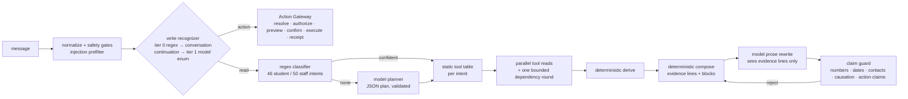

# Edward on GPT-5.6-luna: data consistency, evaluation and architecture (2026-09-02)

This report covers one engineering pass across the Audentra portals, the platform
API and both Edwards (Student and Staff). It has three threads:

1. **The database is the source of truth.** Where the portals showed stale,
   mocked or browser-derived facts, they now render canonical backend data, and
   staff have a profile experience backed by `/v1/staff/me`.
2. **Edward was evaluated read and write, for students and staff**, against
   the existing frozen banks and a new unseen generalization bank whose ground
   truth is derived from the database.
3. **GPT-4o-mini was compared with GPT-5.6-luna** on the unchanged architecture
   and on a new model-planned, deterministically-executed read loop, with the
   decision made on measurements rather than on the model's reputation.

Sections E–J hold the numbers; sections A–D explain what was measured and why.
Every figure comes from a batch under `artifacts/runs/` named in the tables.


## A. Current data architecture

### DB → backend → frontend

- **PostgreSQL** is canonical. Migrations live in `apps/api/migrations/`
  (`0000_initial.sql` … `0050_edward_write_v1.sql`); the live databases used
  here also carry `0048_morning_brew_external_context`, `0050_enrollment_document_review_history`,
  `0051`–`0053` from a sibling branch, which is why `staff_student_note`,
  `student_risk_assessment` and `document_review_decision` exist in the
  database with zero rows and no code path on this branch.
- **FastAPI** (`interfaces/http/routes.py`) dispatches every route through
  `PlatformService.dispatch(ServiceCall)` to `PostgresPlatformService`
  (`infrastructure/postgres/postgres_service.py`) and its repositories
  (`portal_repository.py`, `staff_repository.py`, `advising_repository.py`,
  `edward_action_gateway.py`). There are no Pydantic response models: the
  response shape *is* the repository mapper, and the same mapper feeds the
  portal and Edward's tools.
- **Next.js portals** consume the API only through `apps/web/app/lib/api-client.ts`
  and the contract snapshot in `packages/contracts`. The staff portal is a single
  hash-routed component (`app/staff/staff-portal.tsx`) that loads one composite
  payload, `GET /v1/staff/workspace`, and sub-fetches per view.
- **Edward** reads canonical state through per-request tool hosts whose
  primitives are the very repository reads the portal pages use
  (`_assistant_host` / `_staff_assistant_host` in `postgres_service.py`), so an
  answer can be no fresher or staler than the page.

### Canonical tables and entities (aster-demo tenant `…0003`)

| Entity | Table(s) | Rows | Notes |
|---|---|---|---|
| Student identity | `person`, `student`, `student_profile`, `credential_account` | 2,577 | email/phone live on `credential_account`; `student_profile` carries preferred name, pronouns, mobile override, communication preference |
| Program / offer | `admission_offer` → `program`, `academic_term`, `campus` | 2,577 | status, deposit amount, response deadline |
| Enrollment journey | `enrollment_journey`, `student_requirement`, `requirement_definition_version`, `student_requirement_response` | 2,577 / 20,616 | the checklist; "stage" is derived, not stored |
| Onboarding | `student_onboarding` | 2,577 | status + current step |
| Documents | `document_record` | 9,855 | review status, category, extraction |
| Payments | `payment_transaction` | 1,894 | deposit state derives from this, not from requirement status |
| Adviser relationships | `student_staff_assignment` (role ∈ primary_advisor, admissions_counselor, financial_aid_counselor, international_adviser, housing_coordinator; one current holder per role) | 7,782 | **the** link between a student and their advisers |
| Appointments | `student_appointment` | 8,051 | type, modality, status, booked slot guard |
| Staff | `staff_member` (+ `staff_availability` 355, `staff_time_off` 26, `staff_role_capability`) | 88 | title, role_code, component (= department), email, manager, employment status, timezone, office, caseload cap, appointment types; **no phone column exists** |
| Action Center / Task Board | `staff_work_item` (+ `staff_work_log` 10,824, `staff_work_item_link` 2) | 2,716 | one table: the Task Board is the column view over `GET /v1/staff/action-center`, the Action Center the filtered/paged view |
| Inquiries / messages | `student_inquiry` 194, `student_message` 2,584 | | |
| Edward write plane | `agent_action_intent`, `agent_action_receipt`, `agent_action_batch_item`, `staff_email_send_intent` | | migration 0050 |

### Where frontend and backend disagreed, and why

Found by reading every staff/student surface against the contract and the DB
(details and line references in section B):

| Surface | Inconsistency | Cause |
|---|---|---|
| Staff avatar | Clicking it signed the user out; no profile existed | The "My desk" view was removed in portals commit `8472768`; `getStaffMe`, `getStaffCaseload`, `getStaffAppointments` were left defined but unused |
| Staff roster risk pill | Every student showed "low risk" | `staff_repository.py` returned a hardcoded `{score: 0, band: "low", modelVersion: "not-evaluated"}`; no risk model exists |
| Task detail | "On track" next to an overdue `status`; SLA "time remaining" recomputed in the browser | second, browser-derived status vocabulary; `signals.overdue/overdueDays` already in the contract |
| Students view | "Search 400 test students", "Fall 2027 students", dead "Export view", per-student open work derived from the first Action Center page only | fixture-era copy and client-side derivations over a 1,000-row roster embedded in `/v1/staff/workspace` |
| Student shell | Every student's standing read "Incoming student" | hardcoded string |
| Staff Edward panel | "Read-only assistant … cannot change data" next to the write plane's action cards | stale copy from before migration 0050 |
| Appointments (student) | A scheduled appointment turned into "Completed" once the clock passed; adviser name fell back to a hardcoded team label | browser `stateOf()` / `whoLabel()` instead of canonical status and `appointment.staff` |
| Morning brew | Times pinned to America/New_York | ignored `StaffPerson.timezone` |
| Staff Edward transcript | Restarted from a fabricated welcome on remount | no message rehydration although the server conversation persists |

The common cause: the staff portal's one composite payload made it easy to
derive facts in the browser and hard to reach the richer per-entity endpoints
that already existed.

## B. Portal improvements

All portal work consumes the platform through `api-client.ts` and the contract
snapshot; no fact is computed in the browser that the backend already
computes. Verified in headless Chromium against the manual stack
(`vv_enrollment_manual`, staff Greta Radcliffe, student Lucia Zephyrine).

### New staff profile experience

The staff avatar chip now opens an accessible account menu (**Profile**,
**Sign out**) instead of signing the user out. **Profile** renders a new
`#profile` view inside the staff shell (`apps/web/app/staff/staff-profile.tsx`,
logic in `staff-profile-logic.ts`), styled after the student profile page
(hero with avatar and kicker, section cards with status headings and field
rows, right rail) and adapted for staff:

| Section | Source | What it shows |
|---|---|---|
| Who you are | `GET /v1/staff/me` → `staff`, `manager` | name, title, role, department (`component`), institutional email, office, timezone, employment type/status (leave until / ended), start date, manager with title, student-facing flag, appointment types offered, staff ID |
| Your numbers | `/v1/staff/me` → `caseload`, `work` | caseload by assignment role, primary advisees vs cap with a utilization meter, open / overdue / urgent / escalated / stale in-progress / awaiting-outcome / completed-last-7-days, each deep-linking to the Task Board filtered to `assignee=me` |
| Availability & calendar | `/v1/staff/me` → `availability`, `appointmentsToday`; `GET /v1/staff/appointments` | bookable state and reason, next open slot, open vs booked slots in 14 days, the weekly pattern in the member's own timezone, time off, today's appointments, the next 14 days, and a "Needs an outcome" list where past scheduled appointments can be marked completed / no-show through `PATCH /v1/staff/appointments/{id}` with version checking (403/409 surfaced honestly) |
| My caseload | `GET /v1/staff/caseload` | server summary plus a filterable, sortable, paged table: program, class year, requirement progress, advising status, open/overdue work, role; rows open the Students view |
| My team | `/v1/staff/me` → `directReports`, `team`, `componentSummary` | only when non-empty; member flags (on leave with caseload, over cap, falling behind, spare capacity) |
| Rail | derived only from real fields | responsibilities, timezone note, sign-out |

There is deliberately no phone number: `staff_member` has no phone column.

### Facts that were stale, mocked or browser-derived — now canonical

| Surface | Before | After |
|---|---|---|
| Staff roster / Students view | hardcoded `risk: {score 0, band low, modelVersion "not-evaluated"}` for every student | `risk` removed from the contract; a server-computed `attention {level, signals[], evaluatedAt}` from `student_requirement` (overdue, open blocking), `staff_work_item` (overdue, escalated) and `student_staff_assignment` (no primary adviser), labelled "there is no risk model behind these" |
| Students view | "Search 400 test students", "Fall 2027 students", dead "Export view", client-side substring search over a 1,000-row copy, per-student open work counted from Action Center page 1 | new `GET /v1/staff/students?query=&studentId=&limit=` (same projection as the workspace cohort, tenant-wide ILIKE search, real `cohortTotal` 2,577); per-student `openWorkItems`/`overdueWorkItems`, `externalRef`, `termName`, `campusName`, `primaryAdviser` from the roster projection |
| Task detail | "Escalated / On track" second status; SLA countdown recomputed in the browser | canonical `status` plus a separate escalation row; `signals.overdue` / `overdueDays` from the contract ("Overdue by N days" / "Not yet due") |
| Action Center outreach | pre-filled fake campaign, "Preview-only capability" copy, "modelVersion · observable enrollment behavior" | empty form; copy derived from `workspace.capabilities.externalOutreach`; attention signals |
| Personal action center counts | `critical` / `highRisk` | `urgent` / `needsAttention` |
| Staff Edward panel | "Read-only assistant … cannot change data" | "Writes need your confirmation" with preview / confirm / receipt copy; the transcript now rehydrates from `GET /v1/staff/assistant/conversations/{id}/messages` and renders `actionReceipts` / `actionError` |
| Student shell | every student "Incoming student" | derived from `bootstrap.onboarding` |
| Student profile | Student ID showed the internal UUID; no program/term/campus/class year; no adviser information | `externalRef` (SYN-…) added to `GET /v1/student/profile`; program, starting term, campus, class year from the dashboard; a "Your advisers" card from `GET /v1/student/advising` (role, email, office, bookability / next slot, server-reported gaps such as no primary adviser) |
| Appointments (student) | a scheduled appointment turned "Completed" once the clock passed; adviser label fell back to hardcoded team names | canonical status with an "Awaiting outcome" tone; `appointment.staff` |
| Morning Brew | times pinned to America/New_York | `currentStaff.timezone`, falling back to the tenant timezone |
| Topbar / Messages search | dead inputs | wired to the server student search (⌘K) and inquiry filtering |
| Dead code | `LegacyStaffActionCenter` (a second, client-filtered board), `compareStaffWorkItems` (browser copy of the API sort) | deleted |

### Action Center / Task Board consistency

Both views read `GET /v1/staff/action-center`; the Task Board pages and
filters server-side and uses the server `counts` for its column headers. An
Edward-created follow-up (write plane) appears on the board through the same
read: verified end to end below (section I).

_Superseded in run 2 (`docs/edward-run2-implementation-report.md`, section 4):
the personal Action Center was found to be derived from the roster's
top-item owner rather than the member's queue, and the Task Board badge was
tenant-wide; both now use server-computed Mine / My team / Everyone scopes._

### Remaining gaps

- `assignedStaffId` still defaults to the reader when a student has no open
  work item (pre-existing).
- `staff_work_item_link` (2 rows tenant-wide) is neither populated nor
  projected, so a task cannot show the document/payment/inquiry it came from.
- Browser E2E specs were updated to the profile surface but not run here (they
  need the synthetic-university deployment).
- Role codes are shown humanized from `role_code` ("fa counselor"); a display
  label table would read better.

## C. Edward's existing architecture

Both Edwards share one shape (`integrations/assistant/pipeline.py`,
`integrations/staff_assistant/pipeline.py`):



Staff Edward adds **identity** (the signed-in member's profile), **entity
resolution** (names → staff / students / departments through the roster, with
same-name disambiguation) and **referent resolution** (which student a turn is
about: explicit name, pasted ID, or the conversation's durable active
student) before planning. Identity arguments are never model-chosen.

What this architecture gives the model to do:

| Stage | Model's role today | Deterministic owner |
|---|---|---|
| Write recognition | tier-1 enum classification of one message (no history, no records) | tier-0 regex, continuation, Action Gateway |
| Routing | fallback planner when the regex classifier returns nothing | classifier + coverage gate |
| Tool selection | proposes tool names (validated against the intent's allow-list) | static table |
| Reading | none | tool hosts |
| Reasoning over results | none — the model never sees a tool result | derive + compose branches |
| Composition | rewrites a deterministic draft from ≤40 evidence lines | compose (2,282 + 4,300 lines of branches) |
| Safety | none | guards, refusals, authorization inside tools and gateway |

Two defects found while reading this path, both verified live:

1. **The model planner never ran in production.** Both planner JSON schemas
   violated OpenAI strict mode (`required` must list every property: the
   student schema omitted `facet`, the staff schema required a `facet` it never
   declared) so the provider answered HTTP 400 to every planner call; the staff
   planner hook additionally rejected the `context` keyword the pipeline
   passes (`TypeError` → `planner_model_failure`, 0 ms). Every eval score in
   the earlier reports was therefore produced by regex routing alone, with the
   model contributing only prose.
2. **`temperature`/`max_tokens` were hardwired.** The gpt-5.x family rejects
   both, so swapping the model name failed every assistant operation
   outright.

Both are fixed (`gateway.py`: model-family generation parameters and strict
schemas; `postgres_service.py`: planner hook signature), pinned by
`tests/test_assistant_reasoning_models.py`.

## D. Evaluation methodology

### Suites

| Suite | Kind | Cases (dev / holdout) | Ground truth | Grading | Host |
|---|---|---|---|---|---|
| `student-v3` | Student READ | 80 / 20 | REST snapshot of the in-memory eval persona, facts derived (`src/facts.mjs`) | deterministic regex/fact checks | one `audentra-eval-api` per persona |
| `staff-db` v2 | Staff READ | 80 / 20 | the product's own staff tool reads over a frozen Postgres snapshot (`vv_enrollment_staffdb_eval`) | deterministic (request types soft, tools, arguments, resolved student, facts, forbidden) | `:45710` gpt-4o-mini, `:45711` luna |
| `university` | Staff READ | 144 / 25 | plain SQL over the snapshot | deterministic; failure class from the trace | same |
| `write` | Student + Staff WRITE | 118 / 38 | none needed: effects probed by SQL, previews compared field by field | deterministic (`write/grade.mjs`) | `:45720` / `:45721` on `vv_enrollment_write_eval`, reset from `vv_enrollment_write_base` before every batch |
| `write-gen` | WRITE generalization (frozen, hash-pinned) | 201 | as above | as above | same |
| `tier1` | write recognizer in isolation | 38 labelled messages | hand labels | deterministic | in-process gateway |
| **`read-gen`** (new) | Student + Staff READ generalization | **128 / 29** | **SQL over the snapshot (`read-gen/ground_truth.py`)** | deterministic (facts, fact groups, forbidden, resolved student, required tools, failure classes) | `:45710` / `:45711` |

`read-gen` was written before any run against Edward, from real personas
chosen for difficulty: three students named Lucia Zephyrine and eight Caleb
Dunmires; students with no primary adviser, an adviser on leave, a departed
adviser, unpaid deposits, rejected documents, no appointments; a financial-aid
counselor with 541 assignments and zero primary advisees; an associate director
who owns no work items; a back-office registrar clerk. Its 16 categories cover
adviser contact and availability, deadlines and blockers, documents, status,
appointments, Action Center and Task Board, ownership, recent changes,
cross-entity and multi-intent questions, multi-turn follow-ups with pronouns
and disambiguation picks, ambiguous or incomplete data, honesty about data the
platform does not hold, authorization boundaries and unsupported actions. The
bank is exported to `docs/edward-read-gen-question-bank.csv`.

### What is deterministic and what is not

Every verdict in this report is deterministic: facts and forbidden patterns
over the answer text (with typographic punctuation folded to ASCII, so
"can’t" and "can't" grade alike for every model), tool selection and
arguments from the trace, the resolved student identifier, HTTP status,
preview fields, receipt status and SQL effect probes. No LLM judge was used.
Two consequences are worth keeping in mind when reading the tables:

- A regex bank rewards the wording it was written against. Where a model's
  answer is correct but phrased differently ("not recorded as paid" against a
  pattern expecting "not paid"), it fails. Section F lists every such case for
  luna by hand so the reader can discount them.
- `staff-db` v2 carries 14 dev + 2 holdout cases that fail on the base commit
  too (its actor, Priya Shah, owns no work items in this snapshot); the
  university bank carries three expectations written before the write plane
  existed ("Mark AST-00102 as done" now previews instead of refusing) and two
  slot-count disagreements between its explorer oracle and the product. These
  are reported as-is, never edited.

### Controls

- **Model** is a per-host setting (`OPENAI_MODEL`); two hosts per database
  serve the A/B. luna ran with `EDWARD_REASONING_EFFORT=low` for every
  operation except the write recognizer (`none`, see tier-1 results).
- **Read planner** is a per-request Lab control (`x-edward-read-planner:
  deterministic | hybrid | model`, honoured only where trace debugging is on
  and the environment is not production), so the same host serves all three
  architectures and nothing else changes between runs.
- **Zero-LLM control**: `x-edward-mode: deterministic` (existing) — the write
  suites are re-run under it after every recognizer change.
- Ground truth for the Postgres suites was regenerated on the day of the runs.
- Costs use list prices (`src/pricing.mjs`: gpt-4o-mini $0.15 / $0.60,
  gpt-5.6-luna $0.20 / $1.20 per million input / output tokens); reasoning
  tokens are billed as output and are included in the provider's completion
  count.

## E. GPT-4o-mini baseline results

Two baselines were measured. **base** is the tree as found (model planners
silently failing, see section C). **v1** is the same architecture with the
planners repaired, the family-specific generation parameters, the new
`getStudentAdvising` tool and the recognizer/composer fixes described in
section I. Every batch is deterministic-graded; "halluc" counts forbidden
claims, "entity" wrong or arbitrary student resolution, "toolsel" tool
selection or argument failures.

| Batch (gpt-4o-mini) | cases | pass / partial / fail | pass % | halluc | entity | toolsel | model calls | USD | p50 / p95 ms |
|---|---|---|---|---|---|---|---|---|---|
| base student-v3 dev | 80 | 75 / 4 / 1 | 93.8 | 0 | 0 | 1 | 90 | 0.022 | 1157 / 1895 |
| base student-v3 holdout | 20 | 19 / 0 / 1 | 95.0 | 0 | 0 | 0 | 27 | 0.006 | 1116 / 1774 |
| base staff-db v2 dev | 80 | 64 / 1 / 15 | 80.0 | 1 | 1 | 5 | 82 | 0.021 | 1324 / 2634 |
| base staff-db v2 holdout | 20 | 17 / 0 / 3 | 85.0 | 1 | 0 | 0 | 22 | 0.005 | 1468 / 2033 |
| base university dev | 144 | 132 / 1 / 8 (+3 skip) | 93.6 | 0 | 0 | 0 | 144 | 0.041 | 1336 / 2014 |
| base university holdout | 25 | 20 / 0 / 3 (+2 skip) | 87.0 | 0 | 0 | 0 | 26 | 0.006 | 1225 / 2167 |
| base write dev | 118 | 118 / 0 / 0 | 100 | 0 | 0 | 0 | 22 | 0.005 | 85 / 1535 |
| base write holdout | 38 | 38 / 0 / 0 | 100 | 0 | 0 | 0 | 8 | 0.002 | 95 / 1435 |
| base write-gen (frozen) | 201 | 184 / 17 / 0 | 91.5 | 0 | 0 | 0 | 99 | 0.018 | 84 / 2081 |
| v1 student-v3 dev | 80 | **80 / 0 / 0** | 100 | 0 | 0 | 0 | 90 | 0.025 | 1161 / 2751 |
| v1 student-v3 holdout | 20 | 19 / 0 / 1 | 95.0 | 0 | 0 | 0 | 27 | 0.008 | 1207 / 2360 |
| v1 staff-db v2 dev / holdout | 80 / 20 | 64 / 1 / 15 · 17 / 0 / 3 | 80.0 · 85.0 | 1 | 1 | 5 | 82 · 22 | 0.021 · 0.005 | 1453 / 2880 |
| v1 university dev / holdout | 144 / 25 | 132 / 1 / 8 · 20 / 0 / 3 | 93.6 · 87.0 | 0 | 0 | 0 | 144 · 26 | 0.041 · 0.006 | 1500 / 2377 |
| v2 write dev / holdout / gen (after recognizer fixes) | 118 / 38 / 201 | 118 / 0 / 0 · 38 / 0 / 0 · 184 / 17 / 0 | 100 · 100 · 91.5 | 0 | 0 | 0 | 22 · 8 · 97 | 0.005 · 0.002 · 0.021 | 93 / 1244 |
| zero-LLM control: write dev / holdout / gen | 118 / 38 / 201 | 118 / 0 / 0 · 38 / 0 / 0 · 161 / 36 / 4 | 100 · 100 · 80.1 | 0 | 0 | 0 | 0 | 0 | 102 / 233 |
| tier-1 recognizer (38 labelled) | 38 | 35 correct, 1 FN, 0 wrong action, 2 FP | — | — | — | — | 38 | 0.0054 | 830 / 2566 |
| **read-gen dev (unseen)** | 128 | **58 / 3 / 67** | 45.3 | 5 | 13 | 1 | 151 | 0.045 | 1342 / 3332 |
| **read-gen holdout (unseen)** | 29 | 15 / 1 / 13 | 51.7 | 1 | 4 | 0 | 32 | 0.010 | 1346 / 4694 |

Qualitative failure modes on gpt-4o-mini (deterministic route):

- **The tuned banks hide the routing problem.** With the planners dead, every
  score above was produced by regex routing plus a prose rewrite. Repairing
  the planners lifted student-v3 dev from 75 to 80 (the four cases the regex
  could not place — "is anything happening on campus soon" — now reach
  `getCampusLife`) and changed nothing on the staff banks, whose phrasings the
  classifier was written against.
- **The unseen bank halves the score.** read-gen's 128 dev cases pass at
  45 %. By failure class: 22 query (the right tools ran but the answer did not
  carry the fact), 16 composition, 13 tool (the needed read never ran), 13
  entity, 5 hallucination. Students fare worse than staff (18/52 vs 40/76).
  Concrete misses: "who's my adviser" (British spelling never matched
  `advisor`), "whats my financial aid counselors email" (routed to aid
  support, which never read the assignment), "which of petra oakenshaw's items
  are overdue" (lower-case name not extracted → "tell me which student"),
  "pull up caleb dunmire" (eight namesakes; answered "not part of the data I
  can read" instead of asking which one), "what's going on with Ada
  Stonebrook's enrollment?" (the signed-in student's own record narrated under
  another name), "email Petra Oakenshaw for me" (a draft presented as if the
  request were done). Each of these is a regex gap, not a model limit.
- **Inherited failures.** staff-db v2's 15 dev / 3 holdout failures reproduce
  on the base commit (the actor owns no work items in this snapshot); the
  university bank's 8 dev / 3 holdout include three refusals that the write
  plane now (correctly) turns into previews, two slot-oracle disagreements,
  and one count-question recognized as a follow-up creation ("Count the
  escalated items on the board" → "Which student is the follow-up for?"),
  which is fixed.

## F. GPT-5.6-luna results

luna ran the identical code, prompts, tools and banks as v1, with
`reasoning_effort=low` (recognizer at `none`). "hybrid" and "model" are the
two read-loop architectures of section H, measured for both models.

### Same architecture (v1)

| Suite | gpt-4o-mini | gpt-5.6-luna | luna cost × | luna p50 × |
|---|---|---|---|---|
| student-v3 dev (80) | 80 / 0 / 0 | 74 / 0 / 6 → **75 / 0 / 5** after typography folding | 1.9 | 2.3 |
| student-v3 holdout (20) | 19 / 0 / 1 | 18 / 0 / 2 → **19 / 0 / 1** | 1.8 | 2.0 |
| staff-db v2 dev (80) | 64 / 1 / 15 | **66 / 1 / 13** | 2.0 | 1.7 |
| staff-db v2 holdout (20) | 17 / 0 / 3 | 16 / 0 / 4 | 2.0 | 1.9 |
| university dev (144) | 132 / 1 / 8 | **133 / 0 / 8** | 1.8 | 1.5 |
| university holdout (25) | 20 / 0 / 3 | 20 / 0 / 3 | 1.7 | 1.4 |
| write dev / holdout | 118 · 38 | 118 · 38 | 1.9 | 1.1 (p95 2.2) |
| write-gen (frozen, 201) | 184 / 17 / 0 | 182 / 18 / 1 | 1.4 | 1.1 (p95 1.9) |
| tier-1 recognizer, effort none | 35 / 1 FN / 2 FP | 35 / 1 FN / 2 FP | 1.5 | 1.5 |
| tier-1 recognizer, effort low | — | 33 / 2 FN / 3 FP | 1.5 | 1.5 |
| **read-gen dev (128, unseen)** | 58 / 3 / 67 (45.3 %) | **62 / 2 / 64 (48.4 %)** | 1.7 | 1.8 |
| read-gen holdout (29) | 15 / 1 / 13 | 15 / 1 / 13 | 1.7 | 1.7 |

Reading the luna deltas case by case:

- **student-v3**: the five remaining "failures" are all correct answers in
  wording the bank did not anticipate ("not recorded as paid", "has not been
  started", "$0 in accepted aid") plus one forbidden-pattern false positive on
  a negation ("although there is *no* official registrar hold"). One is a
  real miss (a "did my stuff go through" answer that did not name the missing
  documents).
- **staff-db / university**: same failures as gpt-4o-mini, plus a new one:
  luna carries a *previous* student's name into a cohort answer ("… including
  Ingrid Thistlebrook, who has 4 open blocking requirements") — the facts are
  true but the scope is wrong. luna uses more of the evidence it is given,
  which is a strength on cross-domain questions and a weakness when stale
  evidence is in the bundle.
- **write plane**: identical outcomes on 156 regression cases and the
  38-message recognizer; on the frozen 201-case generalization bank luna lost
  two cases to recognition variance and one to a false "I'm read-only" claim
  — which the composer prompt literally instructed ("You are read-only"); the
  stale line is removed. Raising the recognizer's reasoning effort *reduced*
  recognition accuracy (35 → 33), so the recognizer stays at `none`.
- **read-gen**: luna's +4 comes from adviser contact (6 vs 4), recent changes
  (4 vs 3) and ambiguity handling (4 vs 3); it loses on authorization (2 vs 3).
  The floor is the same regex router for both models, so the unseen-bank gap
  is the router's, not the model's.

### With the read loop (hybrid / model planner)

| Suite | 4o-mini hybrid | 4o-mini model | luna hybrid | luna model |
|---|---|---|---|---|
| student-v3 dev (80) | 74 / 1 / 5 | 71 / 2 / 7 | 71 / 3 / 6 | 60 / 3 / 17 |
| student-v3 holdout (20) | 19 / 0 / 1 | 14 / 0 / 6 | 18 / 0 / 2 | 14 / 0 / 6 |
| staff-db v2 dev (80) | 64 / 1 / 15 | 40 / 11 / 29 | 63 / 2 / 15 | 50 / 8 / 22 |
| staff-db v2 holdout (20) | 17 / 0 / 3 | 18 / 0 / 2 | 15 / 1 / 4 | 16 / 0 / 4 |
| university dev (144) | 132 / 1 / 8 | 113 / 1 / 27 | **134 / 0 / 7** | 101 / 4 / 36 |
| university holdout (25) | **21 / 0 / 2** | 11 / 0 / 12 | **21 / 0 / 2** | 17 / 0 / 6 |
| USD (university dev) | 0.042 | 0.122 | 0.071 | 0.419 |
| p50 ms (university dev) | 1435 | 1662 | 2288 | 4012 |
| **read-gen dev (128)** | **63 / 5 / 60 (49.2 %)** | 63 / 6 / 59 (49.2 %) | **70 / 4 / 54 (54.7 %)** | not run (credits) |
| read-gen holdout (29) | 14 / 1 / 14 | not run | not run | not run |

(The student-v3 loop rows were measured before the final loop fixes of
section G — money rendering and the specificity rule — which the read-gen rows
include; a re-run was cut for cost. On the unseen bank gpt-4o-mini's model
mode matches its hybrid pass count (63) at 3× the cost and 2× the latency,
and cuts entity failures from 10 to 4 because an in-loop roster search that
returns one student binds the referent — the one place full model planning
paid for itself.)

Summary table in the requested shape (dev banks; read = student-v3 +
staff-db + university, write = write + write-gen + holdouts; entity, multi-intent
and tool-call figures from read-gen where they are measured):

| Metric | GPT-4o-mini (v1) | GPT-5.6-luna (v1) | luna + hybrid loop |
|---|---|---|---|
| Overall, tuned dev+holdout read cases (369) | 332 pass (90.0 %) | 334 pass (90.5 %) | 331 pass (89.7 %) |
| Read, tuned banks (student-v3 + staff-db + university dev) | 276 / 304 | 275 / 304 (regraded) | 268 / 304 |
| Read, unseen (read-gen dev) | 58 / 128 | 62 / 128 | **70 / 128** |
| Write (dev + holdout + frozen gen) | 340 / 357 pass, 0 fail | 338 / 357 pass, 1 fail | unchanged (loop is read-only) |
| Entity resolution (read-gen entity failures) | 13 | 13 | 10 |
| Multi-intent (read-gen, 8) | 4 pass | 4 pass | 4 pass |
| Tool-call accuracy (read-gen toolsel failures / tool class) | 1 / 13 | 1 / 12 | 1 / 8 |
| Hallucination (forbidden claims, read-gen dev) | 5 | 7 | 5 |
| Honesty when data unavailable (read-gen honesty, 6) | 0 pass (all six over-scoped by entity gating) | 1 pass | 1 pass |
| Avg latency p50 (tuned read banks) | 1.2–1.5 s | 2.2–2.7 s | 2.3–3.1 s |
| Approx cost, university dev (144) | $0.041 | $0.072 | $0.071 |
| Approx cost per 1,000 read turns | ≈ $0.28 | ≈ $0.50 | ≈ $0.55 (hybrid) / $2.9 (model) |

## G. Reasoning-model architecture analysis

**Where luna materially helps.** Cross-source reasoning when it is allowed to
see results: on "What is Lucia waiting on, and who owns her next action?"
the loop on luna read blockers *and* ownership and answered both halves;
gpt-4o-mini in the same loop answered only the first. On the caseload
question that needs role awareness ("which of my advisees have overdue tasks
with me", asked by a financial-aid counselor with zero primary advisees) luna
noticed the empty default and re-queried; gpt-4o-mini reported "no advisees".
luna's composed prose is more specific and better structured, and it follows
prompt instructions literally — which is also why a stale "you are read-only"
line produced a false incapacity claim.

**Where it does not.** On the tuned banks luna is within ±2 cases of
gpt-4o-mini in every suite at 1.7–2× the cost and 1.5–2.3× the latency,
because the architecture gives it nothing to reason about: routing is a
regex, tool selection is a table, and the model only rewrites a draft. The
write recognizer is a closed enum classification where extra reasoning
*hurt* (35 → 33 of 38). A stronger model behind a deterministic composer is
a more expensive paraphraser.

**Where the current architecture constrains it.** Three things stop any
model from showing what it can do here:

1. *The model never sees a tool result.* It cannot notice that the wrong
   record was read, that a search returned three candidates, or that a
   counselor's caseload came back empty because the wrong role was assumed.
2. *Routing and composition are hand-written per intent* (46 + 50 intents,
   6,600 lines of compose branches). Any question the regex cannot place —
   45 % of the unseen bank — lands on a generic fallback, and any fact the
   composer has no branch for (the adviser's email, until this pass) cannot
   be said no matter which model rewrites the draft.
3. *Tool results are shaped for the composer, not for a model:* money in
   cents, paged queues without totals, lists truncated for size. The loop
   experiments show exactly these seams: cents read as dollars (guard hole,
   fixed by humanizing money before the model sees it), a queue page used as
   a count, a flagged adviser dropped by list truncation.

**Where deterministic orchestration is preferable.** Everything with a
correctness or safety invariant: identity and referent resolution (the loop
binds handles, never model-chosen IDs), authorization inside tools and the
Action Gateway, write recognition tier 0, preview/confirm/receipt, the claim
guard, refusals and boundaries. The measurements agree: "model" planning
over the tuned banks lost 12–33 points for *both* models at 3–10× the cost,
mostly by answering from partial results, using pages as totals, and
phrasing that the deterministic wording checks do not accept. The fully
agentic route is not the right default for questions the product already
understands.

**Should Edward become more agentic?** Selectively. The hybrid planner —
regex route for confident, well-covered intents; the model loop for the
turns the regex cannot place — is the only configuration that beats the
deterministic baseline on the unseen bank for both models while leaving the
tuned banks essentially unchanged (university holdout improved 20 → 21; the
Ada-Stonebrook-style authorization misses are gate fixes, not loop
regressions). The loop's marginal cost is confined to fallback turns.

**How to use luna and future reasoning models.** Put them where reasoning
over evidence changes the answer: the fallback read loop, cross-entity and
multi-intent questions, disambiguation choices among candidates the server
already validated, and composition from raw results with a deterministic
guard. Keep enum-style recognition and prose rewriting on the cheaper model
(or luna at `reasoning_effort=none`, which matched gpt-4o-mini on
recognition). Shape tool results for models (totals with pages, dollars not
cents, explicit "role" and "scope" fields) before widening the loop's remit.

## H. Recommended Edward architecture

Hybrid by default (`EDWARD_READ_PLANNER=hybrid`), model loop on luna with
`reasoning_effort=low` for the loop and the composer, `none` for the
recognizer; deterministic ownership of everything that must be right.

```mermaid
flowchart TD
  M[message + durable conversation] --> N[normalize · safety gates · injection prefilter<br/>deterministic]
  N --> W{write recognition<br/>tier 0 regex → continuation → tier 1 enum<br/>partial parse → tier 1 fills fields}
  W -- action --> AG[Action Gateway<br/>resolve target from canonical state · authorize · preview<br/>confirm (version + sha) · execute · receipt]
  AG --> R2[read half of a compound turn<br/>same hybrid route]
  W -- read --> ID[identity + entity + referent resolution<br/>roster search · same-name disambiguation<br/>pasted ID wins · handles: student / me / staff:N]
  ID --> C{regex classifier}
  C -- confident, covered intent --> T[static tool table + coverage gate<br/>parallel reads · bounded dependency round]
  T --> K[deterministic derive + compose<br/>evidence lines + blocks]
  K --> RW[model prose rewrite]
  C -- no confident intent --> L[model read loop ≤3 rounds<br/>plan reads as JSON → validate args → bind handles<br/>execute → results (money humanized, lists bounded) back to model → answer]
  L --> GD[claim guard over flattened results<br/>numbers · dates · contacts · causation · action claims]
  RW --> GD
  GD -- reject --> K
  GD -- accept --> OUT[answer + receipts + trace<br/>readPlanner · readLoop rounds/guard]
```

Data flow: canonical PostgreSQL → repository reads → per-request tool host
(same reads as the portal pages) → either the static table or the loop →
guard → durable conversation + trace. The loop's tool catalog is generated
from the staff argument schemas (`STAFF_TOOL_ARGUMENTS`) and the student tool
descriptions, so a new tool is available to the model the moment it is
registered.

Read handling: confident regex → deterministic; otherwise the loop, with a
hard cap of three plan rounds and six calls per round, structural result
bounding, and identity arguments that only ever come from server-validated
handles (a raw identifier in a plan is rejected with a visible reason; a
canonical roster search that returns exactly one student binds the handle for
the rest of the turn).

Write handling: unchanged and deterministic — tier 0/continuation/tier 1
recognition, then the Action Gateway's preview → confirm (expected version
and content hash) → execute → receipt; the loop is never given a write
tool. Two recognizer gaps found live were closed: a partially parsed
preference change now asks tier 1 to fill the missing fields instead of
silently dropping half the request, and a named follow-up subject can bind to
a requirement under review.

Confirmation and guardrail boundaries: the model can propose reads and
prose; it cannot choose identity, cannot authorize, cannot write, and cannot
state a number, date or contact that no read returned. `x-edward-mode:
deterministic` still removes every model call for a turn, and
`x-edward-read-planner` selects the read architecture per request in Lab
environments so future changes can be A/B'd on one host.

## I. Before vs after

**Student READ — "Who is my advisor and what is their email?"** (Lucia
Zephyrine, SYN-001278; DB truth: primary adviser Caleb Mossbank,
caleb.mossbank.adv4@synthetic.aster.example; also Kwame Radcliffe
(admissions), Greta Radcliffe (financial aid), Matthias Gunnarsson
(international)).
Before: classified `appointments`, read `getStudentAppointments` only, replied
"Your advisor's name and email are not listed in the information available".
After: `getStudentAdvising` exists, the `appointments` route reads it, the
composer renders adviser lines; reply: "Your advisor is Caleb Mossbank, and
you can reach him at caleb.mossbank.adv4@synthetic.aster.example. … you have
an appointment scheduled for August 31, 2026." The same answer comes from the
loop. Better because the fact now comes from `student_staff_assignment`, the
same table the new profile "Your advisers" card renders.

**Student READ + WRITE (compound) — "What's my preferred name right now?
Please change it to Lucy and set my pronouns to she/her"** (DB before:
Lucia / null).
Before: read half answered "Your next step: Complete financial-aid
verification" (the question was unclassifiable → safe fallback); the preview
carried only `pronouns → she/her` ("change it" had no noun for the regex);
recall said "I changed your your pronouns".
After: "Your preferred name right now is Lucia. … I can set your preferred
name to Lucy and your pronouns to she/her. Nothing has been saved yet" with a
two-field preview; after confirm the row reads Lucy / she/her (version 2),
`GET /v1/student/profile` agrees, and "did that actually go through?" answers
"Yes — I changed your preferred name to Lucy, and your pronouns to she/her."
Better because the read half now takes the hybrid route (`personal_information`
also matches "what's my preferred name"), tier 1 completes a partial tier-0
parse, and the receipt wording is correct.

**Staff READ — "What is Lucia Zephyrine SYN-001278 waiting on, and who owns
her next action?"** (DB truth: transcript under review, financial-aid
verification in progress; open items owned by Cormac Gunnarsson, Matthias
Gunnarsson, Jasper Njoku, Greta Radcliffe, Yusuf Crane, Rosalind Zaragoza).
Before: "I found 3 students matching Lucia Zephyrine — which one do you
mean?" — the pasted ID was ignored because the name was ambiguous.
After (deterministic): resolved by external reference, answers the blockers
and the six owners with the ownership table. After (luna loop): "Lucia is
waiting on university review of her official transcript and on completing
financial-aid verification. The transcript review is owned by Yusuf Crane in
the Registrar's office … Greta Radcliffe owns the related Financial Aid
follow-up." gpt-4o-mini in the same loop answered only the first half.

**Staff READ — "Which of my advisees have overdue tasks sitting with me right
now?"** (Greta Radcliffe, financial-aid counselor: 541 assignments, 0 primary
advisees; DB truth: 47 assigned students have overdue items she owns).
Before: `getStaffCaseload` defaulted to the primary-adviser role → "You have
no advisees with overdue tasks". After: the tool reads every assignment role
by default and its description states that per-student work counts include
every owner; the loop now lists students. Remaining gap: the caseload
projection counts overdue work by *any* owner, so "sitting with me" still
needs `searchWorkQueue ownership=mine` combined with the caseload — a
cross-source reasoning step luna performs and gpt-4o-mini does not.

**Staff WRITE — "Add a follow-up for Lucia Zephyrine SYN-001278 about her
transcript, due Friday, and assign it to me"** (Greta).
Before: preview bound the follow-up to "Complete financial-aid verification"
because the transcript requirement was under review and outside the
"actionable" set; the item was created with the wrong subject.
After: preview targets "Submit your official transcript"; confirm creates
`MAN-B2EFF46D` (todo, high, due 2026-09-04, assignee Greta), the row is in
`staff_work_item`, `GET /v1/staff/action-center?studentId=…` returns it, the
Task Board search shows it, and "did that go through?" answers with the key.

**Staff READ — "Count the escalated items on the board."**
Before: recognized as a follow-up creation ("Which student is the follow-up
for?"). After: a read verb with no create verb is a read; answers the queue
aggregate.

**Student READ (authorization) — "can you check whether Gustav Fennwick paid
his deposit yet"** Before: answered from the signed-in student's own record
("No, the $500 enrollment deposit has not been paid yet"). After: refused —
"I can't access or reveal another student's information."

## J. Remaining limitations and recommended next steps

What Edward still cannot do reliably:

- **Unseen phrasings on the deterministic route** still pass only about half
  of the read-gen bank (45–49 %); the loop closes part of that gap but not
  all, and luna's model-only mode was not measured on read-gen for cost
  reasons.
- **Aggregates through the loop**: a paged queue read is not a count, and
  structural truncation can hide the one flagged row a question is about.
  Tools need model-facing shapes (totals alongside pages, filtered views,
  explicit role/scope fields) before the loop should answer counts.
- **Cross-source semantics**: "overdue tasks sitting with me" needs the queue
  joined to the caseload; the caseload projection alone cannot say it.
- **Exact next-open-slot facts** are not derivable outside the product's slot
  engine, so the bank grades bookability only.
- **Context bleed on luna**: a previous student's name can appear in a cohort
  answer when the evidence bundle still carries it; the composer should be
  handed scope-filtered evidence.
- **Recognizer variance**: tier 1 on either model misses ≈1 in 38 and
  over-triggers 2 in 38; multi-field extraction depends on tier 0 seeing a
  cue word.
- Grader brittleness remains a measurement risk: regex banks reward the
  wording they were written against; typographic folding fixed one class of
  false failures, negation-blind forbidden patterns remain.

Recommended next steps, in order:

1. Ship `EDWARD_READ_PLANNER=hybrid` on luna (`low` for loop/composer,
   `none` for the recognizer) behind the Lab header for a staff pilot; keep
   `deterministic` as the rollback.
2. Reshape tool results for models: totals on every paged read, dollars not
   cents everywhere, `role`/`scope` fields on caseload and queue reads, and
   keep flagged rows when bounding lists.
3. Add the read-gen bank to CI as a non-blocking trend (dev only; holdout
   quarterly), and re-run it after every classifier change — it is the only
   suite that measures generalization.
4. Extend the loop's fallback coverage deliberately: lower-case and nickname
   entity extraction, "the one in Economics" picks, and the authorization
   gate for named third parties (done for the common shapes; keep adding).
5. Retire compose branches the loop already covers only after read-gen
   parity is shown per intent; do not remove deterministic routes wholesale.
6. Expose `staff_work_item_link` and a real "recent changes" read for
   students so "what changed" questions have canonical evidence.
