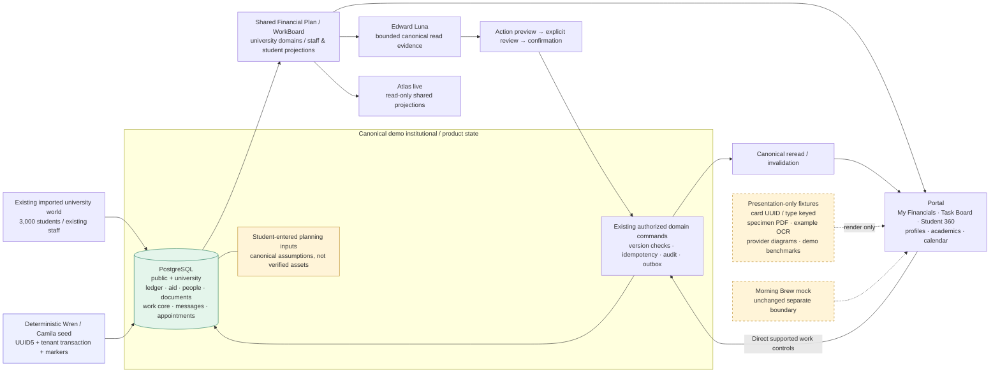

# Wren & Camila demo iteration

Work is confined to the existing `audentra-vnext/platform` and `audentra-vnext/portals` integration clones. Nothing was pushed or deployed. The product/visual reference was the live **https://test.audentra.ai** website, inspected with Chromium; donor repositories were not used as visual authority or modified.

## Baseline and boundaries

See [the recorded baseline](demo-excellence-baseline.md). Starting platform branch/HEAD: `integration/audentra-vnext-platform` at `b01155c1a37dac4dd80308ffa7946e197a11fb86`. Starting portal branch/HEAD: `integration/audentra-vnext-portals` at `6d31120787e4179bcb1ef2e71036275638776d39`.

The platform already had user changes to `docs/integration/README.md` and `tools/university/run_runtime.py`. Those changes were preserved and excluded from this iteration's commits. Existing Edward GPT-5.6 Luna, model read planning, shared PostgreSQL projections, document decisions, outreach drafts, and action confirmation infrastructure were retained.

This is one handcrafted student and one primary staff persona. Eight other existing students receive ordinary adviser handoffs and a few operational cards to make Camila's caseload believable; their financial, academic, and personal records are not enriched to Wren's level. The other 87 staff profiles are not expanded.

## The two personas

**Wren Halloway**, `SYN-000000`, student UUID `ac2fa509-b4e3-402d-900b-ffb8440fc430`, is an existing in-state Computer Science student, Fall 2026 entry, Class of 2030, at Aster Main Campus. They use they/them pronouns. Existing identity, contact information, admissions/enrollment evidence, current classes, housing, meals, institutional deadlines, catalog, and campus directories remain canonical.

- Four current classes: AST 100, CS 101, MATH 151, WRIT 101; 12 enrolled credits.
- Six accepted Summer Bridge transfer credits: HIST 110 and PSY 101, three credits and grade A each. Received August 1, evaluated August 12. Current course enrollment is not counted as completed credit.
- Existing Alder Hall assignment, ALD-107A, and unlimited meal enrollment remain intact. A quiet-study housing conversation does not imply a room transfer or approval.
- The former academic adviser assignment ends September 7; **Camila Abernathy** becomes primary adviser in both the university relationship record and the product assignment model. Existing financial-aid, admissions, and housing relationships remain available. Hollis Castellanos remains the financial-aid contact shown in My Financials.
- Two scheduled in-person conversations with Camila: September 14, 10–10:30 a.m., semester funding; September 15, 11–11:30 a.m., academics and campus involvement. Both are in Advising Centre room 204, Eastern time.
- Original accepted enrollment documents remain. Insurance waiver evidence and a fall enrollment verification letter are under review. The latter does not reverse the accepted transfer-credit evaluation.
- A formal Fall funding/registration support case has a completed agreement step, entrance counseling and promissory-note steps ready for the student, and a blocked loan-release step dependent on both.
- Three canonical portal inbox messages explain the funding plan, acknowledge waiver review, and invite exploration of Aster Robotics and the upcoming Family Weekend. They do not enroll the student in a club or event.
- Four dated history entries describe the returned payment, Pell posting, agreement, and adviser handoff, linked to their actual canonical entities.

**Camila Abernathy**, staff UUID `01973261-954a-5019-8e9e-24a699abea7b`, demo reference `AU-55ff7e408818`, university staff ID `55ff7e408818cef52c5c5bb8`, is the existing Director, Academic Advising Center, with the `operations_lead` role.

Her existing office, team, published availability, three direct reports, and 80-student primary-adviser capacity are retained. The demo has nine primary advisees and 21 assigned open cards, including seven urgent blocked items. Four coordination meetings/follow-up blocks complement Wren's two appointments. Meeting blocks are also entered into the existing booking-authority `staff_time_off` table so those times are not offered as free appointments. Existing time-off/coverage records remain visible; no fictional manager or leave approval is added.

Four saved outreach drafts remain **unsent**. The semester-support message has a matching canonical portal inbox message, staff interaction, and delivered portal communication event; it is seeded portal history, not a claimed external email delivery. The board includes ten document-review examples, five payment examples, outreach work, housing requests, student requests, and a linked formal case.

## One reconciling financial story

Wren's original $11,500 family ACH was returned. Its original credit stays in the ledger, with an explicit linked $11,500 reversal. A replacement $2,000 payment has posted. Insurance remains charged while a waiver is reviewed. A $1,750 loan disbursement is held for counseling and a promissory note. A signed installment agreement anticipates that loan's release; signing an agreement or starting a payment does not remove the hold.

| Fall charges | Amount |
|---|---:|
| Tuition | $9,200.00 |
| Mandatory fees | $725.00 |
| Housing | $3,625.00 |
| Meals | $1,450.00 |
| Student health insurance | $1,850.00 |
| Payment-plan enrollment fee | $45.00 |
| **Posted charges** | **$16,895.00** |

| Posted funding / resulting balance | Amount |
|---|---:|
| Aster Access Scholarship, Fall disbursement | $3,000.00 |
| Pell Grant, Fall disbursement | $3,697.50 |
| Posted enrollment deposit | $500.00 |
| Posted replacement family payment | $2,000.00 |
| **Net posted funding** | **$9,197.50** |
| **Posted account balance** | **$7,697.50** |

`$16,895 − $6,697.50 posted aid − $2,500 net posted payments = $7,697.50`.

Payment-state totals are posted $2,500; pending $1,982.50; failed $1,250 across the $750 card attempt and earlier $500 deposit failure; reversed $11,500. Gross historical payment credits total $14,000, but $11,500 was reversed. The dashboard adapter and My Financials funding chart now remove that linked reversal from the displayed current payment funding. The original ledger remains available as history.

Annual account aid offered is **$18,895**, accepted **$16,895**: Access $6,000 accepted; Pell $7,395 accepted; Direct Subsidized Loan $3,500 accepted; Merit $2,000 offered but unaccepted. Campus employment authorization of $3,000 annually is shown separately and excluded from account-aid totals. Actual posted term aid is $6,697.50; anticipated/held term loan aid is $1,750. No personalized loan interest rate was invented.

After anticipated loan aid, the account gap is **$5,947.50**. The agreement has $5,902.50 principal plus the already-posted $45 fee, and three $1,982.50 installments due September 15, October 15, and November 15. The first payment attempt is pending. If the loan remains held, the extra $1,750 is still owed; the agreement is not a promise of aid release or hold clearance.

Student-entered **term assumptions**: savings $1,500, family support $2,500, expected employment $1,800; total $5,800. Books $600, transportation $350, personal/phone $400, groceries $400, off-campus rent $0, other $0; living expenses $1,750. Campus housing/meals are already on the institutional bill. These inputs and the saved commuter scenario are canonical *planning inputs*, not verified institutional assets or income.

## Canonical versus presentation-only financials

| Canonical and Edward-readable | Presentation-only |
|---|---|
| Charges, linked reversals, payments and lifecycle state | Chart colors, layout, icons and explanatory copy |
| Offered/accepted awards, posted/held disbursements | Optional product/coverage descriptions and illustrative provider details |
| Holds, document state, workflow requirements and dependencies | Visual product packaging; no insurance approval or price quotation inferred |
| Assigned housing, meal enrollment, insurance waiver state | Illustrative scenario explanation; server-computed scenarios remain explicitly estimates |
| Agreement, fee, installments, catalog rates | No fabricated authoritative historic account series |
| Student-entered budget assumptions, saved scenario | Document/provider specimens are not financial evidence |

The deployed Plan Studio shell, gradient header, stacked cards, expense navigation, coverage surface and simulator remain. New rings and legends use actual posted charges and **net** posted credits; aid cards distinguish offers, acceptance and disbursement. Payment history, installments, requirements, housing, meals and planning inputs are populated from the shared Financial Plan service. No independent browser financial store was introduced.

## Task Board core and fixtures

Every curated card is a PostgreSQL `public.staff_work_item`, projected by the existing `WorkBoardProjection` with its linked domain evidence. Its core includes UUID, stable `DEMO-*` key, title, description, student, work/action type, component/responsible office, derived project, operational status, priority, assignee, due date, timestamps and optimistic version. Document IDs, payment runtime links, workflow links, draft references, communication events and work history remain canonical.

The project is a **projection of the existing domain/component**, not a second editable project store. The separate `status` shown by document/payment workflow columns reflects evidence; `operationalStatus` represents staff work. The added **Work status board** groups the same cards by operational status so a safe “In Progress” change visibly moves a card without pretending that an ACH settled or a document was approved.

| Deployed project | Curated cards | Total project cards after seed |
|---|---:|---:|
| Financial Aid / Document review (`fa-docs`) | 5 | 102 |
| Financial Aid / Outreach (`fa-outreach`) | 5 | 5 |
| Financial Aid / Payments (`fa-payments`) | 5 | 9 |
| Enrollment / Document review (`en-docs`) | 5 | 857 |
| Enrollment / Outreach (`en-outreach`) | 5 | 6 |
| Enrollment / Student requests (`en-requests`) | 5 | 167 |
| Campus Life / Housing requests (`cl-housing`) | 5 | 6 |

Camila opens a curated `DEMO-` server search by default. A visible toggle exposes the entire institutional queue. Search/filtering still happens before pagination. Sidebar counts and project summaries describe the whole project; matching/page counts describe the current filter. Other staff accounts open the ordinary full board. Every curated project has varied statuses, priorities, owners and dates.

`portals/apps/web/public/action-center-approved/src/demo-detail.js` contains deterministic, UUID/key/type-scoped **presentation fixtures**: a specimen document, highlighted example field, two-page visual, extraction comparison table, confidence label, payment processing diagram, and illustrative stage benchmarks/historical averages. Specimens and benchmarks are visibly labeled as demo examples. Actual work age, due date, document decision, payment lifecycle and recorded history retain their canonical meaning. No API or Edward imports this fixture module, and fake extraction values are never submitted as review evidence. Actual original-file access and official review controls remain separate.

The existing nested sidebar, board/list modes, card layout, search, filters, grouping, sorting, details, activity/comments, related work, outreach composer/drafts and domain workflow diagrams are preserved. Drawers open directly into the relevant review, payment, communications or request workspace. Safe direct execution controls share the existing backend work command. Background refresh preserves dirty execution forms and saved/unsaved outreach drafts. Closing a drawer during an asynchronous refresh/save no longer reopens it.

### Curated card manifest

| Key | Title | Project |
|---|---|---|
| DEMO-101 | Review insurance waiver evidence | fa-docs |
| DEMO-102 | Review scholarship eligibility statement | fa-docs |
| DEMO-103 | Check tax transcript classification | fa-docs |
| DEMO-104 | Request corrected verification worksheet | fa-docs |
| DEMO-105 | Review household-size statement | fa-docs |
| DEMO-106 | Explain held loan and next steps | fa-outreach |
| DEMO-107 | Follow up on unsigned aid offer | fa-outreach |
| DEMO-108 | Schedule verification check-in | fa-outreach |
| DEMO-109 | Confirm counseling appointment | fa-outreach |
| DEMO-110 | Prepare scholarship reminder | fa-outreach |
| DEMO-111 | Review pending first installment | fa-payments |
| DEMO-112 | Follow up on failed card attempt | fa-payments |
| DEMO-113 | Review returned family ACH | fa-payments |
| DEMO-114 | Confirm replacement payment posting | fa-payments |
| DEMO-115 | Review earlier unsuccessful deposit attempt | fa-payments |
| DEMO-116 | Review fall enrollment verification letter | en-docs |
| DEMO-117 | Check transfer credit evidence | en-docs |
| DEMO-118 | Review name correction evidence | en-docs |
| DEMO-119 | Request final graduation certificate | en-docs |
| DEMO-120 | Review residency supporting statement | en-docs |
| DEMO-121 | Check in after the first week | en-outreach |
| DEMO-122 | Invite student to adviser office hours | en-outreach |
| DEMO-123 | Follow up on orientation question | en-outreach |
| DEMO-124 | Share registration support options | en-outreach |
| DEMO-125 | Confirm campus visit follow-up | en-outreach |
| DEMO-126 | Coordinate Wren’s semester support plan | en-requests |
| DEMO-127 | Review course-planning question | en-requests |
| DEMO-128 | Arrange adviser handoff | en-requests |
| DEMO-129 | Clarify prerequisite review next step | en-requests |
| DEMO-130 | Coordinate accessibility introduction | en-requests |
| DEMO-131 | Discuss quiet-study housing preferences | cl-housing |
| DEMO-132 | Review roommate mediation request | cl-housing |
| DEMO-133 | Coordinate room-maintenance follow-up | cl-housing |
| DEMO-134 | Clarify spring housing renewal | cl-housing |
| DEMO-135 | Review residence accessibility request | cl-housing |

## Edward reads and writes

`getUniversityWorkBoard` now accepts bounded project, key/search, status, priority, assignee, due window and offset arguments. Edward receives core cards plus full project summaries, with bounded context that retains totals and distinguishes filtered results from institutional counts. “Task Board” is no longer mistaken for a student's name. A resolved work key is explicitly passed to model planning as work identity. Card questions use the shared projection; no Edward-only board database or generic SQL tool was added.

Live provider checks covered 12 student questions and 11 staff questions: balance/aid/payment lifecycle, holds, requirements/documents, planning, advisers, appointments, classes/credits, deadlines, campus opportunities, recent changes; urgent/assigned/overdue/blocked work, Wren's work, payment cards, task identity, due dates, and per-project open counts. Additional financial probes check separate employment authorization, failed-payment history and unverified planning assumptions. Long responses remain bounded; a first page is not a claim of exhaustive history.

| Operation | Edward | Direct board UI |
|---|---|---|
| Priority | Preview → explicit review → confirmation → existing command | Priority selector + Save |
| Operational status | Same confirmation boundary and existing domain validation | To do / In progress selector; other stages require their supported domain operation |
| Assignment to self | Supported with existing staff authorization | Existing owner selector, including team queue |
| Due date | Supported, including normalized relative dates | UTC date/time control + Save |
| Basic work note | Existing `nextStep`/follow-up guidance remains available | Existing canonical Activity comment command |
| Project/category move | Not added: source/component routing is domain-derived | Not added |
| Payment settlement/document decision/case resolution | Not represented by a simple operational status mutation | Existing domain-specific controls and guards remain |

Priority and due-date fields were added to the strict HTTP request schema, canonical TypeScript contract, actual repository update, work logs and outbox payload. Migration `0076_work_item_priority_due_date_activity.sql` extends the existing work-log action check with `priority_changed` and `due_date_changed`. Existing action intents retain authorization, preview hash, expected versions, idempotency, recovery, receipts and audit. Recovery compares the newly supported fields rather than falsely reporting success from status alone. Document/payment/case terminal changes require their owning domain.

## Synchronization evidence

The browser action harness signs in through the real restricted demo mechanism against a disposable seeded PostgreSQL runtime, asks Edward for the old state, requests each of four changes, checks that preview has not mutated the record, ticks the existing explicit-review checkbox, confirms, verifies one version increment, observes the refreshed board, reads the same record through Atlas, and asks Edward again. It then changes priority and status through the actual drawer controls and verifies the canonical API, Atlas, and Edward reread.

| Confirmed browser action | Before → after | Receipt |
|---|---|---|
| DEMO-126 priority | High → Low | `2b8c09ea-5d2f-4a4e-a032-0fbef459fcb0` |
| DEMO-126 operational status | To do → In progress | `6492328c-0684-409a-a397-ec4ca9944088` |
| DEMO-129 assignment | Team queue → Camila | `e6b0c99d-5b4b-4e86-b0ea-207037917dc5` |
| DEMO-126 due time | September 14, 21:00 UTC → 17:00 UTC | `9cb1399b-56d2-4a56-835d-54110347b990` |
| Direct UI reverse change | Low / In progress → High / To do | Canonical API, Atlas and Edward reread agree |

[Recorded synchronization evidence](../../../portals/artifacts/demo-excellence/final/synchronization.json) contains before/after fields and receipt IDs. [Live local parity results](../../../portals/artifacts/demo-excellence/final/parity.json) compare the entire Financial Plan response and first-page WorkBoard cards/project summaries with Atlas, verify net dashboard payments, all seven curated counts, and Atlas's read-only mutation rejection. Mutation tests operate on the disposable demo database; the interactive main demo is left at its authored initial state.

## Staff information architecture and Student 360

The main navigation is exactly **Morning Brew → Task Board → Student 360 → Developing**, with Developing collapsed by default. Its children include Action Center, Today, Messages, Journeys, Campus Life, Academics, Knowledge, Core Plays and Edward. Staff Profile remains accessible from the account surface. The sidebar retains the live site's navy gradient and violet selection treatment, verified again directly in the deployed browser.

Student 360 is a searchable roster with Wren pinned for the demo, an identity/program/cohort header, evidence-based attention, adviser/relationship summary, posted financial totals, hold and service requirements, upcoming appointments, and an Edward entry point. Enrollment progress and active work are collapsed disclosures. The existing university record component provides Overview, Academics, Account, People & support, Documents and History. A separate disclosure reuses the substantial existing Student Inspector functionality for document, requirement and communication work. Student/task deep links open the polished board or appropriate Student 360 record.

Sources are the existing staff roster/detail, university domain record APIs, shared Financial Plan service, assignments/appointments, and existing Student Inspector APIs. There is no fabricated risk score or new Student 360 datastore. “Needs attention” is based on actual work/holds/evidence.

Action Center (`/staff#outreach`) is retained only under Developing for internal/reference access. It is not a fourth primary product. **Morning Brew's existing visuals, Vivian mock persona and deliberate demo-data boundary are unchanged**; its mock values do not enter Edward's institutional evidence.

## Repeatable build and local access

The complete base-world build/import sequence is documented in [the existing integration runbook](README.md#reproducible-rebuild). Build into a new output directory, migrate a new empty local database, import the generated university SQLite fixture, import its canonical product catalog with `import_product_runtime.py`, then apply this persona overlay. The seed fails early if the required published catalog is missing.

The additive seed is `platform/tools/university/seed_demo_excellence.py`. It requires an explicit loopback `audentra_university*` database, validates the intended existing student, uses stable UUID5 IDs, a tenant-scoped transaction, an advisory lock, and versioned markers in `university.meta`. The base marker preserves subsequent live edits; small booking/history phases are also recorded once. Rebuilding means applying migrations and this overlay to a fresh imported vNext university world, not resetting all students or overwriting an interactive database.

```bash
# Run from platform, against an already imported local world.
DATABASE_URL="$DEMO_DATABASE_URL" npm run db:migrate
apps/api/.venv/bin/python tools/university/seed_demo_excellence.py \
  --database-url "$DEMO_DATABASE_URL"
PYTHONPATH=apps/api/src apps/api/.venv/bin/python tools/university/run_demo_excellence.py \
  --database-url "$DEMO_DATABASE_URL" --port 45619
```

`run_demo_excellence.py` wraps the existing runtime and selects Wren/Camila through existing demo allowlists, with browser authentication required. It adds no production bypass. Existing one-click demo selectors at `/sign-in` and `/staff` now offer these personas. Local main surfaces: portal `http://127.0.0.1:3009`, API `http://127.0.0.1:45619`, Atlas `http://127.0.0.1:4321`. Provider credentials stay in process environment, never in the repo.

The institutional university snapshot remains **September 8, 2026**. Operational work due/overdue calculations and action timestamps use wall-clock time; the run was reviewed September 13. These clocks are deliberately not silently conflated. Wren's important upcoming appointments/installments start September 14–15. Waiver evidence was submitted before its September 11 deadline.

## Changed layers

- Seed: financial ledger/payment reversal and replacement, fund/awards/disbursements, insurance/agreement/installments, planning/scenario, hold, profile preference, adviser relationships, transfer credit, workflow/dependencies, 35 work items/logs/links, document records, drafts, inbox/communication history, appointments, calendar and booking blocks, history/provenance markers. Existing public-to-university document/appointment projections remain in use.
- Schema: one forward work-log constraint migration; no new workflow engine or parallel task store.
- API/domain: net current payment projection; explicit aid-total scope; priority/due update support through the existing request/repository path; outbox activity; shared board reads and overdue summaries.
- Edward: additional supported update fields/key recognition, model context for work identity/project filtering, bounded board evidence with preserved totals, and unchanged confirmation architecture.
- Portal: financial presentation, deterministic detail module, operational board grouping/live controls/refresh behavior, staff navigation, Student 360 composition, quick Edward entry point, synchronized contracts.
- Tooling: persona runner/seed, focused unit/integration tests, browser/read/action/access/parity harnesses, visual artifacts and this report. No external-provider integration was added.

## Verification and visual comparison

| Check | Result / artifact |
|---|---|
| Platform complete `npm run test`, configured isolated contract and university databases | **1,560 Python passed, 24 skipped; 73.65% coverage** (67% gate). All Node suites passed: contracts 6, state-effects 5, assistant-core 202, demo API 118, Edward evaluation 38, voice-agent 56. `platform/artifacts/demo-excellence/tests-release.log` |
| Focused canonical/persona/repository/read-loop tests | **59 passed**, including real PostgreSQL tenant isolation and atomic writes. `targeted-final.log` |
| Rebuilt persona and repeat seed | **10 passed** after canonical product-catalog import; second seed preserved state. `rebuild-final.log` |
| Platform lint/typecheck | Passed. `lint-final.log`, `typecheck-final.log` |
| Portal unit/render tests | **136 passed, 0 failed**. `portals/artifacts/demo-excellence/tests-final.log` |
| Portal lint/typecheck/build | Passed; lint retains **14 existing warnings / 0 errors**. Vinext's existing route-classification advisory remains nonfatal. `lint-final.log`, `typecheck-final.log`, `build-final.log` |
| Main-demo live Edward reads | **23/23 HTTP 200**, all `openai` / `gpt-5.6-luna`, covering 12 student and 11 staff questions. Additional finance follow-ups and the protected six-payment evidence check were run. `edward-reads.json`, `edward-finance-followups.json`, `edward-complete-payments.json` |
| Browser product review | **38 captured states, no page errors**: all eight financial sections, student profile/dashboard/classrooms/documents/housing/appointments/clubs; all seven boards/drawers, list, Student 360 and its reused inspector, staff profile, Morning Brew, responsive financials/board/Student 360. `final/browser-results.json` |
| Existing demo authentication | Student and staff one-click sign-in passed. `final/access-results.json` |
| Confirmed writes + reverse UI change | Four browser-confirmed writes; each observed through board, canonical API, Edward reread and Atlas. Direct priority/status change observed in reverse. `final/synchronization.json` |
| Main-demo cross-surface parity | Financial Plan equality, net dashboard payments, WorkBoard cards/summaries, seven curated counts, Atlas read-only guard passed. `final/parity.json` |
| Deployed visual comparison | 17 paired comparisons, including fresh live desktop sidebar/board and mobile references. `visual-comparison.html` |

The first unconfigured full Python run passed its test cases but failed coverage because PostgreSQL integration tests were skipped. Configuring separate copied contract/university test databases restored the coverage gate. The first configured run caught a hand-built legacy test table missing `priority`/`due_at`; its fixture was updated to match the actual long-existing work schema, then the complete suite was rerun successfully. No coverage threshold or assertion was weakened. The 24 final skips are 20 frozen-host legacy checks, three external-storage/production checks, and the persona-overlay check deliberately absent from the unmodified regression world; that persona check passes separately on the rebuilt demo. Two existing short-HMAC test warnings remain. No external object-storage/provider integration is claimed verified.

The initial rebuild probe intentionally exposed an older baseline missing its product catalog. Importing the existing canonical catalog fixed it; the seed now gives an early prerequisite error instead of failing at a deferred insurance foreign key. The final rebuild and retry both succeeded.

The screenshot set is deliberately stored in ignored local artifacts alongside browser sessions/provider evidence; credentials and captured provider responses are not committed. The report and repeatable harnesses are committed. [Visual comparison gallery](../../../portals/artifacts/demo-excellence/visual-comparison.html) presents live deployed and local screenshots side by side; source images can be opened individually below.

| Surface | Live reference | vNext |
|---|---|---|
| My Financials overview | [deployed](../../../portals/artifacts/demo-excellence/reference/financials-overview.png) | [canonical demo](../../../portals/artifacts/demo-excellence/final/financials-overview.png) |
| Expenses | [deployed](../../../portals/artifacts/demo-excellence/reference/financials-expenses.png) | [canonical demo](../../../portals/artifacts/demo-excellence/final/financials-expenses.png) |
| Task Board | [deployed, rechecked](../../../portals/artifacts/demo-excellence/reference/task-board-current.png) | [vNext](../../../portals/artifacts/demo-excellence/final/en-docs-board.png) |
| List | [deployed](../../../portals/artifacts/demo-excellence/reference/board-list.png) | [vNext](../../../portals/artifacts/demo-excellence/final/board-list.png) |
| Document drawer | [deployed](../../../portals/artifacts/demo-excellence/reference/document-drawer.png) | [vNext specimen/core](../../../portals/artifacts/demo-excellence/final/fa-docs-drawer.png) |
| Payment drawer | [deployed](../../../portals/artifacts/demo-excellence/reference/fa-payments-drawer.png) | [vNext](../../../portals/artifacts/demo-excellence/final/fa-payments-drawer.png) |
| Outreach drawer | [deployed](../../../portals/artifacts/demo-excellence/reference/fa-outreach-drawer.png) | [vNext](../../../portals/artifacts/demo-excellence/final/fa-outreach-drawer.png) |
| Staff sign-in | [deployed](../../../portals/artifacts/demo-excellence/reference/staff-sign-in.png) | [Camila](../../../portals/artifacts/demo-excellence/final/staff-sign-in.png) |
| Student sign-in | [deployed](../../../portals/artifacts/demo-excellence/reference/student-sign-in.png) | [Wren](../../../portals/artifacts/demo-excellence/final/student-sign-in.png) |
| Mobile financials | [deployed](../../../portals/artifacts/demo-excellence/reference/financials-mobile.png) | [vNext](../../../portals/artifacts/demo-excellence/final/financials-mobile.png) |
| Mobile board | [deployed](../../../portals/artifacts/demo-excellence/reference/board-mobile.png) | [vNext](../../../portals/artifacts/demo-excellence/final/board-mobile.png) |
| Student 360 | New composition | [vNext](../../../portals/artifacts/demo-excellence/final/student360.png) |

## Intentional limits

The demo does not integrate payment/insurance providers, manufacture settlements, auto-approve documents, send external email, or implement category drag/drop. Specimen pages, example extraction/confidence, illustrative processing diagrams and stage benchmarks are not evidence. Real original-file viewing still depends on configured object storage. Missing loan-rate history, historical SLA telemetry, and verified savings remain absent. Existing loan/document/payment/case workflows retain their real boundaries. The student calendar is the dashboard calendar; academics are at `/classrooms`, not new `/calendar` or `/academics` routes. Morning Brew remains its separate demo. Read answers are model-generated and bounded; long-history questions should inspect the domain/aggregate rather than assume every record fits one answer.

## Local commits

- Platform implementation and baseline: `03be4c9` — Seed coherent demo personas and extend canonical Edward work actions.
- Portal implementation and repeatable browser harnesses: `684a8c2` — Build Wren and Camila demo surfaces with live work controls and Student 360.
- This report is committed in a subsequent local documentation commit; its final hash is included in the delivery message.

The portal working tree is clean. The only platform edits intentionally left outside these commits are the two user changes recorded at baseline. No push or deployment occurred.

## Final architecture


