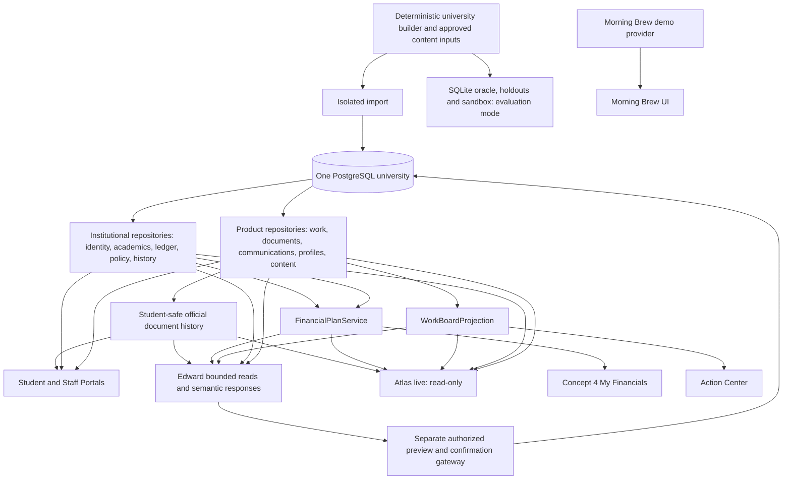
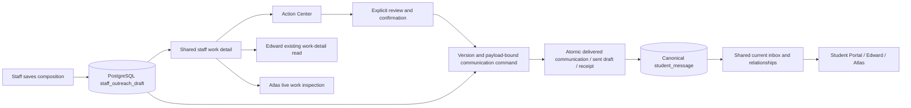

# Audentra vNext integration implementation report

The new workspace combines the exact synthetic architectural baseline with intentionally adapted Concept 4 My Financials, Action Center and Morning Brew product surfaces. PostgreSQL owns live financial facts, operational work and published campus data. Edward retains its Luna planner, tools, grounding, action gateway and workspace. Atlas live reads the same repositories and projections.

**Assessment:** suitable for continued integration development and product review, but not yet recommended as the main Audentra baseline or a deployment candidate. Important external-provider, legacy-evaluation and product-workflow gaps remain below. This report does not label unconfigured or untested capabilities complete.

## 1. Exact provenance and isolation

Workspace: `/path/to/projects/worktrees/audentra-vnext`.

| Source | Branch | Exact HEAD | Use |
|---|---|---|---|
| synthetic-university/platform | feat/synthetic-university-v1 | `4c176ccd0e36e7a753a6bbf66093aa2a2b4a72dc` | Architectural base; clean tracked/untracked state |
| synthetic-university/portals | feat/synthetic-university-v1 | `e17f9263fedcc80b09cd91cb5a9ee527abcb1a56` | Architectural/product base plus 16 modified tracked and 3 untracked files |
| Audentra-platform | main | `d859e5dae15d690e06d0b569e9b7a8fa7162ef48` | Read-only comparison donor |
| Audentra-portals | main | `f98a479ee1630422c7b2908a6ca6d42f452cd833` | Read-only comparison and local deployment lineage |
| audentra-portals-demo-ui | update-demo-financials-morning-brew | `d4569a9924b60491618c2fdf6d6630caa870f339` | UI donor; matches the inspected local deploy/main reference |

The donor commit was verified from the actual local refs and worktree, rather than assumed from previous reconnaissance. No remote deployment was changed or independently attested by a production HTTP comparison. No frontend history merge or wholesale cherry-pick was used.

The integration uses **independent clones**, created without shared object hardlinks or shared Git metadata. This is stricter isolation than registered worktrees: creating/changing integration branches does not change any donor's refs or worktree list. New branches are `integration/audentra-vnext-platform` and `integration/audentra-vnext-portals`; push remotes were removed. No push or deployment occurred.

Before implementation, `provenance/<source>/` captured branch, HEAD, index hash, porcelain-v2 status, binary HEAD diff, staged diff, untracked and ignored lists, refs, remotes and worktree lists. `files.json` records byte hashes, size, mode and symlink targets, including ignored files. The exact modified/untracked portal files were reproduced and committed in the new portal before integration. Ignored dependencies/artifacts were copied privately; source environment files were not used as runtime configuration.

Captured portal changes include the current profile, housing, financial-aid, calendar, university-record, staff portal/profile and design-style changes. The three untracked files were `apps/web/app/audentra-design-styles/bridge/staff.css`, `apps/web/app/audentra-design-styles/features/university.css`, and `tools/university-explorer/portal-ui-smoke.mjs`. Full paths and hashes of all 19 files are in the manifests; this is not a HEAD-only reconstruction.

**Source verification exception:** all five sources retain identical branches, HEADs, indexes, diffs, untracked lists, refs, remotes and worktree registrations. All source product files are unchanged. Four sources have no file differences at all. Two ignored Miniflare observability files in the already-running original synthetic portal changed: the `...a590acd76969f996ec6e4b599c3c09f58c283a76f2d61392b5d3046caf557602.sqlite-shm` and `.sqlite-wal` files beneath `apps/web/.wrangler/state/v3/observability/miniflare-wobs-trace-store/`. An early browser-server availability probe reached the existing port 3000 and is the likely cause. Their exact before/after hashes are recorded in `provenance/source-verification.json`. They were not restored or otherwise manipulated. Therefore **the requested absolute byte-for-byte condition for every ignored runtime file cannot be certified**, even though source code and Git working-tree state remained unchanged.

## 2. Local runtime and database ownership

A fresh PostgreSQL 17 cluster exists only in `platform/artifacts/integration/pgdata`, listening on loopback port **55591**. The integrated database is `audentra_university_vnext`; API port **45619**, portal port **3009**, Atlas port **4321**. Existing synthetic PostgreSQL on port 55487 and deployed infrastructure were not used as integration databases.

Separate test databases hold the compact contract seed, the imported university baseline, and a parity-test copy. Mutable tests use those databases; interactive vNext is used for read-only evaluations and ordinary persisted Edward conversations. Provider keys stay in the process environment. API/Atlas launchers require explicit loopback university database names. The local runtime starts no document/mail worker automatically.

The initial v3 import retained 3,000 students, 88 staff and the full university history/policy model. The extended deterministic build contains 51 university tables, 107 courses, 781 sections, 14,559 enrollments, 15,676 ledger rows, 4,908 payment attempts, 4,627 awards, 8,574 disbursements, 12,343 documents, 43,801 revisions, 10,705 assignments, 164 formal workflows, 172 workflow steps, 92 policies and 30 oracle scenarios. Policy indexing produced 383 passages. Public product tables additionally retain authentication identities, journey state, content, work, communications and preferences.

## 3. UI donor decisions

| Surface | Decision and delivered behavior |
|---|---|
| My Financials / Concept 4 | Take donor visual shell/assets/routes; adapt all data-bearing rendering to the Financial Plan API. Keep overview, payments, expenses, housing, meals, aid, coverage and simulator concepts, hero, typography, cards, charts and Edward entry points. |
| Action Center | Take donor board/list/card/detail visual system and nested Financial Aid, Enrollment and Campus Life navigation. Adapt data and edits through the canonical work/document APIs. |
| Morning Brew | Take the donor dashboard, onboarding, cards, pulse, day/detail, context thumbnails, preferences and mock-provider experience, including required scoped CSS. Keep its explicit demo boundary. |
| Student Profile | Keep the richer synthetic version including its captured dirty changes. The inspected donor removed useful university/program/adviser detail; copying that deletion would regress the requested baseline. |
| Staff Profile | Keep canonical identity, role, office, caseload, team, availability, absence and coverage views. Do not replace them with the donor's mock staff-person data. |
| Portal shell/navigation | Preserve current synthetic shell and Edward workspace; add the deployed financial navigation and nested Action Center projects. |
| Academics/classrooms, housing, documents, calendar, appointments, messages, enrollment/onboarding, FERPA | Preserve the existing canonical synthetic experiences and their UUID/auth relationships. |
| Demo Student 360 | Do not import its separate mock reality. Preserve the existing canonical staff student inspector/overview. Full donor Student 360 visual parity is not claimed. |

The implementation retains useful unavailable concepts rather than inventing personalized values. It does not reproduce every donor detail byte-for-byte: financial numbers, lifecycle labels, empty states and board evidence necessarily differ. Screenshots demonstrate visual continuity; no pixel-perfect certification is claimed.

## 4. Source-of-truth matrix

| Fact or state | Canonical owner | Consumers / boundary |
|---|---|---|
| Authentication and product UUIDs | Existing public identity/student/staff/auth tables | Same UUIDs link university records; no parallel login identities |
| Institutional identity, programs, academic attempts, holds, history | `university.*` repositories and existing public identity links | Student/staff portal, Edward university reads, Atlas |
| Posted account balance | Sum of posted `university.ledger.amount_cents`, by term | FinancialPlanService, legacy university financial adapter, Edward, Atlas |
| Offered/accepted aid and disbursements | `university.award`, fund and disbursement records | Annual commitment and term posting are separate |
| Payment attempts and reversals | `university.payment` plus ledger links | Board movement cannot alter balances |
| Refund settlement | Not implemented | Credit balances/refund ledger entries never prove external settlement |
| Savings, family support, personal expenses | `university.financial_plan_input` | Student-entered assumptions; versioned/audited, not verified assets |
| Hypothetical choices | Read-only scenario projection; scenario storage schema reserved | Preview never changes housing, meals, awards or ledger |
| Published rates | `university.rate_catalog` linked to approved policy | Effective dates, period, eligibility and cents remain explicit |
| Actual meals/insurance/payment agreements | Dedicated enrollment/coverage/agreement/installment tables | Empty when no evidence exists; preference is not agreement |
| Operational ownership, priority, due date, comments and status | Public staff work domain | Board projection, existing full workspace, Edward, Atlas |
| Institutional case outcome | University workflow/step/dependency/evidence records | Completion must satisfy existing case guards |
| Document processing/review/revisions | Public submissions, immutable `document_review_decision`, requirement status history + linked university document/revisions | One shared student-safe decision projection; internal notes remain staff-only; replacement submissions preserve old decisions |
| Inquiry, draft, communication and delivery | Existing public inquiry/interaction/communication/message domains and university case evidence | Delivery status is evidence; task completion alone is not delivery |
| Appointments and coverage | Canonical public scheduling and university relationship links | Profiles, portals, Edward, Atlas |
| Events, clubs and registration | Existing published public content/event/club/registration domains | APIs and Edward use the published rows; seed files are input only |
| Office/building/service information | University office data and approved directory/service policies | Published institutional content, not a new fixture list |
| Morning Brew | Explicit donor demo provider/preferences | Never institutional evidence for Edward |
| Visual theme, icons, navigation labels | Portal code and tenant theme | Presentation metadata; no DB tables needed |
| Oracle and sandbox mutations | Separate SQLite evaluation mode | Never available against Atlas live/runtime mode |

## 5. My Financials mapping

`FinancialPlanService` reads the canonical account repository and tenant-scoped planning/catalog repositories. `/v1/student/financial-plan` exposes that projection; `getUniversityFinancialPlan` and Atlas `/api/financial-plan` use the same service. The iframe renders returned values and sends typed requests through the portal API client. It does not reconstruct balances, anticipated aid, coverage allocations or scenario funding gaps independently.

| UI concept | Mapping |
|---|---|
| Hero balance, expense cards and charts | Term ledger charges/credits, adjustments and posted balance; chart values computed by the service |
| Loans & aid | Annual offered and accepted awards; actual term disbursement schedule/status; loan metadata only when recorded |
| Payments | Pending, posted, failed and reversed attempts; settlement dates only when recorded |
| Financial requirements | Submission requirement plus downstream office service progress, separately displayed |
| Budget and living costs | Ten bounded integer-cent input keys covering savings/support/income and books/transport/personal/rent/groceries/other costs |
| Housing and meals | Published catalog prices/eligibility; actual meal enrollment separately; hypothetical alternative is never an assignment |
| Coverage | Actual insurance/waiver status where recorded; other protection concepts retain honest unavailable states |
| Installment plan | Actual signed agreement and installment rows; no fake four-payment agreement |
| Timeline | Recorded disbursement/payment dates and statuses |
| Simulator | Backend-only, read-only forecast using planning inputs and valid term catalog alternatives; missing comparison basis produces unavailable results |
| Edward entry points | Natural-language question only; Edward independently retrieves records |

`PUT /v1/student/financial-plan/inputs` requires student self-authorization, exact input keys/types, existing term, expected version, bounded idempotency key and matching payload hash. A student row lock serializes first creation and retries. Versioned state, audit and receipt commit atomically. Retrying returns the original receipt; a changed payload or stale version returns a conflict. Financial facts remain untouched.

`POST /v1/student/financial-plan/simulate` does not write. Rates and savings remain assumptions, fund restrictions are not inferred, and missing replacement charges prevent fabricated comparisons. Reversal/refund allocation is not represented as current coverage without an allocation record. The exact ledger stays visible.

The UI has no payment-provider integration, award-acceptance command, insurance approval, agreement-signing command or saved-scenario CRUD. These concepts are retained honestly. Some underlying legacy onboarding/deposit simulation behavior remains in the inherited product and is not production settlement infrastructure.

## 6. Action Center / Task Board mapping

`WorkBoardProjection` joins `staff_work_item` with linked public documents, university payment attempts and formal cases through runtime links. APIs, Edward and Atlas share this projection. Project totals cover all work; the visible page contains at most 100 cards. Project labels describe queues, not independent workflow definitions.

- Cards retain owner, priority, due date, queue, version, operational status and actual history. Document/payment stages take precedence over a simplistic operational completion label.
- Document review calls the existing versioned document-review command, with rejection/correction reasons and related document evidence. Original content uses the authenticated content API. Deep extraction/revision work is available through the existing full canonical workspace where configured.
- Comments and assignment edits use existing commands, then refetch canonical state. A failed/stale edit retains the draft and reports a bounded error.
- Communication details display actual interactions, message bodies, directions and delivery states. Drafting/sending uses the existing full communication workspace. Moving a card does not send a message.
- Payment cards show canonical amount, method, submitted/settled dates and attempt status. Completion is guarded by posted payment state, never a balance mutation.
- Formal case steps/dependencies/evidence remain distinct from operational ownership. The existing university case-completion guards remain active.
- Aggregate project counts and payment-attempt state counts survive Edward's evidence compaction; card samples remain bounded. `getUniversityOperations` retains its old meaning and output.

`seedTasks`, localStorage persistence and the donor's mock workflow/document/delivery engines were removed from the active board. Static stage names/layout metadata remain presentation code. Historical stage averages and targets show unavailable values rather than fake SLAs.

Board search, owner/priority/office filters, quick attention/overdue/mine filters and sorting now run against the full canonical queue before pagination. Grouping remains a presentation of the returned page. Full-project open/attention/overdue counts and office options are server aggregates. Related work outside the current page loads its canonical card and detail; delayed searches cannot overwrite newer results, and failed loads expose an explicit retry. Remaining board limitations: Some advanced creation, external outreach, extraction and correction operations still open that workspace. Portal-inbox composition and confirmed delivery now run inside the approved detail panel. No generic workflow engine or unrestricted drag-to-domain-transition command was added.

## 7. Profiles and campus life

Student Profile preserves product preferences/contact/verification data and combines them with institutional program, academic and adviser/housing records through the existing stable UUID link. Staff Profile uses the canonical staff-me/advising projection for role, office, management relationships, caseload, weekly availability, appointments, absences and coverage. Atlas profile endpoints reuse these same methods. Staff request timestamps are excluded from equality comparisons; all institutional fields are compared.

The existing canonical events, registrations, published content editors, academic catalog and office/policy directory were retained. No new duplicate event engine was needed. The integration discovered that the narrow v3 import had omitted the already-approved club directory. It now imports **12 published clubs** from the architectural baseline's curated Student Life content into `public.student_club`, using deterministic IDs and insert-only conflict handling. Examples include Aster Robotics, Code Collective, Women in Business, Outdoor Aster and the International Students Association. Contacts identify the office, not an invented student officer. No student membership is inferred.

`tools/university/fixtures/club-directory.json` records the source and supplies deterministic publication input. The builder hashes it and emits `campus-content.json`. Full and incremental import use the same publisher. Existing runtime club edits are preserved. Edward's existing `getCampusLife` reads the same published directory as the portal and Atlas. Campus facilities/service details remain approved directory/policy content; not every service has a transactional booking domain. Club joining/membership administration is not implemented by this iteration.

## 8. Morning Brew boundary

The donor Morning Brew remains demo-backed as requested. `MOCK-BOUNDARY.md` documents the boundary. Its preferences/provider-link simulation remain product demo state. The Edward entry point explicitly identifies the briefing as a demo and asks Edward to use canonical records independently; no briefing object is serialized as institutional evidence. A small explanatory-copy adaptation removes a misleading claim that the briefing's mock counts came from live records. The donor visual/interaction concepts otherwise remain intact, including its scoped stylesheet.

## 9. Edward and Lab

Preserved: GPT-5.6 Luna, bounded read planning, student/staff pipelines, structured university tools, PostgreSQL policy retrieval, compaction, grounding, follow-up reads, identity gates, separate write recognition, preview/confirmation, durable action gateway, semantic block projection, citations, drafts, conversations, stop/retry, mobile/desktop workspace, Lab and evaluation banks.

Added reads: `getUniversityFinancialPlan` for student/authorized staff context; `getUniversityWorkBoard` for staff. No generic SQL or financial write tool was added. The full catalog, active university subset and seven existing durable actions are documented in `platform/docs/integration/edward-tool-catalog.md`.

Focused corrections from before/after evaluation:

1. Staff year grounding now accepts a year present in an actual ISO evidence date, while still rejecting an unsupported year.
2. A university answer that has not read facts, or repeats unsupported factual tokens, can use an existing remaining read round. Round limits were not increased.
3. An exact roster external-reference match is bound even if a legacy classifier mistakes the token shape for a work-item key. Unbound/ambiguous identities remain rejected.
4. Policy retrieval recognizes a course offer using the actual tenant course catalog and prioritizes registration policy. This prevents an admissions-offer policy from supplying a course-waitlist reinstatement procedure.
5. Shared-projection compaction keeps term/provenance/catalog periods and full board aggregates ahead of duplicate detail.

Lab's Architecture explanation names the shared projections, retains the existing actual-trace route map and exposes sanitized model evidence. A live Luna turn selected `getUniversityFinancialPlan`; its trace inspector and Architecture map were verified in a browser. The university evidence panel was given scoped spacing so it does not squeeze the route map into a narrow column.

## 10. Selective platform donor audit

Authentication repository, core middleware and object-storage paths were compared; the synthetic base already retains the needed auth/security boundaries. No donor authentication identity migration or deployment credentials were copied. The later SSO/deployment callback-origin improvement was identified in deployment scripting and is listed as rollout configuration work, not executed against test infrastructure.

The newer human-facing document-review labels/projector behavior was adapted, with a clean forward migration. The donor's conflicting migration sequence was not copied. Existing upload originals, extraction retries, tenant scoping, FERPA/delegate restrictions, public inquiry/mailbox foundations and canonical staff student inspector were preserved and covered by applicable existing tests.

The donor's official document history was selectively adapted in integration migration 0070, preserving the synthetic named-evidence requirement checks. Migration 0071 repairs replacement-submission synchronization. Action Center, student Documents, Edward and Atlas now share official decision history. AI auto-resolution remains unimported; machine extraction alone does not constitute an official review. Mainline web-search/model-default changes were not substituted for the requested Luna/university evidence architecture. External mailbox/provider configuration, SSO callback wiring and deployment origin values require an isolated deployment setup; none were pointed at deployed systems.

## 11. Schema and architecture

| Migration | Purpose |
|---|---|
| `0066_canonical_financial_planning.sql` | Tenant-scoped rate catalog, planning inputs/scenarios, meal enrollment, insurance coverage, payment agreement/installment, loan terms and planning receipts; cents, checks, composite foreign keys and RLS |
| `0067_payment_work_item_boundary.sql` | Prevent completion of linked payment work without posted canonical payment evidence |
| `0068_payment_work_tenant_guard.sql` | Scope/restore tenant context correctly inside the payment guard |
| `0069_document_review_product_copy.sql` | Adapt current human-readable document review titles/types and version affected work |
| `0070_document_review_history.sql` | Tenant reason catalog, immutable official decisions, requirement status history, identity/link validation and tenant RLS |
| `0071_document_resubmission_sync.sql` | Follow the current submission link, preserve older decisions, and prevent an old submission from overwriting the current university document |
| `0072_university_academic_progress.sql` | Restore the missing PostgreSQL academic-progress view used by Atlas dossiers, with tenant joins and invoker permissions |
| `0073_staff_outreach_drafts.sql` | Staff-only versioned composition, tenant/actor/work links, and sent-to-communication integrity |
| `0074_outreach_draft_activity.sql` | Extend the existing immutable work activity vocabulary with draft saving |
| `0075_imported_case_work_classification.sql` | Correct only original importer defaults: formal case coordination versus notification communication work |
| SQLite `0004_product_planning.sql` | Deterministic evaluation counterparts for the new financial seed domains |

No prior synthetic migration was renumbered or overwritten. Applied integration migrations were not changed. The catalog has 12 approved policy-derived rates, and 992 active meal enrollments are grounded in existing billed meal records. Savings, agreements, insurance coverage, loan terms and saved scenarios are not fabricated to fill screens.

## 12. Verification and evaluation results

Baseline tests were run on the copied source before integration. The initial Python run had **1,398 passed / 153 skipped**, but its **62.78% coverage failed the 67% gate** because isolated PostgreSQL tests were not yet configured. This is recorded as a failed baseline gate, not a passing full baseline. Baseline universe tests passed (17), and the properly imported university runtime tests passed (6). Baseline portal tests had **128 passed / 1 failed**: the Lab production-404 assertion conflicted with the local debug-enabled setting. Baseline typechecks/builds passed; portal lint had 14 warnings.

Subsequent full platform runs used explicit isolated contract/parity databases. One contract run initially failed because its managed Harvard tenant seed was missing; explicitly seeding the disposable contract database fixed the test. Final full results and artifact references are recorded in the generated verification appendix below. The last completed full run before final aggregate-label changes had **1,546 passed / 23 skipped**, **73.30% coverage**. Node suites passed: 6 contract checks, 5 state-effects tests, 202 assistant-core tests, 118 demo-api tests, 36 Edward evaluation tests and 56 voice-agent tests. Targeted final projection/read-loop tests passed **39** tests.

The portal has **136 passing tests**, passing typecheck/build and zero lint errors (14 warnings, primarily inherited image guidance). Four browser tests cover the full Edward workspace, fixed floating assistant, mobile navigation layering and stop/retry with the same request ID. Cross-surface HTTP/browser tests compare Financial Plan, board totals/cards, campus events/clubs, student profile and staff profile against Atlas and check live sandbox denial. Screenshots cover all major imported views and mobile finance. Live Lab also passed.

Finance parity uses 30 representative students, direct ledger totals, the shared service, API dispatch, Edward's actual registered read and Atlas's service path. Tests separate offered/accepted/disbursed, pending/posted/failed/reversed, credit/refund, requirement/review, and planning assumptions. Planning tests cover unauthorized actors, read-only preview, stale versions, changed-payload replay, idempotency, audit and no account/aid mutation. Board tests compare full project totals, owner, priority, due date, version, linked payment state and Edward tool output; bounded evidence must retain all aggregate counts.

The original 30-case oracle was exercised as both student and staff: **60 baseline responses** (57 Luna, 3 deterministic/guided), followed by intermediate and final comparison runs. The intermediate run exposed two grounding fallbacks and a non-answer; the corrected 60-response run had 57 Luna responses and 3 guided responses, with zero grounding fallbacks. Manual review additionally found the roster-binding and course-policy failures described above; targeted reruns verified their corrections. This is a response/evidence comparison, **not a claim that 60 model calls equal 60 fully graded semantic passes**. The final 60-response rerun and subsequent refund-boundary checks are summarized in the appendix.

### Verification limits

- The normal full-suite command leaves twenty legacy-host tests unconfigured. In the restored isolated fixture, nineteen now pass and one old time-dependent capacity assertion fails. Three storage/production tests still require S3 configuration; see section 21.
- The old read-generalization SQL ground-truth generator now succeeds. An absent `student_risk_assessment` capability is explicitly `false` with a null row count, never a fabricated zero-risk finding. The untouched matched and holdout banks then fail template preflight against their older staff/persona assumptions; see section 18. They are not reported as passing.
- The legacy write development and holdout banks now pass 118/118 and 38/38 cases in separate writable copies of the current schema. Read-bank failures and skips remain explicitly reported in section 21; every bank is not claimed green.
- No external SSO round trip, object-store upload/download, email delivery or money-provider settlement was certified. No deployment smoke was performed.
- Visual checks use representative screenshots and functional browser assertions, not an exhaustive pixel-diff matrix for every viewport/state.
- Model prose can still be imprecise about staff/student pronouns or refund wording. Numeric grounding and successful tool execution alone do not prove semantic correctness.

## 13. Remaining work before main-baseline promotion

1. Resolve the remaining read-bank semantic concerns, including legacy deposit deadline derivation and ambiguous staff/student names, and finish semantic acceptance beyond regex scores. The restored legacy write development and holdout banks now pass completely; see section 21.
2. Configure an isolated object store and document worker; verify original upload/download, extraction provider execution and revision comparison. Canonical correction/resubmission and official history are now tested through real domain commands; the desired AI auto-resolution capability still needs a separate domain review and implementation.
3. Complete any donor interactions still opening the older canonical workspace. Confirm the desired Student 360 visual scope. Full-queue board filtering/search and cross-page related-work navigation are now implemented.
4. Add real provider-backed financial commands only with receipts and settlement evidence: payments/refunds, award acceptance, signed installment agreements, insurance review and saved scenario management. Existing honest empty states should remain until then.
5. Decide how institutional snapshot time and operational wall-clock scheduling should behave in long-running demos. The fixed university oracle clock remains September 8 while operational availability uses current time.
6. Add canonical club membership/join workflows if desired; current directory publication is real, membership is not inferred. Expand transactional service bookings only when there is a real command/domain.
7. Add production authorization for any remotely exposed Atlas operator mode; current Atlas is intentionally loopback-only. Keep all sandbox operations separate.

## 14. Recommended eventual test.audentra.ai rollout

Do not deploy these branches directly over the existing database. First resolve the promotion gates above and review the final visual experience with the new local workspace. Provision a separate test database, object-store namespace and provider credentials. Build exact platform/portal revisions together with matching contracts. Run all forward migrations in a standalone migration job, then import the intended synthetic world once into that empty database. Never run destructive import/reset jobs against the existing test or deployed database.

Configure the API public URL, portal API proxy, credentialed requests, exact allowed origins, tenant slug/domain bootstrap and SSO callback/redirect allowlist together. Adapt the inspected newer callback-origin deployment-script fix to the chosen test domains. Configure mailbox/webhook/object-store credentials through secrets, not frontend build variables. Disable public Lab traces and demo-header auth for an externally accessible environment; use the existing production identity flow. Keep Atlas behind an authenticated operator boundary or local tunnel, with live mutation disabled.

Run auth/FERPA, upload/review, financial lifecycle, task dependencies, content publication/registration, parity and Edward acceptance tests against that isolated candidate. Take a database backup and define rollback of application revisions plus data-compatible migration handling. Only then consider switching the test hostname. No such infrastructure action, push or deploy occurred during this integration.

## 15. Local commits and final verification appendix

Final audit timestamp: **2026-09-13 03:57:57 UTC**. The audit checked 215,150 files across the five sources. Every recorded Git check passed. The only file differences are the two ignored original portal trace-store files described in section 1; absolute byte-for-byte preservation is therefore not claimed.

| Final verification | Result | Local evidence |
|---|---|---|
| Platform complete test command | 1,546 Python passed, 23 skipped; 73.33% coverage; all six Node package suites passed | `platform/artifacts/integration/tests-release.log` |
| Final platform lint/typecheck | Passed; 276 Python files already formatted | `platform/artifacts/integration/lint-release.log`, `typecheck-release.log` |
| Last refund-account evidence change | 12 targeted tests passed after the complete test run | `platform/artifacts/integration/refund-boundary-tests.log` |
| Final projection/read-loop checks | 39 passed | `platform/artifacts/integration/final-projections.log` |
| Deterministic world build/tests | 17 passed; extended world built successfully | `platform/artifacts/integration/world-tests-final.log`, `build-world-final.log`, `final-world/` |
| Empty-database rebuild | All migrations applied, 3,000 students / 88 staff / 51 university tables imported; 383 policy passages | `platform/artifacts/integration/rebuild-migrations.log`, `rebuild-import.log` |
| Rebuilt runtime and parity | 8 passed against `audentra_university_test_vnext_rebuild` | `platform/artifacts/integration/rebuild-tests.log` |
| Existing integration migration check | Successful checksum/no-op verification | `platform/artifacts/integration/migrations-final.log` |
| Portal contributor gates | 136 tests passed; typecheck/build passed; lint 0 errors / 14 warnings | `portals/artifacts/integration/{tests,typecheck,build,lint}-handoff.log` |
| Final mobile/UI cleanup build | Passed | `portals/artifacts/integration/build-release.log` |
| Cross-surface HTTP/browser parity | Passed, including finance/scenario, board/payment detail, profiles, clubs, Brew setup/dashboard and Atlas | `portals/artifacts/integration/browser-parity-handoff.log` |
| Edward workspace/browser | 4 passed, including stop/retry and mobile navigation | `portals/artifacts/integration/edward-browser-handoff.log` |
| Provider-enabled Edward Lab | Passed; financial-plan read, Luna trace and Architecture inspected | `portals/artifacts/integration/lab-handoff.log` |
| Final 60-response Edward comparison | 57 OpenAI model-loop responses, 3 deterministic/guided; no failure codes or grounding fallbacks | `platform/artifacts/integration/handoff-edward/` |
| Refund semantics follow-up | 4 student/staff probes distinguish accounting refund/credit from unrecorded bank settlement after the last evidence change | `platform/artifacts/integration/refund-boundary-edward/`, `refund-eval.log` |
| New-domain live probes | Clubs, per-term meal catalog and full work/payment aggregates verified | `platform/artifacts/integration/new-domain-final-edward/` |

The complete Python test run precedes the final small refund-evidence addition; the listed 12 targeted tests, lint/typecheck and four live refund probes cover that addition. The 60-response comparison is not a complete semantic acceptance score, and the old fixture-bank limitations in section 12 remain. No omitted legacy evaluation is counted as a pass.

[Open the visual review gallery](VISUAL-REVIEW.html) for donor and integrated screenshots, including My Financials, Action Center/detail/payments, profiles, clubs, Morning Brew, mobile finance, Atlas and Lab. Raw provider responses, runtime databases and screenshots remain ignored local artifacts. They are available for local review, not embedded as production fixtures.

### Platform implementation commits

Branch: `integration/audentra-vnext-platform`.

- `ea4dc4b48e30e4193bd3f30e6848fc734943ced2` — feat: share canonical financial planning and work-board projections
- `3a310ceb4073ae17e757a55b0c48510a5006ff77` — fix: retain canonical evidence and roster bindings in Edward read loops
- `fdb3b73ef70933db968d099faba5d763eb96ab90` — feat: adapt current document-review labels without replacing workflows
- `ea61e0efc69c5c84751edac14d3283a7eaaf4006` — feat: make Atlas live mode observe the isolated PostgreSQL university
- `cc5ee22f32484429e4014319925c8df736e26b99` — fix: expose complete board labels and explicit refund settlement evidence

### Portal commits

Branch: `integration/audentra-vnext-portals`. The first commit captures the source dirty state before UI integration.

- `a81ded68b92c82b27bd9af622196ce1b34acf7f2` — chore: preserve exact synthetic portal working state as integration baseline
- `39b4375b448dd72fc87f785421d2587c91a77ac7` — feat: connect Concept 4 My Financials to canonical planning services
- `64c53b01066832cc5df26e46ca002e12f2eb5217` — feat: adapt deployed Action Center to canonical work and evidence
- `029dd638619a78538bd2a984afec1829fab96234` — feat: preserve deployed Morning Brew with an explicit demo boundary
- `54a66c7ba5330e8929de4060d707b8f7275fd07c` — feat: verify live Atlas parity and preserve Edward Lab and workspace behavior
- `846529460aea882be75454e9242b57892c27f82c` — fix: preserve mobile financial readability and verify published clubs and Brew

### Documentation and workspace artifacts

The platform documentation commit records this report, the local runbook and the final registered/active Edward tool catalog. Its exact hash is `d7ba36e910a418c9246ab244ad770a1a1e547fc4` — docs: record integration provenance, verification and deployment gates. Root provenance manifests and the visual gallery stay within this isolated workspace; the root directory itself is not a third Git repository.

Both integration clones have no remotes. No source commit, index, branch, tracked file or untracked product file was changed. No push, deploy or existing institutional database mutation was performed. See the explicit ignored trace-file exception above.

## 16. Continued integration: full-queue Action Center

The imported board now delegates search, assignee, priority, component, quick filters and sorting to the existing tenant-scoped work repository before its bounded 100-card page. `StaffWorkBoardQuery` is synchronized between platform and portal contracts. Canonical project summaries supply full-project open, attention and overdue totals and office choices. Attention uses linked document review, failed/reversed payment and blocked request evidence. The page retains visual grouping and the deployed board/list treatment. A nonfunctional demo-only EDgent-owner filter was removed; no automated owner is fabricated.

The detail panel resolves related cards outside the loaded page through the same canonical projection. Search result sequencing rejects older responses; a failed query displays a retry action instead of a permanently busy board. A meaningful browser regression finds a matching card beyond the first page, checks filters and page resets, opens related work outside the result page, deliberately delays a prior query, and exercises failed-load recovery.

The portal test command now explicitly disables `NEXT_PUBLIC_EDWARD_DEBUG_ENABLED` only in its production test build/process. This prevents the intentional local Lab setting from invalidating the production-404 assertion while preserving the development Lab.

Verification artifacts for this continuation use `*-board-filters.log` in each clone's ignored integration artifacts. Results: platform **1,547 passed / 23 skipped, 72.89% coverage**, all Node suites passed; platform lint/typecheck passed. Portal **136 passed / 0 failed**, typecheck/build passed, lint **0 errors / 14 warnings**. Cross-surface HTTP/browser parity and the full-queue board browser regression passed, including actual Next/Previous navigation through a filtered queue larger than 100 cards. Two direct PostgreSQL board tests also passed against the independently rebuilt integration test world.

The final CSS toast-dismissal adjustment was covered by the browser regression and final production build after the complete portal test run. The full platform test run and final targeted checks cover the UUID search used by cross-page detail navigation. The latest source audit at **2026-09-13 04:22:27 UTC** again found all Git states and source product files unchanged, with only the same two ignored trace-store exceptions. No additional source differences appeared.

The platform commit records the canonical query/projection work and this documentation; the portal commits separate board behavior from the production-test configuration fix. Exact hashes are recorded in the workspace-root report after commit creation. No migration or Edward planner/action change is introduced by this continuation.

Continuation commits (local only):

- platform: `765a14f502c48264cf49d21845e0ec395fa22261` — feat: filter canonical Action Center work before pagination
- portals: `10af627b175dce7c9d50b0426c4555e25a901573` — feat: search full task queues and resolve related work across pages
- portals: `2627a203768f4eb548b12aad8b971be517d104aa` — test: disable local Lab flags in production gate builds

## 17. Continued integration: official document decisions and resubmission

Mainline donor migration 0050 and its review/history UI informed fresh integration migration 0070. Each uploaded submission receives at most one immutable official decision. The command records the tenant-approved rejection reason, student guidance, staff-only note, reviewer, work item and requirement together with existing audit/notification behavior. Expected work version, authorization, idempotency and payload-hash checks remain mandatory. Replaying the same request returns the same decision receipt; changed payloads and stale work versions fail. Student requirements still use the synthetic named-document evidence rules: accepting an unrelated file cannot complete verification or disburse aid.

Replacement uploads preserve prior submissions and decisions. Migration 0071 follows the current `runtime_link` when synchronizing university document status and revisions; a later update to an older submission cannot overwrite the current head. Legacy imports receive explicitly identified status snapshots, with unknown original reviewer/guidance rather than fabricated official reviews. The original university revision reasons remain independently valid evidence. The deterministic importer creates snapshots for all **8,726** terminal submissions in the rebuilt university tenant; other managed seed tenants are outside that publisher's scope.

`public_review_decision` is the shared privacy boundary for student Documents, staff detail, Edward's existing `getUniversityDocuments`, and Atlas `/api/documents`. Official receipt and later history values match exactly, including UTC timestamp normalization. Internal notes are never selected into student or university read evidence. The deployed detail panel now renders actual extraction fields/confidence/warnings, reason selection, student guidance, a distinct internal-note field, explicit confirmation and official history. A correction/resubmission remains a new review cycle. No file content or extraction output is fabricated when storage/provider execution is unavailable.

Atlas's live Documents tab now renders the same document projection. Browser testing exposed a pre-existing omission in the PostgreSQL port: `academic_progress` was absent, causing full student dossiers to fail even though the overview worked. Migration 0072 restores the deterministic world's attempted/earned-credit/GPA semantics with tenant-bound joins and invoker permissions. The normal parity browser harness now requests a full dossier as well as comparing document histories.

A live probe initially answered a transcript-correction question from academic registrations alone. The existing document/academic tool descriptions now distinguish submitted-file review from academic attempts, and the evidence instruction requires reading an owning domain before asserting absence. The bounded Luna planner and tool inventory are unchanged. Six subsequent student/staff probes on the fresh imported database correctly identify the rejected seal, pending review, and verification-to-aid dependencies. These are targeted semantic checks, not a complete legacy-bank certification.

| Document integration verification | Result | Evidence |
|---|---|---|
| Complete platform test command | 1,548 Python passed / 23 skipped; 73.20% coverage; all Node suites passed | `platform/artifacts/integration/tests-document-history.log` |
| Final platform/portal lint and typecheck | Passed; portal retains 14 warnings, zero errors | Each clone's `artifacts/integration/{lint,typecheck}-document-history-final.log` |
| Portal tests / final production build | 136 passed; final build passed | `portals/artifacts/integration/tests-document-history.log`, `build-document-history-final.log` |
| Deterministic world | 17 tests passed; fresh build/import succeeded | `platform/artifacts/integration/document-history/world-tests.log`, `world/`, `rebuild-import.log` |
| New empty PostgreSQL database | All migrations through 0072; 3,000 students, 88 staff, 51 university tables, 383 policy passages; migration rerun is a checksum/no-op success | `document-history/rebuild-migrations-noop.log`, `fresh-history-counts.log` |
| Fresh runtime + cross-domain parity | 6 runtime tests and 4 document/finance/board tests passed | `document-history/fresh-runtime-tests.log`, `fresh-parity-tests.log` |
| Real review/resubmission transaction | Reject, replay/conflict, unauthorized actor, immutable history, replacement acceptance, stale-head protection and unchanged account verified; fixtures rolled back | `apps/api/tests/test_document_history_integration.py` |
| Full review browser | Confirmation precedes mutation; student guidance, staff history and Atlas agree; internal-note privacy verified | `portals/artifacts/integration/browser-document-review.log` |
| Normal browser parity and board filters | Passed, now including full Atlas dossier and document projection | `portals/artifacts/integration/browser-parity-document-history-final.log`, `browser-board-filters-document-history.log` |
| Luna document regression checks | Six grounded student/staff answers after tool-description correction | `platform/artifacts/integration/document-history/edward-{student,staff}-final.log` |

The complete platform suite precedes the small final tool-description change and academic-progress view; fresh-runtime/parity tests, browser coverage, final lint/typecheck and live probes cover those final changes. The browser uses a separately named test database and metadata fixture, not an uploaded original object. External extraction, original storage and AI auto-resolution remain unverified/unimplemented. The fixed institutional snapshot clock and operational decision wall clock remain distinct and explicitly documented.

Source re-audit after document integration: all five Git states and all source product files still match; only the same two ignored trace-store files differ. See `provenance/source-verification-document-history.log` and the timestamped manifest. No additional source difference, push, deploy, or existing institutional database mutation occurred.

Document integration commits (local only):

- platform: `68d7de32c9537a022069610b68fac8d2f694f85e`
- portals: `d303cc2e5203b7c8e90db024dc474853a2127836`

## 18. Legacy evaluation preflight

The legacy read-generalization truth generator now tolerates a genuinely absent assessed-risk domain by reporting capability availability and a null count. It does not add risk tables or predictions to the institutional world. This permits read-only SQL truth extraction from the fresh integration database and separates a schema capability from a cohort fact.

The original case banks remain unchanged. Matched-bank preflight reports **128 cases / 145 turns / 155 template problems** against this university, chiefly missing old staff external references and associated expectations. Holdout preflight reports **29 cases / 33 turns / 31 template problems**, captured in `platform/artifacts/integration/document-history/read-gen-holdout-lint.log`. No paid run was started with unresolved templates. The copied workspace has no matching frozen database dump; preserving these banks therefore requires reconstructing their documented original fixture or producing a separately reviewed integration adaptation that retains each scenario's intent. Changing live canonical people or weakening expected facts to make a bank pass is not part of this implementation.

Evidence: `read-gen-truth.json` (ignored synthetic records), `read-gen-truth.log`, `read-gen-lint.log`, `read-gen-holdout-lint.log` under the same artifact directory. This advances diagnosis and reproducibility; it does not close the remaining full acceptance-matrix requirement.

Legacy preflight commit (local only): `604dd334b899d99b5719c4cd510ac7c422367bb2`. Both integration branches have clean working trees and no remotes configured.

Latest final source audit: **2026-09-13T05:16:47.943694+00:00**. Every Git-state check still passes; the same two previously documented ignored trace-store differences are the only file differences. Evidence: `provenance/source-verification-document-final.log`.

## 19. Continued integration: inline portal outreach and current inbox evidence

The approved Action Center now retains its communication workspace while supporting actual portal-inbox composition and confirmed sending directly in the detail panel. It shows canonical interaction history, delivery status, channel, timestamps and replies. The objective and conversation treatment reuse the donor's visual classes. The explicit recipient/confirmation form sends through the existing `start_interaction` and `record_interaction_communication` commands. External email/voice entry remains in the full workspace; recording that activity does not claim provider delivery.

Those two existing commands now use the shared durable idempotency helper, binding actor, operation, entity, full request payload and expected version under a transaction lock. The receipt commits with delivery/history/outbox changes. Identical retries return the canonical work detail without sending again; a changed payload or version under the same key fails. Older request keys without a durable replay receipt fail explicitly rather than guessing success. The iframe retains a command's original version and key across a lost response, preserving the draft on failure. Sending cannot close the formal case, settle money or mark required institutional steps complete.

Typed, unsent composition remains ephemeral text in the open board, explicitly described as lost on leaving/refreshing. It is not a browser-owned delivery record or a claimed saved institutional draft. This historical limitation is superseded by section 20 for persisted cross-session drafts. Automated drafting/approval remains unfinished. No generic send tool, external provider integration or workflow engine was added.

The integration also identified and repaired a read gap: newly sent public portal messages were absent from the university relationship evidence used by Edward. `getUniversityRelationships` now includes the latest 50 canonical `student_message` records, with operational timestamps and explicit delivery/case boundaries. It does not expose staff-only notes or claim an historical time-lens read. Atlas `/api/relationships` and its live Relationships tab use that same projection. Stale asynchronous document/inbox results cannot populate a different student's newly opened dossier.

An initial paid probe repeated a UUID embedded in the synthetic test subject and was correctly rejected by the existing identifier-leak guard; the guard was preserved. A subsequent student answer incorrectly attached unrelated aid blockers to the specific case. The university evidence instruction now requires a recorded link before doing that. The corrected student answer explicitly limits its claim to the available message/case evidence; the staff answer identifies the still-open delivery-and-confirmation step. These are focused probes, not a complete semantic certification.

Verification includes a real PostgreSQL transaction for authorization, start/send replay, changed-payload rejection, stale-version rejection, exactly one portal message, recorded-but-undelivered external activity, durable receipts, Edward's registered relationship read and unchanged financial facts. A browser test intentionally drops a successful send response, confirms draft retention and retries; exactly one message appears in staff detail, the student's rendered inbox and Atlas while work stays open. Artifacts and final gate results follow after completion of this verification run.

| Outreach integration verification | Result | Local evidence |
|---|---|---|
| Complete platform test command | 1,546 Python passed / 26 skipped; 73.6% coverage; all Node suites passed | `platform/artifacts/integration/tests-outreach.log` |
| Supplemental PostgreSQL gate | 46 passed, including the three checks skipped solely because `TEST_DATABASE_URL` was absent from the full command | `platform/artifacts/integration/outreach-extra-postgres.log` |
| Final outreach boundaries | Authorized delivery, request-hash/version/replay, registered Edward read, recorded external activity and no account mutation passed | `platform/artifacts/integration/outreach-boundaries-final.log` |
| Final document + outreach commands | 2 passed after inbox evidence was added | `platform/artifacts/integration/outreach-final-tests.log` |
| Platform lint/typecheck | Passed | `platform/artifacts/integration/{lint,typecheck}-outreach-final.log` |
| Portal tests | 136 passed | `portals/artifacts/integration/tests-outreach.log` |
| Portal final build/typecheck/lint | Passed; 14 warnings / zero lint errors | `portals/artifacts/integration/{build,typecheck,lint}-outreach-final.log` |
| Confirmed-send browser with lost response | Passed, including rendered student inbox and Atlas | `portals/artifacts/integration/browser-outreach-final.log` |
| Normal parity and board-filter regression | Passed; current parity additionally compares portal-inbox rows with Atlas | `portals/artifacts/integration/browser-parity-outreach-final.log`, `browser-board-filters-outreach.log` |
| Targeted Luna | Staff identifies outstanding case step; corrected student response limits claims to available evidence | `platform/artifacts/integration/outreach-edward-staff-final.log`, `outreach-edward-student-corrected.log` |

The complete platform suite precedes the final inbox-evidence/context refinements, which have dedicated transaction, registered-tool, browser and live-probe coverage. The supplemental PostgreSQL run closes three configuration-only skips; twenty legacy frozen-host tests and three external-storage/production tests remain unexecuted. The portal test build precedes the final checkbox alignment and screenshot-animation adjustment; the final build and browser run cover them. No schema migration was required for this continuation: canonical message, communication, interaction and idempotency tables already existed.

Outreach integration commits (local only):

- platform: `731bc5c3324dc1604ea7e549f8c0b0e7a9d0ae67`
- portals: `76062d2d06c91f26ef2bd4d976138e21f477f40b`

Latest source audit: **2026-09-13T05:37:04.856799+00:00**. All source Git/product-state checks remain unchanged, with only the same two ignored trace-store differences documented earlier. No push or deploy. Both integration branches are clean and have no configured remotes.

## 20. Continued integration: durable outreach drafts and evidence-derived stages

The deployed communication workspace now saves real, shared staff drafts. `public.staff_outreach_draft` owns one current composition per tenant/work item. The record contains subject/body, student/work linkage, author/updater, version and an optional sent communication link. It is product workflow state, never verified institutional fact or a delivered message merely because it exists. New synthetic worlds contain no fabricated staff drafts. Starting another composition continues the record's version; prior sent messages and their command receipts remain canonical history. Full per-keystroke draft revision history and automated drafting/approval are not implemented.

`PUT /v1/staff/work-items/{id}/outreach-draft` enforces staff authorization, bounded text, tenant/work/student/actor integrity, expected work and draft versions, payload-bound idempotency, an atomic receipt, activity and the existing outbox event. Saving does not create an interaction, send a message, change account facts, or complete a formal case. The browser keeps only unsaved typing and in-flight retry keys. Saved content survives reload. A competing save rejects stale input while retaining local typing; explicit reload retrieves the current version. Sending after explicit review saves any changed composition, then binds the exact saved draft ID/version/subject/body to the existing communication command. Delivered communication, portal inbox insertion, draft `sent` state and replay receipt commit together. A changed or already-sent draft cannot be sent under a stale version. Retry retains the original command payload and creates one message.

Edward's existing `getWorkItemDetail` returns the same staff-only projection; its catalog now describes the provenance boundary. No new Edward tool or write action was introduced. The Luna model read planner, action gateway, grounding and privacy guards remain in place. A live staff probe correctly identifies a newly saved draft as unsent and distinguishes it from four earlier delivered messages on the same task. Student university relationships do not contain private draft text. Atlas live adds `/api/work-item?work_item_id=<UUID>` and an inspectable work/draft panel, sharing the staff repository and retaining live mutation denial. The Architecture description includes this actual draft/delivery path.

The draft stage test exposed an older integration classification error: the board used action names that canonical PostgreSQL constraints do not allow. Outreach now means canonical communication work or `communication_response`, with document/payment evidence retaining precedence. Its stage is drafting for an unsent saved draft, waiting for an actual outbound delivery, responded for a recorded inbound communication, or completed for terminal operational work. Blocked operational status is not an approval decision. Attention remains explicit for blocked work without changing its evidence-derived stage. The current importer also assigned every formal university workflow the document-review work type. Fresh imports and forward migration 0075 now classify notification cases as communication work and other formal case coordination as enrollment work with `staff_decision`; individual source-linked document review cards retain their own file workflow. Existing ownership, operational state, case dependencies and evidence remain authoritative.

| Added ownership mapping | Canonical owner | Consumers |
|---|---|---|
| Saved outreach composition | `staff_outreach_draft` plus staff command receipts/activity | Approved board, staff work detail, Edward work-detail read, Atlas operator view |
| Actual portal delivery | `communication_event`, `student_message`, linked sent draft | Staff conversation, student inbox, Edward relationships, Atlas relationships |
| Outreach stage/attention | Shared Work Board projection over work, draft and communication records | Board filtering/counts/cards, Edward operations, Atlas operations |

| Draft integration verification | Result | Local evidence |
|---|---|---|
| Complete platform test command | 1,550 passed, 23 skipped; 73.72% coverage; Node suites passed | `platform/artifacts/integration/tests-drafts.log` |
| Fresh imported PostgreSQL transaction/runtime/parity tests after final classifier change | 11 passed; no skipped tests | `platform/artifacts/integration/drafts-classified-fresh-tests.log` |
| New empty database rebuild | Migrations through 0075 and deterministic import succeeded; 3,000 students, 88 staff, 383 policy passages; zero seeded drafts | `platform/artifacts/integration/drafts-classified-fresh-import.log`, `drafts-classified-mapping.log` |
| Portal full tests | 136 passed, no failures or skips | `portals/artifacts/integration/tests-drafts-final.log` |
| Platform/portal lint and typecheck, portal build | Passed; portal retains 14 warnings and no lint errors | Respective `artifacts/integration/*-drafts-final.log` |
| Browser draft workflow | Save/reload, concurrent-save conflict, retained local text, explicit refresh, no pre-confirmation delivery, dropped-response retry, one message, portal/Atlas equality passed | `portals/artifacts/integration/browser-drafts-final.log` |
| Normal canonical surfaces and full-queue board browser tests | Passed against the interactive integration runtime | `portals/artifacts/integration/parity-drafts-final.log`, `filters-drafts-final.log` |
| Live Luna staff interpretation | Correctly distinguished an unsent version from prior deliveries | `platform/artifacts/integration/edward-draft-probe.log` |
| Visual review | Saved draft and Atlas draft panels inspected; donor communication treatment retained | Workspace `VISUAL-REVIEW.html` |

The full platform run precedes the final board classification and importer changes; the fresh rebuild and 11 targeted database/runtime/parity tests cover those changes. The final two small frontend refinements bind a pending send to its original detail context and update the Architecture description; final build/typecheck and browser rerun cover them. The same twenty legacy frozen-host tests and three external-storage/production tests remain unexecuted. The packaged older university archive was inspected as a possible legacy reconstruction source; it contains the base population but not the frozen bank's expanded staff fixture. No old bank expectation was rewritten to manufacture a passing score. External delivery, original object storage and complete legacy semantic acceptance remain promotion gates.

Source audit at **2026-09-13T06:13:05.186041+00:00** again confirms all five source Git/product states unchanged. The only byte differences remain the previously disclosed two ignored synthetic portal trace-store files. No additional source differences, pushes, deployments or existing institutional database changes occurred. Exact local commit hashes are recorded below after commit creation. This workspace remains an integration review candidate, with the promotion limits in section 13 still open.

Draft integration commits (local only):

- platform: `867ea1f6cb6b287cc17be09fd0290f8d56bcf065`
- portals: `6d31120787e4179bcb1ef2e71036275638776d39`

## 21. Continued verification: isolated legacy fixtures and final acceptance evidence

A read-only inspection found the documented `vv_enrollment_staffdb_eval` snapshot on loopback PostgreSQL port 5433. It has exactly 2,577 tenant students and 88 staff, including the legacy bank's expanded staff references. A consistent, read-only `pg_dump` was captured under ignored integration artifacts and restored into this workspace's own cluster. Snapshot digest and capture metadata are preserved in `provenance/legacy-evaluation-sources.json`. Two narrow legacy Explorer oracle collections were also copied read-only from port 5439 into a separate evaluation database. Neither source database received application writes, migrations, resets or fixture changes. These legacy copies are evaluation inputs only; live Atlas and the integrated portals remain on their shared 3,000-student institution.

The normal migration checker correctly rejected the snapshot's divergent `0050_edward_write_v1.sql` checksum. The checksum and source migration history were preserved. `tools/university/import_legacy_eval.py` instead copies compatible public fixture data into a newly migrated current schema. It accepts only explicit legacy test database names on this workspace's loopback cluster, refuses a populated destination, reads its source transactionally, and re-creates/validates every foreign key before committing. The import moved 232,754 rows and validated 491 foreign keys. Its report enumerates excluded tables and columns; it does not invent risk assessments, application snapshots, internal student notes, external Morning Brew context, or university-v3 metadata. No current university fact is replaced to fit old personas.

The normal current API now runs the older fixture in legacy product mode with Luna and the model read planner. `run_evaluation_runtime.py` uses the existing persistent provider ceiling and a process lock, serializing model calls to keep reservations consistent. There is no worker or external email sender. Read preflight now resolves the old staff/persona references; the remaining missing values concern time-relative appointment fixtures. The initial matched run exposed an existing harness crash when the question itself contained an expired appointment template. The runner now records an explicit `SKIP` for that unavailable question without making a model request. Its regression test checks the actual spawned runner, emitted transcript and zero assistant HTTP calls. Original case banks and their expectations are unchanged.

Current evidence: the independent world/isolation suite passes 19 tests; the evaluation harness passes 37; a repeat fixture import is rejected. Eighteen legacy backend regression checks pass, and the isolated oracle adds one pass and one failure. The remaining oracle failure expects old time-dependent capacity signals (for example, an over-cap adviser with no upcoming slots) that no longer match current availability. Morning Brew's newer demo UI remains untouched and excluded from canonical evidence. Four current Edward workspace/browser regressions pass after the draft integration.

The first complete legacy read holdout returned 18 PASS, 1 PARTIAL, 9 FAIL and 1 SKIP across 29 cases/33 turns. These are the strict harness results, not a semantic acceptance claim. Review found both overly narrow prose/date expectations and actual behavior needing investigation: an informational question was treated as an unsupported change request, and another answer attributed the signed-in student's document facts to a different named person. Its tools remained bound to the signed-in student; no other student's record was read. Initial corrections add past-tense questions to the informational frame and explicitly prohibit that attribution in the student read context. Seventy-four routing/read-loop/history tests pass. Subsequent live validation and targeted source-baseline comparisons are recorded below.

Fresh write and write-holdout databases have been prepared from the current-schema legacy fixture, with the existing eval-only mailbox/recipient fixtures. The banks' staff, student and work references resolve. Both ran with `--no-reset` and an explicit loopback `WRITE_EVAL_PSQL` command. The inherited Docker reset script was not used. Results follow.

| Final legacy/integration verification | Result | Evidence under `platform/artifacts/integration/legacy-evaluation/` unless noted |
|---|---|---|
| Legacy write development | **118 pass, 0 partial, 0 fail; 148 turns** | `write.log`, `artifacts/runs/vnext-legacy-write/` |
| Legacy write holdout | **38 pass, 0 partial, 0 fail; 47 turns** | `write-holdout.log`, `artifacts/runs/vnext-legacy-write-holdout/` |
| Complete legacy read matched, original grading | 89 pass / 6 partial / 23 fail / 10 skip; 128 cases, 145 turns | `matched-final.log` |
| Same matched responses, punctuation-only regrade | 92 pass / 6 partial / 20 fail / 10 skip | `vnext-legacy-read-matched-final-regrade.log` |
| Complete legacy read holdout | 18 pass / 1 partial / 9 fail / 1 skip; 29 cases, 33 turns | `holdout.log`; same totals after punctuation normalization |
| Source baseline replay of initial matched failures | 2 pass / 21 fail; punctuation regrade 5 pass / 18 fail | `baseline-matched-failures.log` |
| Source baseline replay of initial holdout failures | 2 pass / 7 fail | `baseline-holdout-failures.log` |
| Corrected historical-question behavior | Live holdout passes; 74 routing/read-loop/history tests pass | `corrected-holdout.log`, `identity-routing-tests.log` |
| Corrected peer-record behavior | Live replies refuse peer-record and peer-caseload requests; own adviser controls pass. Narrow legacy regexes still flag some valid refusals. | `corrected-identity.log`, saved transcripts; manual analysis in the linked document below |
| Final integrated university run | **60 responses: 57 Luna, 3 expected guided responses; no runtime errors or trace failure codes** | `university-final-student.log`, `university-final-staff.log`, `university-final-summary.json` |
| Final full Python run | 1,550 passed, 1 obsolete unit-fixture failure, 23 configured skips; 73.77% coverage | `platform-final-tests.log` |
| Fixture correction and rerun | 3 board projection tests pass; all 1,551 Python cases verified across full run and focused rerun | `board-fixture-rerun.log` |
| Final Node suites | Passed, including 38 eval-harness and 56 voice tests | `node-final-tests.log` |
| Final static gates | Platform lint/typecheck pass; portal build/typecheck and lint pass with 14 existing warnings | `lint.log`, `typecheck.log`; prior portal final artifacts |
| Deterministic world/isolation | 19 tests pass; importing again into a populated fixture is rejected | `world-tests.log`, `reimport-refusal.log` |
| Legacy backend regressions | 19 pass / 1 time-dependent oracle failure | `mock-regression.log`, `mock-oracle-regression.log` |
| Edward UI and Lab | 4 browser tests pass; live Luna, trace inspector and Architecture map pass | Portal `browser-edward-drafts-final.log`, `lab-legacy-final.log` |

The full Python run found one old unit fixture still using the invalid `reachout` action without a canonical work type. Production classification and database parity tests were already correct. The fixture now uses `communication_response`/`communication` or `staff_decision`/`enrollment`, and all three projection tests pass. No production change followed that full run; the entire long suite was not repeated solely for this fixture correction. Final Node suites, lint and typecheck were run separately and passed. The twenty legacy-host skips from the normal suite are supplemented by the separate 19-pass/1-fail fixture run; they are not represented as twenty additional passing tests.

The two behavioral fixes are verified beyond their narrow grader result. The corrected student says it can only discuss the signed-in student's records and cannot verify Camila's form; the old regex incorrectly treats the quoted/negated question as disclosure. The corrected caseload answer explicitly refuses to name other students. The record tools remain identity-bound. Source-baseline replay reproduces most raw failures; the few different outcomes include model variability, missing full names, extra adviser-leave dates and staff/student namesake interpretation. This is not a statistical claim of zero semantic regression.

The detailed [legacy evaluation analysis and runbook](legacy-evaluation.md) separates actual issues from old expectations. In particular, legacy public-mode deposit derivation can confuse an offer-response deadline with a student's deposit requirement date. This is an actual inherited limitation, not merely date formatting. The live integrated university mode excludes those legacy financial interpretations and uses the shared canonical financial projection. Other unresolved read concerns include named-person role ambiguity, appointment temporal phrasing and incomplete answers. The bank itself was preserved rather than weakened to manufacture a pass.

Latest source audit: **2026-09-13T06:59:10.652918+00:00**. All source branches, HEADs, indexes, Git status/diffs, refs, worktree registrations and product files match the initial capture. Only the same two previously disclosed ignored synthetic portal trace-store files differ. The later source database inspections/captures were read-only. No push, deployment, original worktree edit or existing institutional database mutation was performed during this continuation.

The workspace is ready for local integration review and continued implementation. It is **not yet recommended to replace main**: the documented semantic and provider/workflow gates remain, and absolute original byte-for-byte preservation cannot be certified because of the earlier ignored trace-file exception.

Legacy verification and Edward correction commits (local only):

- platform `a8c2b1664d0200b10489e2a92848d7cf89d91aea` — canonical board test fixtures.
- platform `66f214a4e8ac0ddebab03f97a76eef6252bcf1d7` — isolated legacy imports, guarded evaluator, robust template reporting and punctuation normalization.
- platform `1ad87cf91ad8d0531ea0245f0196bb38ed7b4fe3` — informational past-tense requests and student-only identity context.
- portals remains `6d31120787e4179bcb1ef2e71036275638776d39` — canonical saved outreach UI and Atlas work inspection.
