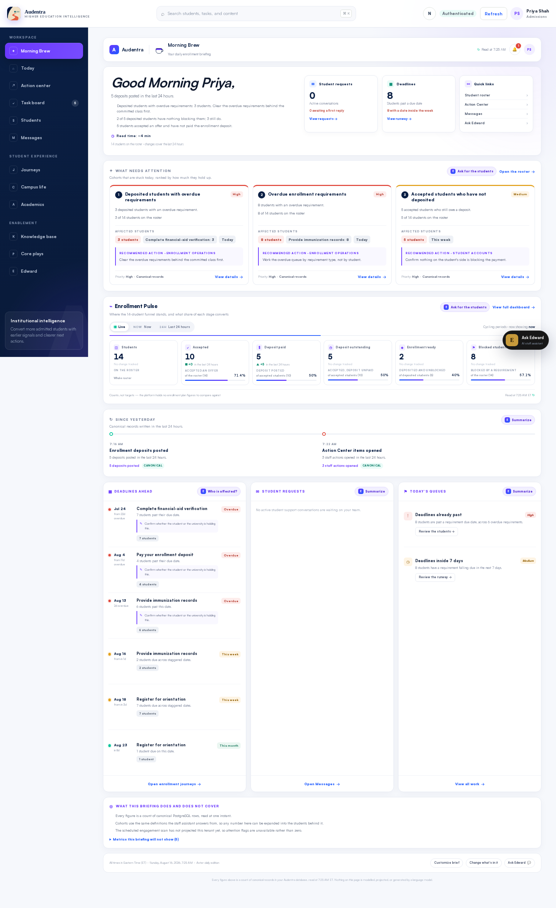
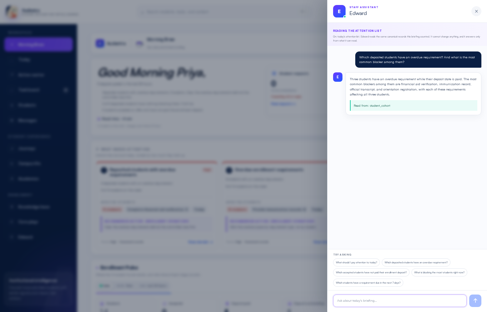
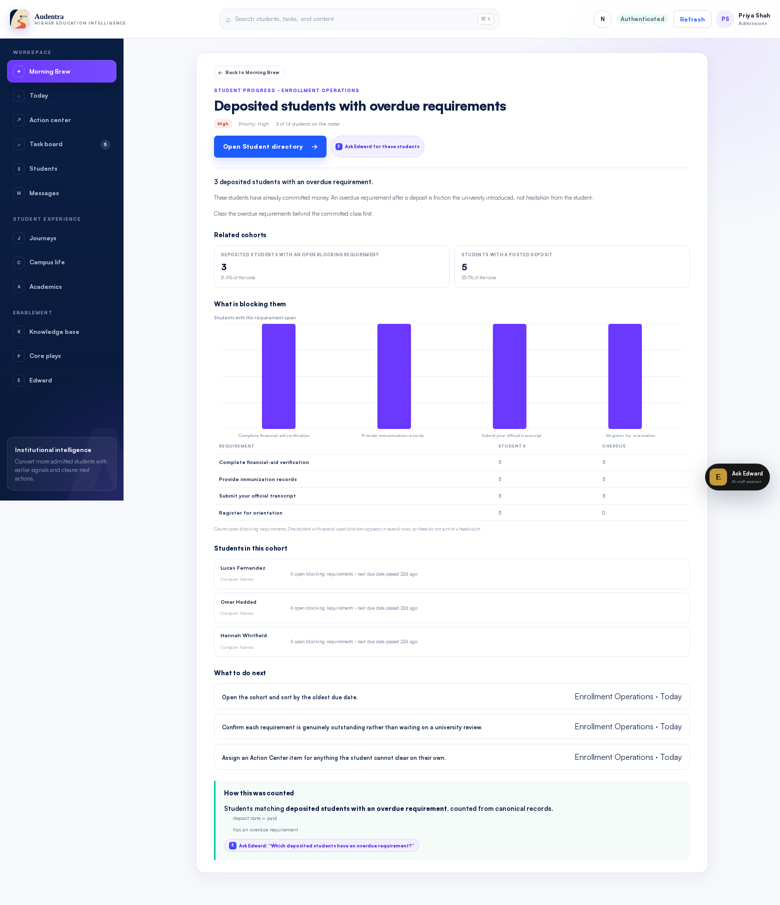

# Morning Brew V1 — real canonical data

Session 1 · branch `feat/morning-brew-real-data` (platform and portals)
Baseline SHA: `a062592f93ab2a290d2603e4614006aa9b5ba7ab` (platform),
`9c2126533ca6a338d97e23d16b12f8a7200b2053` (portals)

Morning Brew now renders a briefing assembled from canonical PostgreSQL rows.
The page looks the way it did; every number on it is different, because every
number on it is now real.



---

## 1. What Morning Brew was

Morning Brew was a frontend-only surface: ~5,600 lines under
`Audentra-portals/apps/web/app/staff/morning-brew/`, with **no backend
whatsoever**. Nothing named "brew" existed in the platform repository.

`content.ts` (1,855 lines) held a synthetic corpus for a fictional "Aster
University Fall 2026 cycle", internally consistent so it survived click-through.

### Every card, classified

| Surface | Item | Classification |
|---|---|---|
| Hero deck | "Here is your enrollment executive morning brief as of today 7:00 AM ET" | **Hardcoded**; the momentum clause branched on open-task count |
| Hero glance 1 | `unread: 23` | **Hardcoded literal** |
| Hero glance 2 | "Meetings today" | **Unsupported by product state** — no calendar integration exists |
| Quick links | 4 workspace destinations | Real (navigation only) |
| AI insights (7) | `$1.8M`, `−92 Enrolled Students`, `Confidence: 85%`, 7-point trend series, named students | **Fake/modeled**, including probability-shaped values the session brief forbids |
| — `verification-backlog` | students substituted from `workspace.cohort` where `risk.band ∈ {high, critical}` | **Unsupported**: the canonical roster hard-codes `risk.band = "low"`, `score = 0` (`staff_repository.py:4822`), so this substitution matched **zero students in production** and silently fell back to the synthetic list |
| — `early-alerts` change | `recommendedToday` count | Real but always small; `highRisk.length` was always `0` |
| Enrollment Pulse | 11 KPIs × 4 timeframes: applications, admits, deposits, deposit-rate, net-tuition, yield, aid-verified, persistence, housing-contracts, registration-holds | **All fake** — values, sparkline `points`, `target`, `targetProgress`, deltas, segments, and benchmark history |
| Since yesterday (7) | fixed clock times ("6:10 AM"), fixed counts | **Fake** |
| Today's calendar (5) | meetings, attendees, agendas, prep notes | **Unsupported by product state** |
| Email highlights (6) | full bodies, threads, suggested replies | **Unsupported by product state** |
| Today's priorities (5) | breakdowns, steps | **Fake**; one appended real open/urgent work-item counts |
| Higher Ed News (6) | external headlines + images | **Unsupported by product state** |
| Edward panel | `answerEdward()` — keyword matching over hardcoded strings | **Fake**, and quoted invented figures ("312 commuter admits", "40.1% against a 45.0% target") |
| Colophon | "Items labeled *Live workspace* are derived from your Audentra data" | Honest label — but almost nothing qualified |

Two of those rows matter beyond tidiness. The `verification-backlog`
substitution and the `early-alerts` change were the *only* live-data paths, and
both depended on `risk.band`, which the canonical Postgres roster never
populates. So the one part of the page advertised as live was, against a real
database, dead.

---

## 2. What Morning Brew is, from first principles

An enrollment leader opening the page at 7am is asking five questions. The
briefing answers them in order, and answers nothing else.

1. **Where are we now?** — the funnel counted at one instant
2. **What changed since yesterday?** — events with a timestamp that proves them
3. **What needs attention today?** — cohorts that are stuck
4. **Why?** — the canonical evidence behind each cohort
5. **What next?** — the office, the surface, and the cohort to open

Two constraints shape everything:

- **No metric is invented.** A value that cannot be computed from canonical rows
  is not shown. There is no target, no benchmark, no projection, no probability.
- **No delta is guessed.** A change is reported only where a column proves it.
  Where the database cannot reconstruct yesterday's value, the briefing says
  what it *can* count in the window rather than implying a trend.

### Design preserved, semantics replaced

The page keeps its masthead, hero, glance cards, insight grid, KPI carousel,
"Since yesterday" rail, three-column day grid, colophon, setup flow, and Edward
drawer. Class names are unchanged. What changed is what fills them:

| Slot | Was | Is |
|---|---|---|
| Glance 1 | Outlook unread | Active student support conversations, and how many have had no reply |
| Glance 2 | Meetings today | Students past a requirement due date, and how many are due this week |
| Insight cards | Modeled signals with $ impact and confidence | Ranked canonical cohorts with affected headcount, blocker breakdown, named students, and the cohort filter |
| Enrollment Pulse | 11 fake KPIs × 4 fake timeframes | 11 funnel counts × the 2 windows the platform can actually reconstruct |
| Since yesterday | 7 fixed entries | 9 counted event classes, each naming the column it came from |
| Calendar panel | 5 fake meetings | Deadline runway: requirement due dates and offer response deadlines, bucketed |
| Email panel | 6 fake emails with draft replies | Student support conversations waiting on a reply |
| Priorities panel | 5 fake priorities | Staff work queues sized from canonical rows |
| News section | 6 fake articles | **Removed** — no news source exists in the product |
| Edward drawer | Local keyword matcher | The real Staff Edward assistant (`/v1/staff/assistant/messages`) |
| New | — | "What this briefing does and does not cover": coverage notes plus five named unsupported metrics with reasons |

Three small UX adjustments were necessary to make real data readable:

1. **The KPI sparkline and "% to target" are gone.** There is no history table
   and no plan figure. The same visual slots now carry a *share of a named
   denominator* ("of accepted students (10) — 50%"), which is a real ratio of
   two counts read at the same instant.
2. **The timeframe carousel is API-driven.** It renders the windows the payload
   declares. Today that is `NOW` and `24H`; week/month/year are gone because the
   platform stores no end-of-period snapshot.
3. **"Confidence: 85%" is gone** from the insight footer, replaced by the
   priority level and "Canonical records". A confidence score with no model
   behind it is exactly the kind of number the brief forbids.

---

## 3. Canonical cohort semantics — reused, not re-declared

This was the hardest architectural constraint and it is enforced structurally.

**Before:** `_cohort_predicates`, `_deposit_bucket_sql`, `_housing_bucket_sql`,
`_cohort_from_sql`, and `_requirement_progress_sql` were private methods on
`PostgresStaffAssistantRepository`. Any second consumer would have had to copy
them — which is precisely how "7 deposited students" and "who are those 7?"
drift apart.

**Now:** those bodies moved to
`apps/api/src/audentra/infrastructure/postgres/cohort_sql.py` as `CohortSql`.
The assistant repository keeps its method names as one-line delegations, and
`PostgresMorningBrewRepository` builds on the same object. `predicates()` gained
a `prefix` argument so several cohorts can be counted inside one statement.

Morning Brew declares **24 named cohorts** in `domain/morning_brew.py`, and each
one is a `CohortFilter` from `domain/student_cohort.py` — the same validator the
assistant's `findStudents` uses. Two dimensions were added to that shared
vocabulary rather than duplicated locally:

- **`hasOpenBlockingRequirement`** — exactly the condition
  `requirement_progress.open_blocking_count > 0` already tested per student.
  This is what makes "enrollment ready" expressible.
- **`requirementState: "due_soon"`** — open, dated, and inside
  `DUE_SOON_HORIZON_DAYS` (7). One definition of "approaching" for the whole
  product.

Both are immediately available to Staff Edward, because they live in the
vocabulary, not in the briefing.

Every cohort carries the question that reproduces it. The round trip verified
live on a seeded tenant:

> Briefing card: **"3 deposited students with an overdue requirement."**
> Edward, asked the card's own question: *"Three students have an overdue
> requirement while their deposit state is paid… Lucas Fernandez, Omar Haddad,
> and Hannah Whitfield."*



---

## 4. Exact "since yesterday" semantics

**Window:** a rolling 24 hours ending at read time — *not* a calendar day. The
platform stores no end-of-day snapshot, so a calendar-day comparison would need
a denominator PostgreSQL does not retain. The payload states this in
`window.basis` and the page says "changes cover the last 24 hours".

Nine event classes are counted, each shipping the column it came from:

| Class | Column | Exact? |
|---|---|---|
| Enrollment deposits posted | `payment_transaction.created_at` | ✅ written once, when it posts |
| Admission offers accepted | `admission_offer.accepted_at` | ✅ set once, never rewritten |
| Documents submitted | `document_record.created_at` | ✅ the upload, not the decision |
| Requirements reached a completed state | `student_requirement.updated_at` | ⚠️ **last write, not transition** |
| Student support requests opened | `student_inquiry.created_at` | ✅ |
| Conversations with a new message | `student_inquiry.last_message_at` | ✅ (excludes conversations opened inside the window, so it never double-counts) |
| Action Center items opened | `staff_work_item.created_at` | ✅ |
| Action Center items closed | `staff_work_item.updated_at` | ⚠️ **last write, not transition** |
| Students flagged by the engagement scan | `intervention_candidate.created_at` | ✅ one deterministic, reason-coded row per student per day |

The two inexact classes carry `exact: false`; the UI labels them "Last write"
instead of "Canonical", and the detail view spells out that the count is an
upper bound. This mirrors the caveat the assistant's own timeline already
carries: requirement status transitions are not individually versioned.

**Investigated and rejected as delta sources:**

- **`student_engagement_snapshot`** — primary key `(tenant_id, student_id)`, one
  row per student, `projected_at` overwritten on every scan. It is a **current
  state projection, not a time series**, exactly as the brief warned. It is used
  only for a freshness signal (`engagementScan.available`).
- **`audit_event`** — append-only with real `occurred_at`, but its rows mix
  system-internal actions and need a reviewed allowlist before staff-facing
  interpretation. The assistant's timeline already declines to expose it; so
  does this.
- **`activity_event`** — client-emitted UI telemetry with `trust_level =
  'client_signal'`. Not canonical enrollment state.
- **`communication_event`** — real, but the platform has no vendor send/receive
  integration, so absence of a row is not evidence of no communication. Left out
  of the delta set rather than presented as complete.

---

## 5. Priority logic

Two deliberately different sections, from two different kinds of fact.

**Attention cards** — institution-level cohort signals. Eight rules in
`BREW_PRIORITIES`, each a cohort plus a reason plus an owner plus a surface.
Ranking is the declared `weight`, then cohort size, then id. An empty cohort
never appears. There is no score: a reader who knows the catalogue can predict
tomorrow's order, which is what makes the ranking checkable.

```
deposited-overdue      100  deposited students with an overdue requirement
overdue-requirements    90  students with an overdue requirement
deposit-outstanding     85  accepted students who have not deposited
aid-action-required     75  aid documents marked action_required
deadline-runway         70  requirements due inside 7 days
documents-in-review     65  documents awaiting a staff decision
housing-blocked         55  blocked housing step
transcript-missing      45  no transcript record on file
```

Each card maps *metric → cohort → reason → next action*, and the detail view
adds the blocking-requirement breakdown, a named student sample, and the exact
filter clauses.

**Today's queues** — work-level counts from the Action Center, the inquiry
inbox, and the deadline runway. These are inbox items, not funnel problems, and
they never duplicate the attention cards (asserted in tests).

Queue headlines are **headcounts**, not sums over per-requirement rows. An
earlier build summed deadline rows and printed "36 students past a date" beside
"8 students with an overdue requirement" — one student with four overdue
requirements counted four times. Both now read 8, and the row count moves to the
breakdown as "6 overdue requirements".

**Explicitly not used:** melt probability, recovery probability, opportunity
probability, AI risk percentage, `risk.band`, `risk.score`. A test greps the
serialized payload for every one of those tokens.

---

## 6. Backend architecture

```
PostgreSQL
  → CohortSql                        one SQL translation of the cohort vocabulary
  → PostgresMorningBrewRepository    tenant-scoped aggregate SELECTs
  → domain/morning_brew.py           cohorts, metrics, deltas, priority rules
  → application/morning_brew.py      deterministic composition + prose
  → GET /v1/staff/morning-brew       StaffMorningBrew contract
  → buildBrewBriefing()              rename + reader's filters, nothing else
  → the existing Morning Brew design
  → optional: Staff Edward expands any cohort
```

No business metric lives in a React component. No LLM executes SQL. No second
analytics store exists.

**Reads are bounded.** All 24 cohorts come back from **one** `COUNT(*) FILTER`
pass over the roster, so the funnel is consistent at a single instant (counting
them separately would let deposits be counted after a payment posts and accepted
offers before). All nine delta classes come from one `UNION ALL`. Per-cohort
student samples and blocker breakdowns are fetched only for the top four
attention cards, so cost scales with the institution rather than with the rule
catalogue.

### Files

**Platform — new**

- `apps/api/src/audentra/infrastructure/postgres/cohort_sql.py` — extracted `CohortSql`
- `apps/api/src/audentra/infrastructure/postgres/morning_brew_repository.py`
- `apps/api/src/audentra/domain/morning_brew.py`
- `apps/api/src/audentra/application/morning_brew.py`
- `apps/api/tests/test_morning_brew.py` (24 tests)
- `apps/api/tests/test_postgres_morning_brew.py` (14 tests)

**Platform — modified**

- `domain/student_cohort.py` — added `hasOpenBlockingRequirement`,
  `requirementState=due_soon`, `DUE_SOON_HORIZON_DAYS`
- `infrastructure/postgres/staff_assistant_repository.py` — private SQL builders
  replaced by delegation to `CohortSql` (−357 lines)
- `infrastructure/postgres/postgres_service.py` — `staff.get_morning_brew`
- `interfaces/http/routes.py` — `GET /v1/staff/morning-brew`
- `bootstrap/api.py` — repository wiring
- `packages/contracts/src/index.ts` — `StaffMorningBrew` and 10 supporting types

**Portals — modified**

- `app/lib/api-client.ts` — `getStaffMorningBrew()`
- `app/staff/morning-brew/{types,catalog,data,preferences}.ts`
- `app/staff/morning-brew/{morning-brew,dashboard,pulse,detail,onboarding,edward-panel}.tsx`
- `app/globals.css` — 55 dead rules removed, ~35 added for the new states
- `app/tests/rendered-html.test.mjs`, `tools/browser-e2e/specs/morning-brew.spec.ts`
- `packages/contracts/src/index.ts` (synced snapshot)

**Portals — deleted**

- `app/staff/morning-brew/content.ts` — the entire 1,855-line synthetic corpus

**Portals — new**

- `apps/web/tests/morning-brew.test.mjs` (12 tests)

No migration was added. Migrations remain at 0037/0038. `relational.py` and all
seed data are untouched.

---

## 7. Contract changes

`StaffMorningBrew` plus `StaffBrewMetric`, `StaffBrewMetricFrame`,
`StaffBrewChange`, `StaffBrewChangeValue`, `StaffBrewAttentionItem`,
`StaffBrewPriority`, `StaffBrewDeadline`, `StaffBrewRequest`,
`StaffBrewCohortRef`, `StaffBrewSynthesis`, and their unions. Additive only —
no existing type changed. Synced byte-identical into the portals snapshot.

Three properties of the contract are worth naming:

- **`StaffBrewCohortRef`** ships the `findStudents` filter, the filter in words,
  and a question that reproduces the number. That is the audit trail.
- **`unavailable: boolean`** on every metric frame distinguishes "zero" from
  "not tracked".
- **`coverage.unsupported`** names what the briefing will not report and why. The
  page renders it.

---

## 8. Frontend

`buildBrewBriefing(brew, preferences, staffName)` does exactly two things:
rename fields, and apply the reader's filters and limits. It computes no metric,
derives no severity, and writes no prose about the institution — so the frontend
cannot quietly disagree with the API, because there is nothing there to disagree
with. Preferences only ever *subtract*.

States handled:

- **Loading** — the existing shimmer, now also while the brew read is in flight
- **Error** — a dedicated `brew-unavailable` panel that refuses to show
  yesterday's numbers under today's date
- **Empty tenant** — 0 students produces an empty briefing and an honest
  headline, not a placeholder one
- **Empty section** — deadlines and requests each render their own empty message
- **No delta** — the KPI movement slot reads "No change tracked"
- **Quiet window** — every event class still appears at deep read, showing 0
- **Small populations** — nothing assumes a minimum roster; percentages are
  omitted when the denominator is 0
- **Section switched off** — renders empty, never backfilled

`preferences.ts` bumps to `v5`. Returning readers keep their topics; the old
inbox/calendar switches map onto their canonical successors, and the reader is
walked back through setup because the vocabulary changed under them.



---

## 9. AI: where it is and is not

**Deterministic (no model):** every count, every ratio, every delta, every
severity, every ranking, the executive synthesis, and all card prose. The
synthesis is a template over values already counted, tagged
`source: "deterministic"`, and a test asserts that **every integer in the prose
appears elsewhere in the payload**.

**AI (real, tool-grounded):** the Edward drawer. It now calls
`/v1/staff/assistant/messages` — the actual Staff Edward pipeline, which reads
the same canonical cohorts through the same repository and is bounded by the
platform's existing safety guard. The old local `answerEdward()` string matcher
is gone.

This is strictly better than either alternative. A local matcher invents
numbers; a bespoke summarizer would be a second answering path. Sending the
briefing's own cohort question to the assistant that owns cohort reads means the
model never sees a figure it did not fetch. When the assistant fails, the panel
says so and shows nothing.

---

## 10. Tests and results

**Platform** — `819 passed, 3 skipped` (from `781` at baseline; the 3 skips are
S3/production integration, unconfigured here).

`tests/test_morning_brew.py` (24, no DB):
- every named cohort round-trips through `build_cohort_filter`
- every metric/priority cohort reference resolves; keys unique
- every delta names a `table.column` and carries a basis note
- severity and level agree on every priority rule
- non-staff actor refused
- the funnel adds up from one read
- a metric reports its share of a named denominator, and has no `target` field
- a metric with no timestamped source reports `unavailable`, not a change
- a quiet event class reports 0 rather than disappearing
- inexact deltas are labelled inexact
- attention ranked deterministically, empty cohorts excluded
- blocker breakdown states that rows are requirements, not people
- detail reads bounded to the top four
- **synthesis contains no integer absent from the payload**
- empty tenant → empty briefing
- missing engagement scan → unavailable, not zero
- payload names what it will not report
- **no synthetic risk token anywhere in the serialized payload**
- windows declared by the API
- work queues disjoint from attention cards
- staggered deadline dates say so

`tests/test_postgres_morning_brew.py` (14, isolated DB):
- **every one of the 24 briefing cohorts equals `findStudents(...).total`**
- funnel partitions without gaps or overlap
- `hasOpenBlockingRequirement` true/false partitions the roster and agrees with
  per-student `openBlocking`; `due_soon` matches a hand-written SQL check
- no cohort, sample, or attention student crosses a tenant boundary
- all eight repository reads refuse a non-staff actor
- **each window count equals a direct count over the column its `basis` names**
- a quiet window reports nothing rather than a guess
- deadline rows collapse per requirement and bucket; headcounts never exceed the
  cohort
- open requests are active conversations only
- no synthetic risk value in the payload
- **every attention headline expands to a cohort of exactly that size, with
  matching filter clauses**

`tests/test_postgres_staff_cohort_parity.py` (11) passes unchanged after the
`CohortSql` extraction — the refactor is behaviour-preserving.

**Portals** — `72 passed, 0 failed`, including 12 new `morning-brew.test.mjs`
tests: API-declared windows, unavailable frames, topics-only-subtract,
switched-off sections, empty tenant, quiet-class depth behaviour, deadline and
request topic routing, urgent-request escape hatch, coverage passthrough, Edward
question hand-off, and legacy v4 preference migration. `rendered-html.test.mjs`
gained a guard that greps the whole surface for `Confidence:`,
`meltLikelihoodPercent`, `recoveryLikelihoodPercent`, `risk.band`,
`Higher Ed News`, `Outlook`, and `$NNM`.

**Gates:** `ruff check`, `ruff format --check`, `mypy` (119 files),
`tsc --noEmit` (web + contracts), `eslint` (0 errors; 10 pre-existing
`` warnings elsewhere in the app, none in Morning Brew).

**Database isolation:** `vv_brew_s1_test` was created on the local Postgres for
this session, migrated to 0038, and seeded per test run. `vv_enrollment` was
never written to.

**Live verification:** a second API on `:4100` against a disposable
`vv_brew_s1_demo` clone, portal dev server on `:3100`, Chromium via Playwright.
Route: `/aster/staff` → sign in → Morning Brew. Screenshots in
`docs/reports/media/`.

---

## 11. Unsupported metrics (named in the payload and on the page)

| Metric | Why not |
|---|---|
| Week / month / cycle-to-date comparisons | No end-of-period snapshot exists, so an earlier denominator cannot be reconstructed |
| Yield, melt, and conversion forecasts | No validated predictive model; the preview workspace's percentages are explicitly non-canonical |
| Net tuition and revenue impact | Only deposit amounts are on the canonical ledger |
| Email and calendar | No mailbox or calendar integration; student conversations and canonical deadlines take those slots |
| External higher-education news | No news source is part of the product |

---

## 12. Known weaknesses

1. **Two deltas are last-write proxies.** `requirements_completed` and
   `work_items_closed` use `updated_at` because requirement and work-item status
   transitions are not individually versioned. Both carry `exact: false` and are
   labelled in the UI, but they are upper bounds. A versioned transition table
   (or a reviewed `audit_event` allowlist) would make them exact.
2. **Attention headlines are bounded by `DETAILED_ATTENTION_ITEMS = 4`.** Rules
   ranked fifth and below are computed but not rendered as cards. They are not
   silently dropped — the ranking is deterministic and the cohorts are all in
   `population.cohorts` — but a leader cannot see rule five without changing the
   constant.
3. **Deadline runway is capped at 12 rows and 30 days.** On a very large tenant
   with many requirement types the tail is truncated. The cohort counts behind it
   (`overdue`, `due_soon`) are not capped, so the queue headline stays correct.
4. **The composition chart is uninformative when buckets are equal.** With a
   14-student seed the blocker breakdown often reads 3/3/3/3. Honest, but not
   worth much until Session 5's population lands.
5. **`deliveryTime` remains a stated preference the platform does not act on.**
   There is no scheduled delivery; the page always shows its real read time. The
   preference is kept because it is a genuine user intent, but nothing fulfils it.
6. **The engagement scan is a scheduled worker.** If it has not run,
   `attention_flags` is 0 and `engagementScan.available` is false — the page says
   so, but a reader could still read the zero as "nothing happened".
7. **The Edward drawer needs a provider.** With no model credential the panel
   shows a failure message rather than an answer. That is the correct behaviour,
   but it means the AI affordance degrades to nothing rather than to a
   deterministic fallback.

---

## 13. Recommended next steps

1. **Version requirement and work-item status transitions** (or expose an
   allowlisted `audit_event` projection). That upgrades the two inexact deltas
   and unlocks genuine day-over-day comparison.
2. **Persist a nightly funnel snapshot** — one row per tenant per day holding the
   24 cohort counts. That is the smallest change that makes week/month/cycle
   windows honest, and it fits the existing scheduler.
3. **Make the attention depth a preference** rather than a constant, now that the
   ranking is deterministic and cheap to compute.
4. **Let a leader pin a cohort.** The vocabulary already supports arbitrary
   filters; a saved cohort would become a personal KPI tile with no new backend.
5. **Surface `staff_action_rule` in the briefing.** Rules that fired overnight are
   canonical and reason-coded, and would slot into the "Since yesterday" rail.
6. **Re-run the briefing against Session 5's population** to confirm the bounded
   reads hold at 3,000 students, and to check the deadline-runway cap.
7. **Add a browser assertion that a briefing number equals the roster count**
   behind it, closing the loop end-to-end in CI rather than only at the
   repository layer.

---

## 14. Commits

Both branches are committed and **not merged**.

- platform `feat/morning-brew-real-data` — one commit on top of `a062592`
- portals `feat/morning-brew-real-data` — one commit on top of `9c21265`
