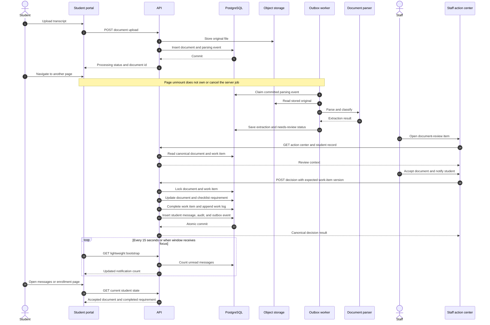
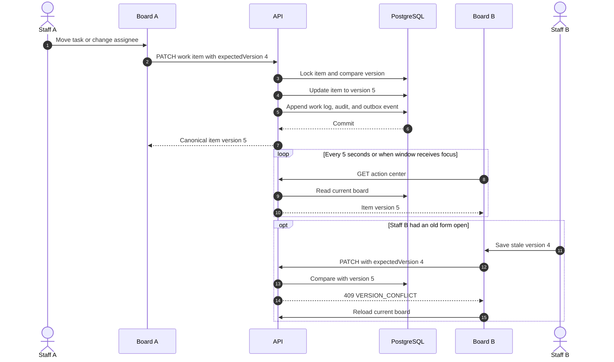
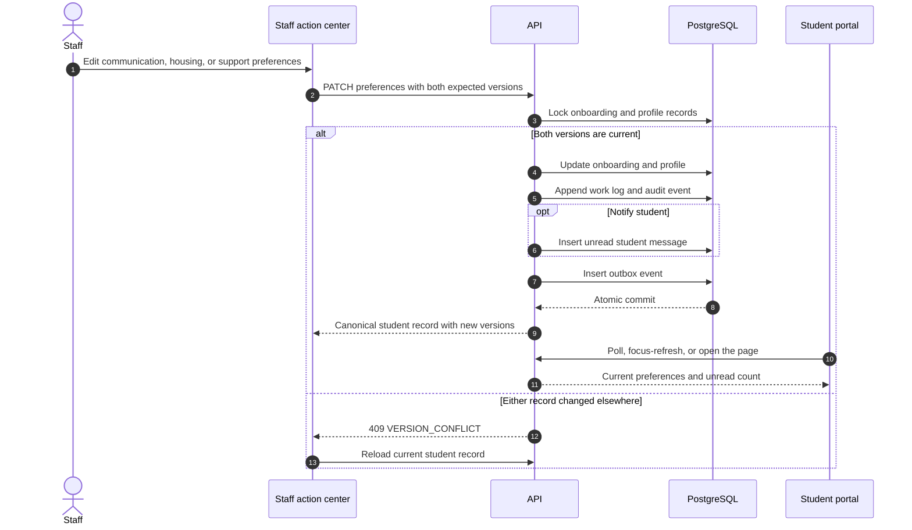
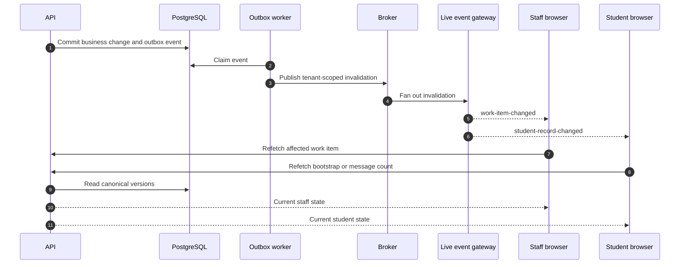

# Student and Staff Sequence Diagrams

These diagrams separate the behavior implemented in the first staff slice from
the later event-driven upgrade. PostgreSQL is the production source of truth.
The local preview uses the same contracts and transaction boundaries with a
serialized development store.

## 1. Student upload, background parsing, staff review, and notification

This is the cross-application flow. Navigating away after the upload request
has completed does not cancel parsing because the job belongs to the server,
not to the React page.

## 2. Two staff colleagues using the same board

The first implementation is near-real-time polling, not a collaborative socket.
One staff member's change normally appears in another open board within five
seconds or immediately when that window receives focus.

## 3. Staff edits student onboarding preferences

The staff and student applications do not maintain separate copies of these
values. Both views read the same student records.

## 4. Later upgrade: live invalidation, not live-owned state

When polling becomes too slow or expensive, add server-sent events (SSE) after
the transactional outbox. The live message only says what became stale; the
browser still refetches the canonical record.

## Freshness decision table

| State | First implementation | Why |
| --- | --- | --- |
| Staff status, assignee, and escalation flag | Five-second poll plus focus refresh | Active coordination benefits from quick convergence, but sub-second editing is unnecessary for V1 |
| Student unread notification count | Fifteen-second lightweight poll plus focus refresh | Material decisions become visible without a manual reload |
| Full onboarding and student detail | Refetch on page open and after mutation | Larger payload and lower urgency |
| Document parsing progress | Bounded polling on the document surface | The job is server-owned and continues after navigation |
| Email and SMS delivery | Transactional outbox plus asynchronous provider worker | External delivery must not hold the database transaction open |
| Audit and work history | Returned with the next board refresh | Durability matters more than animation |
| Presence, typing indicators, and live cursors | Not implemented | They do not change business state |

See [Staff Action Center and Shared State](./22-staff-action-center-and-realtime-state.md)
for the data ownership, security boundary, and staged roadmap.
