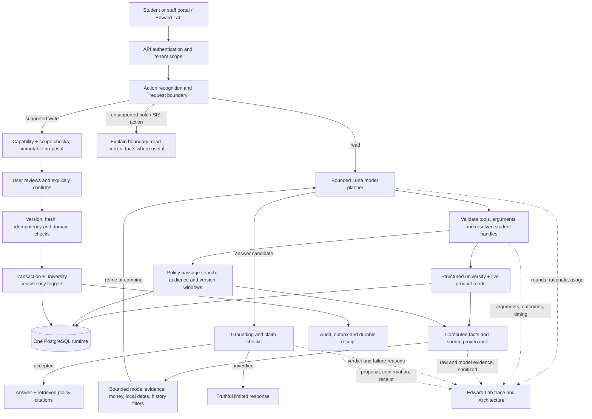

# Synthetic University v3: canonical Audentra runtime

Implementation and evaluation completed in the `synthetic-university` workspace, September 2026. This report supersedes the runtime limitations in the two original v3 reports, while retaining their data-model history and intentional synthetic scenarios.

## Repository provenance

The workspace root contains **two Git worktrees**, `platform` and `portals`; it is not itself a Git repository. Both started on `feat/synthetic-university-v1` and remain on that branch.

| Worktree | Starting commit / source commit |
| --- | --- |
| synthetic-university/platform | `4fa1ae99f9b74632d505e500616e87e50160616a` |
| synthetic-university/portals | `568ca1d0cc6f307a4a5ee4656584d81deef1a945` |
| edward-write-v1/platform, branch `feat/edward-write-v1` | `f8c0f583c7960610331f56cb93105f646b640ac5` |
| edward-write-v1/portals, branch `feat/edward-write-v1` | `568ca1d0cc6f307a4a5ee4656584d81deef1a945` |

The requested v3 reports, university builder/explorer, and a portal ignore-file change were already uncommitted at the start. They are included with the completed work. The Edward source worktrees were inspected read-only.

**The latest Edward was already inherited.** The platform merge base with `edward-write-v1` is its exact HEAD, `f8c0f58`; portal HEADs were identical. Inspection confirmed the newer read-model planner, Luna configuration, action gateway, tracing, and Lab Architecture experience were already here. There was no missing Edward commit to cherry-pick. The work preserves that implementation, reconciles the platform's stale action contract declarations with the already newer portal declarations, and evolves the shared implementation for v3. Nothing was pushed or deployed, and no other repository was edited.

## What v3 initially contained

The previous archive had roughly 3,000 students and 88 staff. The v2 product seed admitted 2,577 of those students into its PostgreSQL portal tenant. The initial v3 work restored all 3,000 stable student identities in a **separate SQLite evaluation world**, with 88 staff, 14 programs and a much deeper institutional model. It had not connected that world to the running portals or Edward.

The important additions were relationships and evidence, rather than population size:

- Seven terms, 107 courses, 781 sections, 14,559 course attempts, course prerequisites, program requirements, accepted/pending transfer evaluations, waitlist offers, and 2,968 SAP evaluations.
- Integer-cent ledger postings, annual awards separate from disbursements, pending/failed/reversed payments, refunds and credit balances, and independent official holds. Settlement and hold release were deliberately separate events.
- 12,343 required documents and 43,801 revisions. Receipt, review, rejection, expiration and acceptance were distinguishable, with source reasons and two timestamps.
- Physical beds and compatible housing placements, approved accommodations that did not imply placement, adviser relationships and coverage, revoked consent, individual exceptions, and multi-office workflow dependencies.
- Approximately 74,000 institutional events with **effective time** and **recorded time**, including a late-arriving corrected grade. Historical knowledge could differ from today's corrected record.
- **92 policy versions**: 88 original institutional documents plus four v3 supplement/version records. These cover academic programs and rules, registration, aid, billing, housing, health, international students, privacy, offices and internal operating procedures. Documents include audience, owner, authority, applicability, publication/effective windows and source hashes; 367 links connect them to institutional entities. Seventy-five calendar entries supply real institutional dates.
- Thirty evaluator scenarios, including close controls and adversarial ambiguities. The oracle is deliberately separate from model-visible evidence.

The original reports explicitly noted weaker operational depth than v2: only 1,774 appointments, one modeled absence, 3,000 adviser assignments and four detailed cases; missing staff working hours/calendar blocks; sparse transfers, consent and exceptions; incomplete repeat/appeal/distribution rules. The explorer's only implemented mutation was a sandbox financial-hold release, not an Edward action.

## Data completion and consistency work

The population remains 3,000 students and 88 staff. The completed reproducible baseline has 43 tables. Important final counts are:

| Domain | Final baseline |
| --- | ---: |
| Academic attempts / SAP evaluations | 14,559 / 2,968 |
| Documents / revisions | 12,343 / 43,801 |
| Policy versions / indexed runtime passages | 92 / 383 |
| Ledger entries / payment records | 15,676 / 4,908 |
| Annual awards / disbursements | 4,627 / 8,574 |
| Holds / current and historical housing records | 953 / 993 |
| Staff assignments / appointments | 10,705 / 1,774 |
| Weekly availability intervals / calendar blocks | 880 / 88 |
| Staff absences with coverage | 21 |
| Institutional cases / steps / dependency edges | 164 / 172 / 8 |
| Institutional events | 74,555 |

The baseline uses seed `20260908`, institutional clock `2026-09-08T16:00:00Z`, and `America/New_York`. The seed database imported into the final local runtime has SHA-256 `5e102a14a604cd53e4e124ac4426bf1a4186100c3a4078038909e28826a92a95`. Subsequent runtime migrations and interactions are mutable PostgreSQL state, not replacements of that seed.

Changes with a workflow purpose:

1. Added weekday office availability with a lunch break, real staff calendar meetings, and twenty additional absences with named service coverage. The importer converts weekday conventions correctly and makes meetings block appointment booking.
2. Added cross-office service relationships for applicable students: admissions, Financial Aid, international advising and housing. Kept curated academic adviser/coverage history.
3. Added 160 document cases only where source evidence requires review or corrected submissions. Preserved the original four handoff scenarios and their dependencies.
4. Made individual exceptions state their **term and numeric scope**. The approved ISS reduced-load exception has an eight-credit floor for Fall 2026; it must not inherit an unrelated accessibility policy's nine-credit floor. Expired overload permission remains expired.
5. Corrected term census dates to the institutional calendar. Add/drop and census are different dates. Local calendar-day rendering prevents September 11 at 11:59 p.m. Eastern becoming a September 12 deadline.
6. Retired the imported mandatory FERPA-release checklist task. A student's optional authorization cannot be a condition of registration. Existing authorizations, revocation evidence and the old checklist audit record remain intact.
7. Removed conflicting v2 financial summary, payment-plan, SAP and verification snapshots from the imported tenant. V3 does not invent a signed payment-plan contract. Normal non-v3 functionality is retained.
8. Added retirement/reconciliation indexes after the full integration run exposed a repeatable seed-publication timeout before fresh tables had useful query-planner statistics.

Further scale was intentionally avoided. Two transfer cases, two course waitlist cases and four individual exceptions are sufficient for the concrete reasoning boundaries exercised here; they are not presented as statistically representative university incidence rates.

## Final database architecture

`tools/university/build.py` produces deterministic SQLite seed input and a separately held oracle. `import_runtime.py` validates that input and imports it once into a **new, explicitly named loopback PostgreSQL database**. It refuses to replace an existing imported world. Resetting means creating a new database, not silently erasing portal/Edward writes.

Numbered migrations `0052`–`0065` add the university schema, indexes, constraints, RLS, compatibility-write synchronization, exception scope, calendar correction, revision sequencing, upload linking optional-FERPA correction, and multi-document requirement guards. Applied migrations were not rewritten.

There is one runtime database with two coordinated areas:

- `university.*` is authoritative for academic attempts and institutional history, ledger/holds, physical housing, policy versions/passages, scoped approvals, named relationships and formal case evidence.
- Existing product tables remain authoritative for interactive profile preferences, checklist execution, current portal messages, authorizations, appointments, work items and Edward intents/receipts/audit/outbox. Imported compatibility records derive from the university world. `university.runtime_link` connects identifiers where the original identifiers differ.

This is a domain ownership boundary, not two independent financial or academic snapshots. Portal finance and academic responses and Edward university tools call the same PostgreSQL repository/projection code. No portal or Edward tool opens SQLite.

The importer preserves existing staff UUIDs when possible and deterministically maps the remaining staff identities. It installs all 3,000 students, correct programs, actual deposits, document statuses, applicable housing evidence, named assignments and staff schedules. Old sample messages are replaced by actual delivered communications; old synthetic work items are cancelled with audit history retained. Managers receive broad staff capabilities; individual staff keep caseload-limited action scope. No background AI worker is started by the local runner.

Tenant-filtered, code-owned SQL and bound parameters are the primary query boundary. Composite tenant keys, foreign keys and forced RLS add database protection; views use invoker security. A non-owner-role test verifies isolation. Student identity comes from authentication; staff must resolve student handles through existing authorized lookup. Delegates cannot read a full university dossier. Model-provided tenant IDs or arbitrary SQL are never accepted.

### Interactive writes stay coherent

Existing gateway preview/confirm/version/content-hash/idempotency/capability checks remain in place. Product writes synchronize relevant university facts in the same database transaction:

- Preferred-name changes update the world identity as well as the product preference.
- Document review appends a revision and institutional event. Revision ordinal uses the existing revision history, independently of the document row version.
- A new upload for an unmet named category becomes a revision of that requirement. Its current file is linked; reviewing an old superseded file cannot overwrite the replacement's result. Placeholders remain not submitted. Generic Financial Aid uploads require classification and cannot satisfy both a worksheet and a tax transcript automatically. Staff review computes the aggregate named-evidence status before awarding completion/rewards; a database guard also rejects bypassing unfinished required evidence.
- Deposits append actual payment and ledger evidence. They do not release unrelated holds.
- Appointments and linked formal case owners/deadlines/statuses synchronize. Completing a linked case with unfinished steps or unresolved evidence is rejected.

This is not a full SIS write system. Course registration, degree certification, formal case-step resolution, policy editing and live financial-hold release are not newly exposed write APIs.

## Student portal mapping

The existing design, navigation and components remain. A shared **My university record** panel surfaces six understandable domains on the dashboard, classrooms and financials pages, and in the staff student inspector.

| Portal surface | Runtime source / behavior |
| --- | --- |
| Profile | Existing product profile plus canonical university identity/email; guarded preference updates synchronize |
| Dashboard | Actual student/application, nullable admission offer, current course count, checklist, ledger summary and university panel; no invented offer for the 423 students absent from the old admitted-only seed |
| Classrooms / academics | Actual program, course descriptions/levels, attempts, passed course/accepted-transfer progress, SAP, current registrations, prerequisites and unresolved distribution requirements; all 14 programs available |
| Financial overview | Exact posted term charges, aid postings, settled payments and adjustments; negative balances remain credit owed |
| Aid / account detail | Annual offers/accepted awards separate from actual installments; pending, failed and reversed payments visible; no empty synthetic payment-plan promises or fabricated SAP/GPA |
| Documents / checklist | Imported current evidence and live product submissions/reviews; revision and rejection history in the university panel; optional FERPA release does not block enrollment |
| Calendar | Institutional deadlines merged with existing personal/portal events; New York dates and explicit times |
| Relationships | Named service contacts, coverage, housing/placement, appointments, consent history and current product authorizations |
| History | Effective and recorded timestamps, with a clearly bounded history view |
| Inbox / tasks / actions | Existing durable product messages and requirement/action workflows, initialized from actual v3 evidence |

The UI does not expose every column. Credits are progress evidence, not a claim of certified graduation; annual aid is not a cash posting; a negative balance is not a completed refund; an accepted accommodation is not a room assignment.

## Staff portal mapping

The roster, student summaries, task cards and Edward identity search now show the imported program even when no admission offer exists. The student inspector reuses the same domain panel, with staff-authorized case ownership, steps and dependencies.

Staff Today adds **My university operations**: their office, weekly working hours, calendar meetings, absences and coverage, appointments and formal cases. Existing Action Center tasks remain live product work items; the operations endpoint also exposes live task counts and recent tasks. Imported formal cases are linked to the Action Center rather than rendered as an unrelated sample queue. Managers and individual staff retain different write scopes.

A selected staff member can legitimately have no formal case while having appointments, service assignments or ordinary product tasks. The interface does not manufacture workload to make the page look busy.

## Edward before this work

The inherited Edward already had student and staff pipelines, bounded model read planning, deterministic/hybrid alternatives, controlled tool execution, evidence/claim checks, conversation and trace storage, and a guarded action gateway. Staff identity resolution and cohort/action scope were established boundaries. Edward Lab already displayed route execution, model calls and planner information.

Its weak point for v3 was the **available evidence and its presentation**. Old product projections could claim holds or course histories were unavailable; financial summaries reflected v2 packaging; static institutional knowledge did not join the new policy versions to exceptions, ledger events and workflows. Generic tool-result bounds spent substantial space on repeated UUIDs and sometimes hid the relevant history. Legacy fallback composition could produce confidently stale guidance when a new read failed its guard.

## Architectural decisions and final Edward flow

Added shared, bounded evidence tools:

- `getUniversityOverview`, `getUniversityAcademics`, `getUniversityAccount`, `getUniversityRelationships`, `getUniversityDocuments`, `getUniversityHistory`.
- Staff `getUniversityOperations`, `getUniversityCasework`, `getUniversityCohort`, and `searchUniversityPolicies`.
- Student `getInstitutionalPolicies` now uses the PostgreSQL document index for imported v3 tenants.

The v3 planner sees the compatible subset of legacy tools plus the new tools. Stale/unsupported hold, financial, timeline and similar legacy reads are excluded. No arbitrary SQL tool, autonomous agent hierarchy or embedding service was added.

History accepts timezone-qualified effective/known cutoffs and optional validated entity type/id filters. External grade corrections are transfer-credit events, not an invented `grade` type. Counts and truncation signals distinguish incomplete retrieval from absence of an event. A current profile header is explicitly not an as-of historical reconstruction.

Academic course-impact facts are computed deterministically: current and post-drop credits, approved numeric floor, major/prerequisite implications and whether prior DSO approval is required. Edward must combine those facts with the governing policy and separate aid decisions.

### Document retrieval

A 383-passage corpus does not justify a separate vector database by default. The implemented approach is PostgreSQL full-text passage retrieval using heading/body weights and a GIN index, vocabulary expansion, exact policy-code preference, and publication/effectivity/audience filtering **before ranking**. Applicability is evaluated against bound student facts and reported as applicable, excluded or unknown. Unknown citizenship is not inferred from domestic residency.

Each result includes policy code/version, title, heading, owning office, authority, audience, applicability basis, effective/publication windows, source path and content hash. Up to ten ranked passages are returned. The model can refine a query or request an exact policy code in a later round. Policies supply rules; structured records establish whether a student has met them or holds a valid scoped exception. Communications are lower-authority evidence and do not supersede a policy or official record.

Server-generated answer blocks list actually retrieved, non-excluded policy citations, even if the model omits them. They are labeled **retrieved passages**, not a guarantee that every listed passage supports every sentence. Lab exposes full provenance and the executed search. Lexical retrieval can still rank distracting terms; there is no claim of perfect recall or exhaustive legal/policy interpretation.

### Planning, grounding and observability

V3 defaults to GPT-5.6 Luna and four allowed read rounds, followed by a forced answer round if needed. Hybrid requests use the model path for this richer evidence; explicitly selected deterministic reads fail closed with an inspectable reason when no suitable v3 planner exists. Provider/guard failures do not fall back to the old contradictory university story.

The executor retains tenant/identity and argument validation. Student tool-result caching is keyed by arguments, so repeated policy/history calls can genuinely refine a query. Bounded model projections remove redundant storage identities, render cents as dollar strings, normalize institutional timestamps to New York and retain useful policy passage text. The numeric/date/contact guard recognizes both ISO and day-first policy dates without allowing unsupported dates. A quoted-advice fact-check can use read-only evidence without turning quoted text into a write request.



**Edward Lab reflects this implementation.** Architecture includes both data sources, planning/refinement, evidence limits and the write branch. Counts derive from selected trace calls. Model iterations, execution/guard outcomes, action receipts and planner rationale remain visible. Tool details distinguish sanitized raw read results from the bounded evidence actually sent to the planner. The Luna price estimate was added. Static labels no longer describe deterministic-only retrieval or a stale fallback as the v3 default. The displayed rationale is the model's returned planning explanation, not a claim to expose private internal reasoning.

## Evaluation and refinement

The reproducible runner is `tools/university/evaluate_runtime.py`. It invokes the actual PostgreSQL `PostgresPlatformService.dispatch` path with authenticated student/staff contexts. The oracle selects actors and questions only; rubric answers and forbidden-claim text are never given to the model. Raw outputs and sanitized traces remain under ignored local artifacts, not Git.

OpenAI-only Luna calls are reserved before execution against a persistent $4.50 runner ceiling, leaving margin under the user's $5 maximum. Cost is computed conservatively at $0.20 per million input and $1.20 per million output tokens, without cached-input discounts; [the official Luna model page](https://developers.openai.com/api/docs/models/gpt-5.6-luna) was checked. No other paid provider was used and the interactive API ran with OpenAI disabled during browser checks.

The evaluation deliberately compared different evidence classes and close controls. It was iterative diagnostic testing, not a blinded benchmark; do not interpret the examples below as a universal pass rate.

| Experiment | Finding and refinement / final observed behavior |
| --- | --- |
| Basic profile, clear enrollment control | Actual program/load/zero balance returned. Fresh-import test caught mandatory FERPA release; retired that task and verified eight complete requirements, no hold, correct September 11 local deadline |
| Pending, failed and reversed payments | Pending/failed money never reduces the posted balance. Reversal cancels the earlier credit. Hold-write boundary reports actual ledger/hold/payment counts without changing a hold |
| $250 versus $250.01 | Separate threshold evidence and official hold status; eligibility is not proof of recorded release |
| Credit owed versus completed refund | Correct distinction between a negative balance and settled refund evidence |
| Reduced-load permission and no-permission contrast | Initially borrowed a nine-credit accessibility floor. Added explicit eight-credit ISS scope, term, computed course impacts and policy references; approved case stays within its floor, unapproved case explicitly requires prior ISS/DSO permission |
| Quoted stale advice | Initial action framing rejected a fact-check. Read-only fact-check path now compares current policy/evidence; quoted statements do not authorize writes |
| Late-arriving Calculus correction | Generic trimming hid relevant history; compacted evidence and added entity filters. Unknown `grade` filter was diagnosed and rejected. Final staff comparison found original F known in August and corrected B received/accepted September 4, therefore not known September 1 |
| Revoked consent / minor student | Family relationship and age do not automatically grant record access; live authorizations and historical consent are separate evidence |
| Housing approval / expired exception | Approval is distinct from compatible placement; expired permission cannot authorize a new action |
| Transfers and prerequisites | Pending transfer evaluation is not accepted course credit or satisfied prerequisite |
| Course waitlist offer / expiry | Distinguished a course seat offer from admission/housing. Added exact registration-policy references; expired offers cannot simply be accepted |
| Independent health/financial gates | Zero balance does not remove an unrelated health hold |
| Verification handoff DAG | Old generic task evidence missed the chain. Focused casework now exposes ready/blocked steps and accountable offices; final answer orders verification, aid posting, ledger/hold review and delivered outcome |
| Decision versus delivery | Old communication lookup missed a bounced delivery. Focused casework supplies decision, delivery failure and unfinished communication step; sending/deciding is not delivery |
| Staff operations | Returned authenticated staff office hours, meetings, assignments and case context with local times |
| Cross-entity cohort | Exactly two deduplicated enrolled Fall students with active Fall financial holds and pending Fall payments, denominator 1,773; failed payments excluded |
| Ambiguous student identity | Initial raw-UUID harness attempt hit the legitimate identity boundary. Official student references resolve; colliding names produce clarification rather than guessed identity |
| Existing writes | Real PostgreSQL action suites verify proposal/confirmation, scope, content-hash tampering, version checks, replay and receipts. New v3 test confirms a preferred-name change reaches the university read; no change before confirmation; tampered preview rejected; replay returns same receipt |

**Final evaluation total:** 68 actual Edward turns across all 30 scenario identifiers (54 student, 14 staff), including repeated diagnostics and controls; 146 OpenAI calls. Conservative token-based spend was **$0.1788048**, comfortably below $5, with no unresolved cost reservations. Usage was 793,104 input tokens and 16,820 output tokens, including classifier and planner calls. Across the mixed diagnostic runs, median end-to-end trace time was about 4.4 seconds; this is local observed latency, not a service-level guarantee. The detailed logs remain in `artifacts/university-runtime/`, excluded from commits.

The first/fresh-import runs were intentionally retained, including failures. In addition to the table above, a no-show question containing “cancel” initially hit an inherited lexical mutation flag. The service already handles real action proposals before the read pipeline, so the v3 read-only evidence path now handles such questions without giving the planner any write tools. Re-evaluation correctly found the optional missed appointment and four still-enrolled classes. A final student historical-grade read and staff two-cutoff comparison both correctly rejected the idea that the correction was known September 1.

Example questions now supported by evidence that the older portal seed could not supply:

- “On September 1, did the university already know my corrected Calculus grade?”
- “What happens if I drop CS 101 with my approved reduced-load exception?”
- “My bank-transfer receipt shows a payment; why is there no credit now?”
- “My balance is zero. Why is there still a health hold?”
- “Has the student actually received the aid decision, or was it only approved?”
- “Which office can act next in this verification-to-registration case?”
- “How many enrolled Fall students have both a financial hold and a pending payment?”
- “Does my missed optional planning meeting cancel my existing classes?”

## Remaining capabilities and limitations

- This is a richer synthetic institutional model, not a production SIS replacement. Graduation distributions, repeat/grade-replacement rules, full SAP appeal adjudication, signed payment plans, payroll and comprehensive historic snapshots remain incomplete. The API identifies unresolved degree evidence rather than certifying completion.
- The institutional snapshot is fixed at noon Eastern on September 8, 2026. Product conversation/audit infrastructure still records real transaction time. To simulate a later academic world, rebuild/import a new world or implement explicit clock advancement; do not assume passage of wall time recomputes all synthetic business facts.
- Formal case steps need their own future authorized resolution workflow. Guarded metadata/status updates cannot bypass unfinished dependencies. Appointments and meetings are modeled; this is not an external calendar synchronization service.
- Newly uploaded transcripts can be reviewed but do not automatically grant official university credits. Generic Financial Aid submissions need named evidence classification. Seeded file records are not a complete object-storage media fixture.
- The document index is built from versioned seed sources at import. It is not automatically refreshed by a staff policy editor. Search is lexical with vocabulary expansion, capped at ten passages; a query may need refinement and returned passages can be only partially applicable. No embeddings were necessary to deliver these workflows, but broader corpora or measured recall failures could justify them later.
- Grounding protects specific claims but is not a proof system. Model answers can still omit a relevant office or overgeneralize a passage. Refinement runs show both successes and abstentions; no production correctness guarantee is claimed.
- Existing Edward write capabilities are preserved. **Financial-hold release remains unavailable in live Edward.** Its sandbox simulation was not quietly promoted to an operational action. There is no live enrollment/drop, room assignment, approval or financial transfer tool.
- Portal coverage is selective. The shared record panel exposes academic/account/history depth while the existing operational portal keeps its normal workflow screens. It does not expose all 43 tables or turn every institutional field into an editable control.

## Validation and local execution

Full API/Node and portal gates, v3 transactional tests, deterministic world tests and browser checks were run. External mock-university and S3 tests require services that were not started and remain explicitly skipped. Integration tests used separate disposable PostgreSQL databases, never the final local runtime.

The final local runtime database is `audentra_university_v3` on `127.0.0.1:55487`, local role `dhairya2801`. PostgreSQL 17.6 was compiled and initialized entirely under ignored `platform/artifacts/university-runtime/` because the installed PostgreSQL 14 could not run an inherited migration requiring PostgreSQL 15+. The tarball checksum was verified. The local API is on port 45609; the portal dev server is on port 3000. This worktree's ignored portal `.env.local` now points its public API and internal Lab proxy to port 45609. The Cloudflare worker needs those file-based settings; shell overrides alone did not configure its internal proxy. All are local processes, not deployment artifacts.

Portable installation, migration, import, API and portal commands are in [tools/university/README.md](../tools/university/README.md). For this already prepared workspace, run the API helper with the local URL above; add `--enable-openai` only when you want interactive paid guidance. Existing OpenAI credentials are read from the environment and were never committed. The local helper does not start a worker or S3. If the local cluster is stopped:

```bash
# From platform; these are ignored local artifacts, not required on another machine.
artifacts/university-runtime/pg17/bin/pg_ctl \
  -D artifacts/university-runtime/pgdata17 \
  -l artifacts/university-runtime/postgres17.log \
  -o "-h 127.0.0.1 -p 55487 -k ''" start
PYTHONPATH=apps/api/src apps/api/.venv/bin/python tools/university/run_runtime.py \
  --database-url postgresql://dhairya2801@127.0.0.1:55487/audentra_university_v3
```

For tests, use a migrated empty `audentra_university_integration` DB for inherited integration suites and an independently imported `audentra_university_test` DB for v3 tests:

```bash
AUDENTRA_TEST_DATABASE_URL=postgresql://USER@127.0.0.1:PORT/audentra_university_integration \
TEST_DATABASE_URL=postgresql://USER@127.0.0.1:PORT/audentra_university_integration \
AUDENTRA_UNIVERSITY_TEST_DATABASE_URL=postgresql://USER@127.0.0.1:PORT/audentra_university_test \
OPENAI_API_KEY= OPENROUTER_API_KEY= npm test
npm run lint
npm run typecheck
apps/api/.venv/bin/python -m unittest discover -s tools/university/tests -v
```

Portal gates are `npm run lint`, `npm run typecheck`, and `NEXT_PUBLIC_EDWARD_DEBUG_ENABLED=false npm test`. The explicit false value tests production Lab gating without the inherited local debug override; local Lab development uses true. Browser verification is `node tools/university-explorer/runtime-smoke.mjs` from `portals` with the local API/UI running.

### Final verification results

| Check | Result |
| --- | --- |
| Platform `npm run lint` | Passed |
| Platform `npm run typecheck` | Passed, including API source/tests and all Node workspaces |
| Platform `npm test`, after the final evidence guard | **1,506 API tests passed, 23 skipped; 73.17% coverage**, exceeding the 67% gate; all Node workspace suites passed |
| Focused university/read-loop/trace/staff regression run | 62 passed; one isolated staff DB test skipped in that invocation and covered by the full DB-enabled run |
| Deterministic university world suite | **17 passed**; validation, repeatable builds, negative integrity checks and sandbox action invariants |
| Fresh local database import and migrations | Passed; final runtime includes migrations through `0065` |
| Student portal / Edward parity | Thirty distinct students checked through shared production repositories for exact ledger balance, program and profile agreement; all 3,000 imported identities and 1,774 nonduplicated appointments verified |
| Security and writes | Tenant/delegate/staff boundaries, non-owner RLS including views, preview tampering, confirmed profile synchronization, idempotent replay, document revision/supersession, multi-file completion guard, deposit posting and blocked case completion passed |
| Portal lint / typecheck | Passed; lint retains 14 existing nonfatal image/unused-variable warnings |
| Portal `NEXT_PUBLIC_EDWARD_DEBUG_ENABLED=false npm test` | Production build and **129 tests passed** |
| Browser smoke | Dashboard, classrooms, financials, staff operations and Lab Architecture passed; authenticated Lab catalog HTTP 200; no browser page errors |
| Shared contracts | Platform and portal contract files are byte-for-byte identical |
| Staged-content check | No database binaries, local environments, raw evaluation logs or provider credentials included |
| Source worktrees | Branches, HEADs and original untracked `.ua/` statuses rechecked unchanged |

The 23 full-run skips are external mock-university, production/S3 and seed-media cases whose services were not configured. They are not counted as passes. Earlier incomplete runs exposed coverage without DB services, optional-tool fixture assumptions, seed reconciliation performance, document revision sequencing and evidence/claim weaknesses; those findings and their fixes were retained in the local logs.

The portal commit is `5e17c121d1dcada4bab8b89aa623bb9004c21e89` (`Connect portals and Edward Lab to the canonical university runtime`). The platform implementation and this report are committed separately on the same existing branch name because the workspace contains two Git repositories. Neither commit was pushed or deployed.
